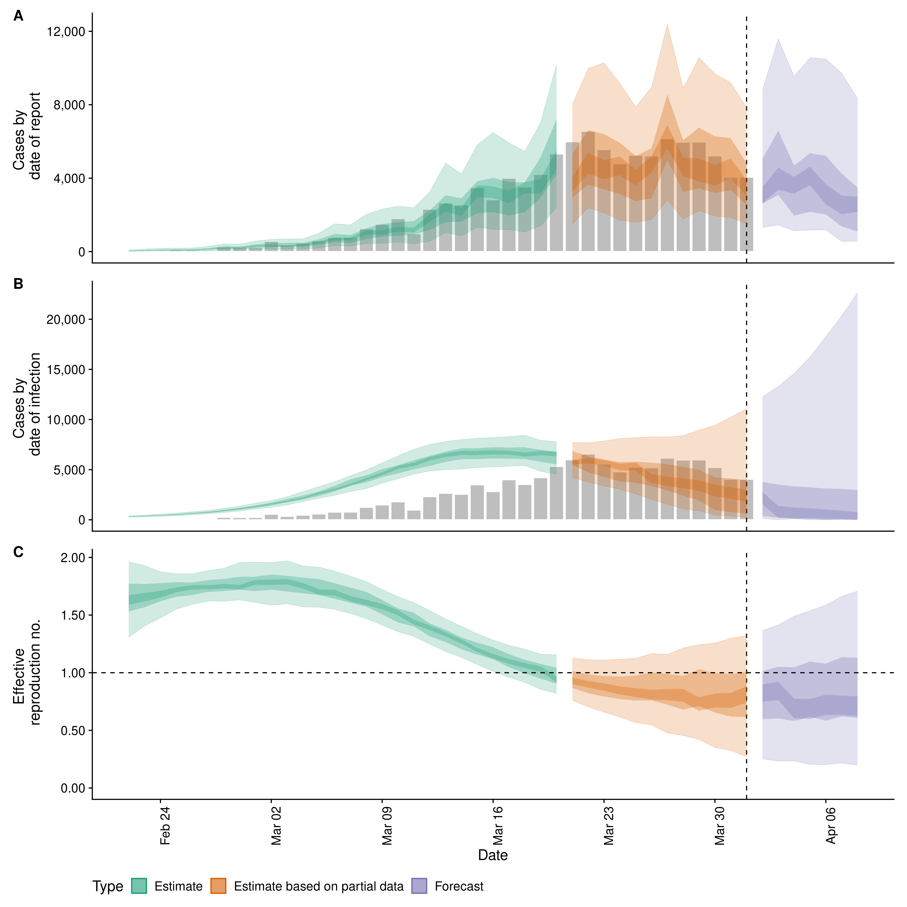
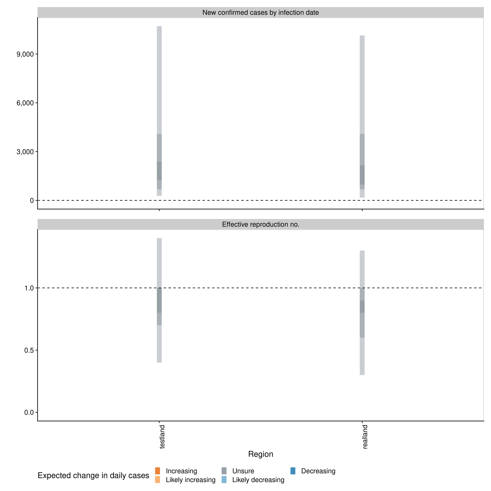

# EpiNow2: Estimate real-time case counts and time-varying epidemiological parameters

[](https://lifecycle.r-lib.org/articles/stages.html#maturing)
[](https://github.com/epiforecasts/EpiNow2/actions)
[](https://app.codecov.io/gh/epiforecasts/EpiNow2?branch=main)
[](https://cran.r-project.org/package=EpiNow2)

[](https://github.com/epiforecasts/EpiNow2/blob/main/LICENSE.md/)
[](https://github.com/epiforecasts/EpiNow2/graphs/contributors)
[](https://makeapullrequest.com/)
[](https://GitHub.com/epiforecasts/EpiNow2/commit/main/)
[](https://zenodo.org/badge/latestdoi/272995211)

This package estimates the time-varying reproduction number, growth
rate, and doubling time using a range of open-source tools ([Abbott et
al.](https://doi.org/10.12688/wellcomeopenres.16006.1)), and current
best practices ([Gostic et
al.](https://doi.org/10.1371/journal.pcbi.1008409)). It aims to help
users avoid some of the limitations of naive implementations in a
framework that is informed by community feedback and is actively
supported.

It estimates the time-varying reproduction number on cases by date of
infection (using a similar approach to that implemented in
[`{EpiEstim}`](https://github.com/mrc-ide/EpiEstim)). Imputed infections
are then mapped to observed data (for example cases by date of report)
via a series of uncertain delay distributions (in the examples in the
package documentation these are an incubation period and a reporting
delay) and a reporting model that can include weekly periodicity.

Uncertainty is propagated from all inputs into the final parameter
estimates, helping to mitigate spurious findings. This is handled
internally. The time-varying reproduction estimates and the uncertain
generation time also give time-varying estimates of the rate of growth.

The default model uses a non-stationary Gaussian process to estimate the
time-varying reproduction number and then infer infections. Other
options include:

-   A stationary Gaussian process (faster to estimate but currently
    gives reduced performance for real time estimates).
-   User specified breakpoints.
-   A fixed reproduction number.
-   As piecewise constant by combining a fixed reproduction number with
    breakpoints.
-   As a random walk (by combining a fixed reproduction number with
    regularly spaced breakpoints (i.e weekly)).
-   Inferring infections using back-calculation and then calculating the
    time-varying reproduction number.
-   Adjustment for the remaining susceptible population beyond the
    forecast horizon.

These options generally reduce runtimes at the cost of the granularity
of estimates or at the cost of real-time performance.

The documentation for
[`estimate_infections`](https://epiforecasts.io/EpiNow2/reference/estimate_infections.html)
provides examples of the implementation of the different options
available.

Forecasting is also supported for the time-varying reproduction number,
infections and reported cases using the same generative process approach
as used for estimation.

A simple example of using the package to estimate a national Rt for
Covid-19 can be found
[here](https://gist.github.com/seabbs/163d0f195892cde685c70473e1f5e867).

`EpiNow2` also supports adjustment for truncated data via
`estimate_truncation()` (though users may be interested in more
flexibility and if so should check out the
[`epinowcast`](https://epiforecasts.io/epinowcast/) package), and for
estimating dependent observations (i.e deaths based on hospital
admissions) using `estimate_secondary()`.

## Installation

Install the stable version of the package:

``` r
install.packages("EpiNow2")
```

Install the stable development version of the package with:

``` r
install.packages("EpiNow2", repos = "https://epiforecasts.r-universe.dev")
```

Install the unstable development version of the package with (few users
should need to do this):

``` r
remotes::install_github("epiforecasts/EpiNow2")
```

Windows users will need a working installation of Rtools in order to
build the package from source. See
[here](https://github.com/stan-dev/rstan/wiki/RStan-Getting-Started#checking-the-c-toolchain)
for a guide to installing Rtools for use with Stan (which is the
statistical modelling platform used for the underlying model). For
simple deployment/development a prebuilt docker image is also available
(see documentation
[here](https://github.com/epiforecasts/EpiNow2/wiki/Docker)).

## Quick start

`{EpiNow2}` is designed to be used with a single function call or to be
used in an ad-hoc fashion via individual function calls. The core
functions of `{EpiNow2}` are the two single-call functions
[`epinow()`](https://epiforecasts.io/EpiNow2/reference/epinow.html),
[`regional_epinow()`](https://epiforecasts.io/EpiNow2/reference/regional_epinow.html),
plus functions
[`estimate_infections()`](https://epiforecasts.io/EpiNow2/reference/estimate_infections.html),
[`estimate_secondary()`](https://epiforecasts.io/EpiNow2/reference/estimate_secondary.html)
and
[`estimate_truncation()`](https://epiforecasts.io/EpiNow2/reference/estimate_truncation.html).
In the following section we give an overview of the simple use case for
`epinow` and `regional_epinow`.
[`estimate_infections()`](https://epiforecasts.io/EpiNow2/reference/estimate_infections.html)
can be used on its own to infer the underlying infection case curve from
reported cases and estimate Rt. Estimating the underlying infection case
curve via back-calculation (and then calculating Rt) is substantially
less computationally demanding than generating using default settings
but may result in less reliable estimates of Rt. For more details on
using each function see the [function
documentation](https://epiforecasts.io/EpiNow2/reference/index.html).

The first step to using the package is to load it as follows.

``` r
library(EpiNow2)
```

### Reporting delays, incubation period and generation time

Distributions can either be fitted using package functionality or
determined elsewhere and then defined with uncertainty for use in
`{EpiNow2}`. When data is supplied a subsampled bootstrapped lognormal
will be fit (to account for uncertainty in the observed data without
being biased by changes in incidence). An arbitrary number of delay
distributions are supported with the most common use case likely to be a
incubation period followed by a reporting delay.

For example if data on the delay between onset and infection was
available we could fit a distribution to it with appropriate uncertainty
as follows (note this is a synthetic example),

``` r
reporting_delay <- estimate_delay(
  rlnorm(1000, log(2), 1), max_value = 15, bootstraps = 1
)
```

If data was not available we could instead make an informed estimate of
the likely delay (note this is a synthetic example and not applicable to
real world use cases),

``` r
reporting_delay <- list(
  mean = convert_to_logmean(2, 1), mean_sd = 0.1,
  sd = convert_to_logsd(2, 1), sd_sd = 0.1,
  max = 10
)
```

Here we define the incubation period and generation time based on
literature estimates for Covid-19 (see
[here](https://github.com/epiforecasts/EpiNow2/tree/main/data-raw) for
the code that generates these estimates). Note that these distributions
may not be applicable for your use case.

``` r
generation_time <- get_generation_time(
  disease = "SARS-CoV-2", source = "ganyani"
)
incubation_period <- get_incubation_period(
  disease = "SARS-CoV-2", source = "lauer"
)
```

### [epinow()](https://epiforecasts.io/EpiNow2/reference/epinow.html)

This function represents the core functionality of the package and
includes results reporting, plotting and optional saving. It requires a
data frame of cases by date of report and the distributions defined
above.

Load example case data from `{EpiNow2}`.

``` r
reported_cases <- example_confirmed[1:60]
head(reported_cases)
#>          date confirm
#> 1: 2020-02-22      14
#> 2: 2020-02-23      62
#> 3: 2020-02-24      53
#> 4: 2020-02-25      97
#> 5: 2020-02-26      93
#> 6: 2020-02-27      78
```

Estimate cases by date of infection, the time-varying reproduction
number, the rate of growth and forecast these estimates into the future
by 7 days. Summarise the posterior and return a summary table and plots
for reporting purposes. If a `target_folder` is supplied results can be
internally saved (with the option to also turn off explicit returning of
results). *Note: Here we use a weekly random walk rather than the full
daily Gaussian process model to reduce run-times.*.

``` r
estimates <- epinow(
  reported_cases = reported_cases,
  generation_time = generation_time,
  delays = delay_opts(incubation_period, reporting_delay),
  rt = rt_opts(prior = list(mean = 2, sd = 0.2), , rw = 7),
  stan = stan_opts(cores = 4), gp = NULL,
  verbose = interactive()
)
names(estimates)
#> [1] "estimates"                "estimated_reported_cases"
#> [3] "summary"                  "plots"                   
#> [5] "timing"
```

Both summary measures and posterior samples are returned for all
parameters in an easily explored format which can be accessed using
`summary`. The default is to return a summary table of estimates for key
parameters at the latest date partially supported by data.

``` r
knitr::kable(summary(estimates))
```

| measure                               | estimate               |
|:--------------------------------------|:-----------------------|
| New confirmed cases by infection date | 2124 (1171 – 3975)     |
| Expected change in daily cases        | Likely decreasing      |
| Effective reproduction no.            | 0.85 (0.62 – 1.2)      |
| Rate of growth                        | -0.042 (-0.11 – 0.049) |
| Doubling/halving time (days)          | -17 (14 – -6.2)        |

Summarised parameter estimates can also easily be returned, either
filtered for a single parameter or for all parameters.

``` r
head(summary(estimates, type = "parameters", params = "R"))
#>          date variable strat     type   median     mean         sd lower_90
#> 1: 2020-03-01        R  <NA> estimate 1.938637 1.939263 0.09247069 1.790875
#> 2: 2020-03-02        R  <NA> estimate 1.938637 1.939263 0.09247069 1.790875
#> 3: 2020-03-03        R  <NA> estimate 1.938637 1.939263 0.09247069 1.790875
#> 4: 2020-03-04        R  <NA> estimate 1.938637 1.939263 0.09247069 1.790875
#> 5: 2020-03-05        R  <NA> estimate 1.938637 1.939263 0.09247069 1.790875
#> 6: 2020-03-06        R  <NA> estimate 1.938637 1.939263 0.09247069 1.790875
#>    lower_50 lower_20 upper_20 upper_50 upper_90
#> 1: 1.874161 1.913719  1.95999  1.99843 2.094506
#> 2: 1.874161 1.913719  1.95999  1.99843 2.094506
#> 3: 1.874161 1.913719  1.95999  1.99843 2.094506
#> 4: 1.874161 1.913719  1.95999  1.99843 2.094506
#> 5: 1.874161 1.913719  1.95999  1.99843 2.094506
#> 6: 1.874161 1.913719  1.95999  1.99843 2.094506
```

Reported cases are returned in a separate data frame in order to
streamline the reporting of forecasts and for model evaluation.

``` r
head(summary(estimates, output = "estimated_reported_cases"))
#>          date  type median     mean        sd lower_90 lower_50 lower_20
#> 1: 2020-03-01 gp_rt  485.0 493.6445  95.01762   354.95   426.75    463.0
#> 2: 2020-03-02 gp_rt  468.0 474.4640  90.45885   337.95   411.00    447.0
#> 3: 2020-03-03 gp_rt  405.0 408.3520  80.65141   284.00   353.00    385.0
#> 4: 2020-03-04 gp_rt  383.0 392.3720  78.99329   278.95   336.00    365.0
#> 5: 2020-03-05 gp_rt  539.0 544.0185 106.53578   383.95   470.00    512.0
#> 6: 2020-03-06 gp_rt  746.5 757.6270 144.86061   537.95   654.75    710.6
#>    upper_20 upper_50 upper_90
#> 1:      508      553   659.00
#> 2:      491      534   634.00
#> 3:      423      460   547.05
#> 4:      405      442   539.00
#> 5:      565      610   731.05
#> 6:      785      852  1005.10
```

A range of plots are returned (with the single summary plot shown
below). These plots can also be generated using the following `plot`
method.

``` r
plot(estimates)
```

<!-- -->

### [regional_epinow()](https://epiforecasts.io/EpiNow2/reference/regional_epinow.html)

The `regional_epinow()` function runs the `epinow()` function across
multiple regions in an efficient manner.

Define cases in multiple regions delineated by the region variable.

``` r
reported_cases <- data.table::rbindlist(list(
   data.table::copy(reported_cases)[, region := "testland"],
   reported_cases[, region := "realland"]))
head(reported_cases)
#>          date confirm   region
#> 1: 2020-02-22      14 testland
#> 2: 2020-02-23      62 testland
#> 3: 2020-02-24      53 testland
#> 4: 2020-02-25      97 testland
#> 5: 2020-02-26      93 testland
#> 6: 2020-02-27      78 testland
```

Calling `regional_epinow()` runs the `epinow()` on each region in turn
(or in parallel depending on the settings used). Here we also switch to
using a weekly random walk rather than the full Gaussian process model.

``` r
estimates <- regional_epinow(
  reported_cases = reported_cases,
  generation_time = generation_time,
  delays = delay_opts(incubation_period, reporting_delay),
  rt = rt_opts(prior = list(mean = 2, sd = 0.2), rw = 7),
  gp = NULL,
  stan = stan_opts(cores = 4, warmup = 250, samples = 1000)
)
#> INFO [2022-10-15 22:03:36] Producing following optional outputs: regions, summary, samples, plots, latest
#> INFO [2022-10-15 22:03:37] Reporting estimates using data up to: 2020-04-21
#> INFO [2022-10-15 22:03:37] No target directory specified so returning output
#> INFO [2022-10-15 22:03:37] Producing estimates for: testland, realland
#> INFO [2022-10-15 22:03:37] Regions excluded: none
#> INFO [2022-10-15 22:14:01] Completed estimates for: testland
#> INFO [2022-10-15 22:23:16] Completed estimates for: realland
#> INFO [2022-10-15 22:23:16] Completed regional estimates
#> INFO [2022-10-15 22:23:16] Regions with estimates: 2
#> INFO [2022-10-15 22:23:16] Regions with runtime errors: 0
#> INFO [2022-10-15 22:23:16] Producing summary
#> INFO [2022-10-15 22:23:16] No summary directory specified so returning summary output
#> INFO [2022-10-15 22:23:17] No target directory specified so returning timings
```

Results from each region are stored in a `regional` list with across
region summary measures and plots stored in a `summary` list. All
results can be set to be internally saved by setting the `target_folder`
and `summary_dir` arguments. Each region can be estimated in parallel
using the `{future}` package (when in most scenarios `cores` should be
set to 1). For routine use each MCMC chain can also be run in parallel
(with `future` = TRUE) with a time out (`max_execution_time`) allowing
for partial results to be returned if a subset of chains is running
longer than expected. See the documentation for the `{future}` package
for details on nested futures.

Summary measures that are returned include a table formatted for
reporting (along with raw results for further processing). Futures
updated will extend the S3 methods used above to smooth access to this
output.

``` r
knitr::kable(estimates$summary$summarised_results$table)
```

| Region   | New confirmed cases by infection date | Expected change in daily cases | Effective reproduction no. | Rate of growth         | Doubling/halving time (days) |
|:---------|:--------------------------------------|:-------------------------------|:---------------------------|:-----------------------|:-----------------------------|
| realland | 2160 (1212 – 3755)                    | Likely decreasing              | 0.86 (0.64 – 1.1)          | -0.04 (-0.11 – 0.039)  | -17 (18 – -6.6)              |
| testland | 2178 (1230 – 3902)                    | Likely decreasing              | 0.86 (0.62 – 1.2)          | -0.039 (-0.11 – 0.044) | -18 (16 – -6.3)              |

A range of plots are again returned (with the single summary plot shown
below).

``` r
estimates$summary$summary_plot
```

<!-- -->

### Reporting templates

Rmarkdown templates are provided in the package (`templates`) for
semi-automated reporting of estimates. If using these templates to
report your results please highlight our
[limitations](https://doi.org/10.12688/wellcomeopenres.16006.1) as these
are key to understanding the results from `{EpiNow2}` .

## Contributing

File an issue [here](https://github.com/epiforecasts/EpiNow2/issues) if
you have identified an issue with the package. Please note that due to
operational constraints priority will be given to users informing
government policy or offering methodological insights. We welcome all
contributions, in particular those that improve the approach or the
robustness of the code base. We also welcome additions and extensions to
the underlying model either in the form of options or improvements.
