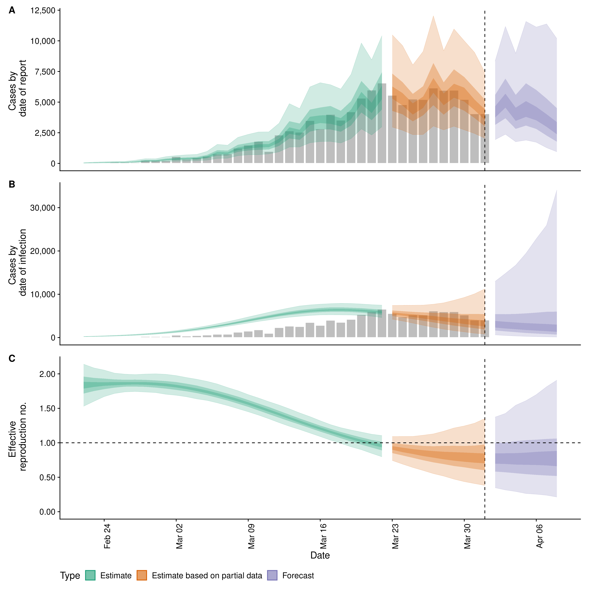
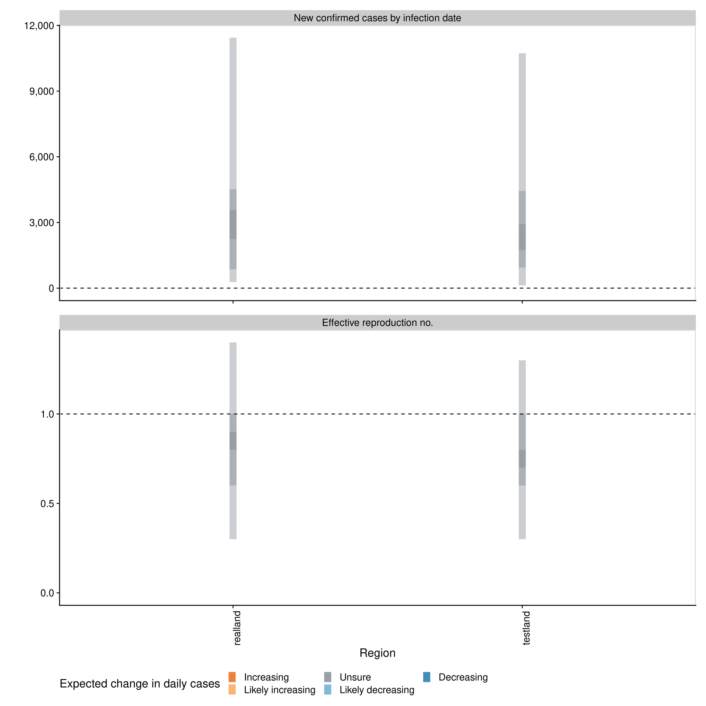

# EpiNow2: Estimate real-time case counts and time-varying epidemiological parameters

[](https://github.com/epiforecasts/EpiNow2/actions)
[](https://codecov.io/gh/epiforecasts/EpiNow2?branch=master)
[](https://cran.r-project.org/package=EpiNow2)

[](https://lbesson.mit-license.org/)
[](https://github.com/epiforecasts/EpiNow2/graphs/contributors)
[](http://makeapullrequest.com)
[](https://GitHub.com/epiforecasts/EpiNow2/commit/master/)
[](https://zenodo.org/badge/latestdoi/272995211)

This package estimates the time-varying reproduction number, rate of
spread, and doubling time using a range of open-source tools ([Abbott et
al.](https://doi.org/10.12688/wellcomeopenres.16006.1)), and current
best practices ([Gostic et
al.](https://doi.org/10.1101/2020.06.18.20134858)). It aims to help
users avoid some of the limitations of naive implementations in a
framework that is informed by community feedback and is under active
development.

It estimates the time-varying reproduction number on cases by date of
infection (using a similar approach to that implemented in the
[`{EpiEstim}`](https://github.com/mrc-ide/EpiEstim)). Imputed infections
are then mapped to observed data (for example cases by date of report)
via a series of uncertain delay distributions (in the examples in the
package documentation these are an incubation period and a reporting
delay) and a reporting model that can include weekly periodicity.

Uncertainty is propagated from all inputs into the final parameter
estimates, helping to mitigate spurious findings. This is handled
internally. The time-varying reproduction estimates and the uncertain
generation time also give time-varying estimates of the rate of growth.

The default model uses a non-stationary Gaussian process to estimate the
time-varying reproduction number and then infer infections. Other
options include:

  - A stationary Gaussian process (faster to estimate but currently
    gives reduced performance for real time estimates).
  - User specified breakpoints.
  - A fixed reproduction number.
  - As piecewise constant by combining a fixed reproduction number with
    breakpoints.
  - As a random walk (by combining a fixed reproduction number with
    regularly spaced breakpoints (i.e weekly)).
  - Inferring infections using back-calculation and then calculating the
    time-varing reproduction number.

The documentation for
[`estimate_infections`](https://epiforecasts.io/EpiNow2/reference/estimate_infections.html)
provides examples of the different options available.

Forecasting is also supported for the time-varying reproduction number,
infections and reported cases. The time-varying reproduction number can
be forecast forwards in time using an integration with the
[`{EpiSoon}`](https://epiforecasts.io/EpiSoon/) package, and converted
to a case forecast using the renewal equation. Alternatively, the
time-varying reproduction number and cases can be forecast using a
Gaussian process.

## Installation

Install the stable version of the package:

``` r
install.packages("EpiNow2")
```

Install the stable development version of the package using
[`{drat}`](https://epiforecasts.io/drat/):

``` r
install.packages("drat")
drat:::add("epiforecasts")
install.packages("EpiNow2")
```

Install the unstable development version of the package with:

``` r
remotes::install_github("epiforecasts/EpiNow2")
```

Windows users will need a working installation of Rtools in order to
build the package from source. See
[here](https://github.com/stan-dev/rstan/wiki/RStan-Getting-Started#checking-the-c-toolchain)
for a guide to installing Rtools for use with Stan (which is the
statistical modelling platform used for the underlying model). For
simple deployment/development a prebuilt docker image is also available
(see documentation
[here](https://github.com/epiforecasts/EpiNow2/wiki/Docker)).

## Quick start

`{EpiNow2}` is designed to be used with a single function call or to be
used in an ad-hoc fashion via individual function calls. The core
functions of `{EpiNow2}` are the two single-call functions
[`epinow`](https://epiforecasts.io/EpiNow2/reference/epinow.html),
[`regional_epinow`](https://epiforecasts.io/EpiNow2/reference/regional_epinow.html),
plus functions
[`estimate_infections`](https://epiforecasts.io/EpiNow2/reference/estimate_infections.html),
and
[`forecast_infections`](https://epiforecasts.io/EpiNow2/reference/forecast_infections.html).
In the following section we give an overview of the simple use case for
`epinow` and `regional_epinow`.
[`estimate_infections`](https://epiforecasts.io/EpiNow2/reference/estimate_infections.html)
can be use on its own to infer the underlying infection case curve from
reported cases and estimate Rt. Estimating
the underlying infection case curve via back-calculation (and then calculating Rt) is
substantially less computationally demanding than generating using default settings but 
may result in less reliable estimates of Rt. For more details on
using each function see the [function
documentation](https://epiforecasts.io/EpiNow2/reference/index.html).

The first step to using the package is to load it as follows.

``` r
library(EpiNow2)
```

### Reporting delays, incubation period and generation time

Distributions can either be fitted using package functionality or
determined elsewhere and then defined with uncertainty for use in
`{EpiNow2}`. When data is supplied a subsampled bootstrapped lognormal
will be fit (to account for uncertainty in the observed data without
being biased by changes in incidence). An arbitrary number of delay
distributions are supported with the most common use case likely to be a
incubation period followed by a reporting delay.

``` r
reporting_delay <- bootstrapped_dist_fit(rlnorm(1000, log(3), 1), max_value = 15,
                                         bootstraps = 1)
```

Here we define the incubation period and generation time based on
literature estimates for Covid-19 (see
[here](https://github.com/epiforecasts/EpiNow/tree/master/data-raw) for
the code that generates these estimates).

``` r
generation_time <- get_generation_time(disease = "SARS-CoV-2", source = "ganyani")
incubation_period <- get_incubation_period(disease = "SARS-CoV-2", source = "lauer")
```

### [epinow](https://epiforecasts.io/EpiNow2/reference/epinow.html)

This function represents the core functionality of the package and
includes results reporting, plotting and optional saving. It requires a
data frame of cases by date of report and the distributions defined
above. An additional forecasting module is supported via `EpiSoon` and
companion packages (see documentation for an example).

Load example case data from `{EpiNow2}`.

``` r
reported_cases <- example_confirmed[1:80]
head(reported_cases)
#>          date confirm
#> 1: 2020-02-22      14
#> 2: 2020-02-23      62
#> 3: 2020-02-24      53
#> 4: 2020-02-25      97
#> 5: 2020-02-26      93
#> 6: 2020-02-27      78
```

Estimate cases by date of infection, the time-varying reproduction
number, the rate of growth and forecast these estimates into the future
by 7 days. Summarise the posterior and return a summary table and plots
for reporting purposes. If a `target_folder` is supplied results can be
internally saved (with the option to also turn off explicit returning of
results). *Note: For real use cases more samples and a longer warm up
may be needed*. See fitting progress by setting `verbose = TRUE`.

``` r
estimates <- epinow(reported_cases = reported_cases, 
                    generation_time = generation_time,
                    delays = list(incubation_period, reporting_delay))
names(estimates)
#> [1] "estimates"                "estimated_reported_cases"
#> [3] "summary"                  "plots"
```

Both summary measures and posterior samples are returned for all
parameters in an easily explored format. Summarised measures can be
accessed using `summary` for ease.

``` r
head(summary(estimates, type = "estimates"))
#>          date variable strat     type   median     mean         sd lower_90
#> 1: 2020-02-22        R  <NA> estimate 1.786782 1.787457 0.13522192 1.550465
#> 2: 2020-02-23        R  <NA> estimate 1.797566 1.797380 0.10692184 1.609453
#> 3: 2020-02-24        R  <NA> estimate 1.808140 1.807251 0.08308303 1.670462
#> 4: 2020-02-25        R  <NA> estimate 1.814874 1.816374 0.06518351 1.714157
#> 5: 2020-02-26        R  <NA> estimate 1.821462 1.823993 0.05480635 1.735223
#> 6: 2020-02-27        R  <NA> estimate 1.828548 1.829316 0.05208623 1.745749
#>    lower_50 lower_20 upper_20 upper_50 upper_90
#> 1: 1.704961 1.752871 1.823508 1.879213 2.008546
#> 2: 1.730812 1.771682 1.826039 1.872769 1.967753
#> 3: 1.752713 1.785954 1.828918 1.861805 1.945575
#> 4: 1.772790 1.799900 1.832135 1.858523 1.926977
#> 5: 1.786083 1.808577 1.837048 1.861203 1.914268
#> 6: 1.792769 1.816007 1.840706 1.862948 1.913533
```

Reported cases are returned separately in order to ease reporting of
forecasts and model evaluation.

``` r
head(summary(estimates, type = "estimated_reported_cases"))
#>          date  type median    mean       sd lower_90 lower_50 lower_20 upper_20
#> 1: 2020-02-22 gp_rt     42  43.422 13.10770    24.00       34     39.0     46.0
#> 2: 2020-02-23 gp_rt     64  66.274 18.23325    39.00       53     61.0     69.0
#> 3: 2020-02-24 gp_rt     81  82.887 22.69434    48.00       67     76.0     87.0
#> 4: 2020-02-25 gp_rt     88  90.976 26.47365    52.00       72     82.0     94.0
#> 5: 2020-02-26 gp_rt    104 106.637 30.30693    59.95       86     97.6    112.0
#> 6: 2020-02-27 gp_rt    152 154.337 44.13086    93.00      122    142.0    161.4
#>    upper_50 upper_90
#> 1:       52    67.00
#> 2:       78    97.00
#> 3:       97   122.00
#> 4:      106   138.05
#> 5:      125   159.00
#> 6:      178   238.00
```

A summary table is returned for rapidly understanding the results and
for reporting purposes.

``` r
knitr::kable(summary(estimates))
```

| measure                               | estimate              |
| :------------------------------------ | :-------------------- |
| New confirmed cases by infection date | 466 (184 – 1098)      |
| Expected change in daily cases        | Likely decreasing     |
| Effective reproduction no.            | 0.7 (0.4 – 1.1)       |
| Rate of growth                        | \-0.09 (-0.18 – 0.02) |
| Doubling/halving time (days)          | \-7.9 (42.2 – -4)     |

A range of plots are returned (with the single summary plot shown
below). These plots can also be generated using a `plot` method.

``` r
plot(estimates)
```

<!-- -->

### [regional\_epinow](https://epiforecasts.io/EpiNow2/reference/regional_epinow.html)

The `regional_epinow` function runs the `epinow` function across
multiple regions in an efficient manner.

Define cases in multiple regions delineated by the region variable.

``` r
reported_cases <- data.table::rbindlist(list(
   data.table::copy(reported_cases)[, region := "testland"],
   reported_cases[, region := "realland"]))
head(reported_cases)
#>          date confirm   region
#> 1: 2020-02-22      14 testland
#> 2: 2020-02-23      62 testland
#> 3: 2020-02-24      53 testland
#> 4: 2020-02-25      97 testland
#> 5: 2020-02-26      93 testland
#> 6: 2020-02-27      78 testland
```

Calling `regional_epinow` runs the `epinow` on each region in turn (or
in parallel depending on the settings used).

``` r
estimates <- regional_epinow(reported_cases = reported_cases, 
                             generation_time = generation_time,
                             delays = list(incubation_period, reporting_delay))
#> INFO [2020-10-28 18:16:02] Producing following optional outputs: regions, summary, samples, plots, latest
#> INFO [2020-10-28 18:16:02] Reporting estimates using data up to: 2020-05-11
#> INFO [2020-10-28 18:16:02] No target directory specified so returning output
#> INFO [2020-10-28 18:16:02] Producing estimates for: testland, realland
#> INFO [2020-10-28 18:16:02] Regions excluded: none
#> INFO [2020-10-28 18:16:02] Showing progress using progressr. Modify this behaviour using progressr::handlers.
#> INFO [2020-10-28 18:33:24] Completed estimates for: testland
#> INFO [2020-10-28 20:22:38] Completed estimates for: realland
#> INFO [2020-10-28 20:22:38] Completed regional estimates
#> INFO [2020-10-28 20:22:38] Regions with estimates: 2
#> INFO [2020-10-28 20:22:38] Regions with runtime errors: 0
#> INFO [2020-10-28 20:22:38] Producing summary
#> INFO [2020-10-28 20:22:38] No summary directory specified so returning summary output
#> INFO [2020-10-28 20:22:39] No target directory specified so returning timings
```

Results from each region are stored in a `regional` list with across
region summary measures and plots stored in a `summary` list. All
results can be set to be internally saved by setting the `target_folder`
and `summary_dir` arguments. Each region can be estimated in parallel
using the `{future}` package (when in most scenarios `cores` should be
set to 1). For routine use each MCMC chain can also be run in parallel
(with `future` = TRUE) with a time out (`max_execution_time`) allowing
for partial results to be returned if a subset of chains is running
longer than expected. See the documentation for the `{future}` package
for details on nested futures.

Summary measures that are returned include a table formatted for
reporting (along with raw results for further processing).

``` r
knitr::kable(estimates$summary$summarised_results$table)
```

| Region   | New confirmed cases by infection date | Expected change in daily cases | Effective reproduction no. | Rate of growth        | Doubling/halving time (days) |
| :------- | :------------------------------------ | :----------------------------- | :------------------------- | :-------------------- | :--------------------------- |
| realland | 589 (227 – 663600)                    | Decreasing                     | 0.8 (0.5 – 1)              | \-0.06 (-0.15 – 0)    | \-11.4 (-1873.9 – -4.5)      |
| testland | 476 (195 – 1116)                      | Likely decreasing              | 0.7 (0.4 – 1.1)            | \-0.08 (-0.17 – 0.02) | \-8.3 (43 – -4.1)            |

A range of plots are again returned (with the single summary plot shown
below).

``` r
estimates$summary$summary_plot
```

<!-- -->

### Reporting templates

Rmarkdown templates are provided in the package (`templates`) for
semi-automated reporting of estimates. These are currently undocumented
but an example integration can be seen
[here](https://github.com/epiforecasts/covid/blob/master/_posts/national/united-kingdom/united-kingdom.Rmd).
If using these templates to report your results please highlight our
[limitations](https://doi.org/10.12688/wellcomeopenres.16006.1) as these
are key to understanding the results from `{EpiNow2}` .

## Interactive figures

`{EpiNow2}` is integrated with the `{RtD3}` package which provides
interactive visualisations of Rt estimates. See the package
[documentation](https://epiforecasts.io/RtD3/) for details.

## Contributing

File an issue [here](https://github.com/epiforecasts/EpiNow2/issues) if
you have identified an issue with the package. Please note that due to
operational constraints priority will be given to users informing
government policy or offering methodological insights. We welcome all
contributions, in particular those that improve the approach or the
robustness of the code base.
