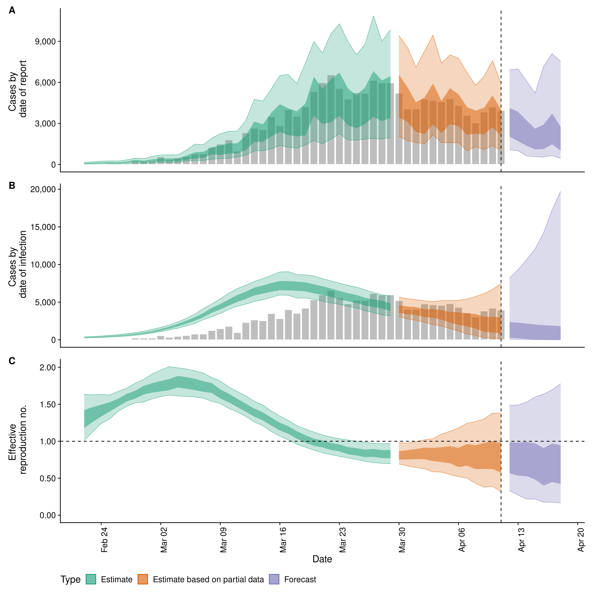
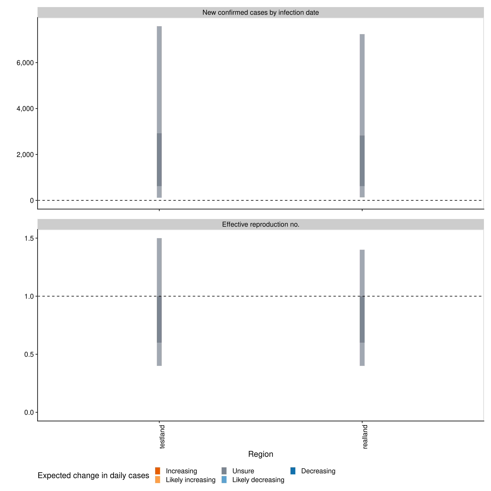

# EpiNow2: Estimate real-time case counts and time-varying epidemiological parameters

[](https://github.com/epiforecasts/EpiNow2/actions)
[](https://codecov.io/gh/epiforecasts/EpiNow2?branch=master)
[](https://zenodo.org/badge/latestdoi/247464257)

This package estimates the time-varying reproduction number, rate of
spread, and doubling time using a range of open-source tools, a novel
methodology, and current best practices. It aims to help users avoid
some of the limitations of naive implementations in a framework that is
informed by community feedback and is under active development. It
estimates the time-varying reproduction number on cases by date of
infection (using a similar approach to that implemented in the
[`{EpiEstim}`](https://github.com/annecori/EpiEstim)). Imputed
infections are then mapped to observed data (for example cases by date
of report) via a series of uncertain delay distributions (in the
examples in the package documentation these are an incubation period and
a reporting delay) and a reporting model that can include weekly
periodicity. The default model uses a non-stationary Gaussian process to
estimate the time-varying reproduction number but optionally a
stationary Gaussian process may be used (faster to estimate but reduced
performance for real time estimates) and arbitrary breakpoints can be
defined. A fixed reproduction number is also supported. When combined
with user defined breakpoints this gives the option of modelling the
time-varying reproduction number as piecewise linear. The documentation
for
[`estimate_infections`](https://epiforecasts.io/EpiNow2/reference/estimate_infections.html)
provides examples of the different options available. Propagating
uncertainty from all inputs into the final parameter estimates (helping
to mitigate spurious findings) is handled internally. Time-varying
estimates of the rate of growth are derived from the time-varying
reproduction estimates and the uncertain generation time. Optionally,
the time-varying reproduction number can be forecast forwards in time
using an integration with the
[`{EpiSoon}`](https://epiforecasts.io/EpiSoon) package and converted to
a case forecast using the renewal equation. Alternatively, the
time-varying reproduction number and cases can be forecast using a
Gaussian process. As a standalone tool non-parametric back-calculation
is also supported using a novel formulation based on a smoothed mean
delay shift of reported cases combined with a Gaussian process to
determine the most likely outbreak trajectory.

## Installation

Install the stable version of the package:

``` r
install.packages("EpiNow2")
```

Install the stable development version of the package using
[`{drat}`](https://epiforecasts.io/drat/):

``` r
install.packages("drat")
drat:::add("epiforecasts")
install.packages("EpiNow2")
```

Install the unstable development version of the package with:

``` r
remotes::install_github("epiforecasts/EpiNow2")
```

Windows users will need a working installation of Rtools in order to
build the package from source. See
[here](https://github.com/stan-dev/rstan/wiki/RStan-Getting-Started#checking-the-c-toolchain)
for a guide to installing Rtools for use with Stan (which is the
statistical modeling platform used for the underlying model). For simple
deployment/development a prebuilt docker image is also available (see
documentation
[here](https://github.com/epiforecasts/EpiNow2/wiki/Docker)).

## Quick start

`{EpiNow}` is designed to be used with a single function call or to be
used in an ad-hoc fashion via individual function calls. In the
following section we give an overview of the simple use case. For more
on using each function see the [function
documentation](https://epiforecasts.io/EpiNow2/reference/index.html).
The core functions are:
[`epinow`](https://epiforecasts.io/EpiNow2/reference/epinow.html),
[`regional_epinow`](https://epiforecasts.io/EpiNow2/reference/epinow.html),
[`estimate_infections`](https://epiforecasts.io/EpiNow2/reference/estimate_infections.html),
and
[`forecast_infections`](https://epiforecasts.io/EpiNow2/reference/forecast_infections.html).
[`estimate_infections`](https://epiforecasts.io/EpiNow2/reference/estimate_infections.html)
can be use on its own to infer the underlying infection case curve from
reported cases with Rt optionally returned (on by default). Estimating
the underlying infection case curve alone is substantially less
computationally demanding than also estimating Rt.

### Reporting delays, incubation period and generation time

Distributions can either be fitted using package functionality or
determined elsewhere and then defined with uncertainty for use in
`{EpiNow2}`. When data is supplied a subsampled bootstrapped lognormal
will be fit (to account for uncertainty in the observed data without
being biased by changes in incidence). An arbitrary number of delay
distributions are supported with the most common use case likely to be a
incubation period followed by a reporting delay.

``` r
reporting_delay <- EpiNow2::bootstrapped_dist_fit(rlnorm(100, log(6), 1))
## Set max allowed delay to 30 days to truncate computation
reporting_delay$max <- 30

reporting_delay
#> $mean
#> [1] 1.42554
#> 
#> $mean_sd
#> [1] 0.1756773
#> 
#> $sd
#> [1] 1.49372
#> 
#> $sd_sd
#> [1] 0.1580481
#> 
#> $max
#> [1] 30
```

Here we define the incubation period and generation time based on
literature estimates for Covid-19 (see
[here](https://github.com/epiforecasts/EpiNow/tree/master/data-raw) for
the code that generates these estimates).

``` r
generation_time <- list(mean = EpiNow2::covid_generation_times[1, ]$mean,
                        mean_sd = EpiNow2::covid_generation_times[1, ]$mean_sd,
                         sd = EpiNow2::covid_generation_times[1, ]$sd,
                         sd_sd = EpiNow2::covid_generation_times[1, ]$sd_sd,
                         max = 30)

incubation_period <- list(mean = EpiNow2::covid_incubation_period[1, ]$mean,
                          mean_sd = EpiNow2::covid_incubation_period[1, ]$mean_sd,
                          sd = EpiNow2::covid_incubation_period[1, ]$sd,
                          sd_sd = EpiNow2::covid_incubation_period[1, ]$sd_sd,
                          max = 30)
```

### [epinow](https://epiforecasts.io/EpiNow2/reference/epinow.html)

This function represents the core functionality of the package and
includes results reporting, plotting and optional saving. It requires a
data frame of cases by date of report and the distributions defined
above. An additional forecasting module is supported via `EpiSoon` and
companion packages (see documentation for an example).

Load example case data from `{EpiNow2}`.

``` r
reported_cases <- EpiNow2::example_confirmed[1:50]

head(reported_cases)
#>          date confirm
#> 1: 2020-02-22      14
#> 2: 2020-02-23      62
#> 3: 2020-02-24      53
#> 4: 2020-02-25      97
#> 5: 2020-02-26      93
#> 6: 2020-02-27      78
```

Estimate cases by date of infection, the time-varying reproduction
number, the rate of growth and forecast these estimates into the future
by 7 days. Summarise the posterior and return a summary table and plots
for reporting purposes. If a `target_folder` is supplied results can be
internally saved (with the option to also turn off explicit returning of
results). *Note that for real use cases more samples and a longer warm
up may be needed*.

``` r
estimates <- EpiNow2::epinow(reported_cases = reported_cases, 
                             generation_time = generation_time,
                             delays = list(incubation_period, reporting_delay),
                             horizon = 7, samples = 1000, warmup = 200, 
                             cores = 4, chains = 4, verbose = TRUE, 
                             adapt_delta = 0.95)

names(estimates)
#> [1] "estimates"                "estimated_reported_cases"
#> [3] "summary"                  "plots"
```

Both summary measures and posterior samples are returned for all
parameters in an easily explored format.

``` r
estimates$estimates
#> $samples
#>                 variable          parameter time       date sample    value
#>      1:       infections imputed_infections    1 2020-02-04      1    2.000
#>      2:       infections imputed_infections    2 2020-02-05      1    6.000
#>      3:       infections imputed_infections    3 2020-02-06      1   14.000
#>      4:       infections imputed_infections    4 2020-02-07      1   30.000
#>      5:       infections imputed_infections    5 2020-02-08      1   47.000
#>     ---                                                                    
#> 259071: prior_infections   prior_infections   71 2020-04-14      1 2394.826
#> 259072: prior_infections   prior_infections   72 2020-04-15      1 2335.601
#> 259073: prior_infections   prior_infections   73 2020-04-16      1 2277.840
#> 259074: prior_infections   prior_infections   74 2020-04-17      1 2221.508
#> 259075: prior_infections   prior_infections   75 2020-04-18      1 2166.569
#>         strat     type
#>      1:  <NA> estimate
#>      2:  <NA> estimate
#>      3:  <NA> estimate
#>      4:  <NA> estimate
#>      5:  <NA> estimate
#>     ---               
#> 259071:  <NA> forecast
#> 259072:  <NA> forecast
#> 259073:  <NA> forecast
#> 259074:  <NA> forecast
#> 259075:  <NA> forecast
#> 
#> $summarised
#>            date       variable strat     type      bottom          top
#>   1: 2020-02-22              R  <NA> estimate   0.4799337     1.159969
#>   2: 2020-02-23              R  <NA> estimate   0.6103788     1.219749
#>   3: 2020-02-24              R  <NA> estimate   0.7161870     1.247816
#>   4: 2020-02-25              R  <NA> estimate   0.7816067     1.229354
#>   5: 2020-02-26              R  <NA> estimate   0.9425218     1.313403
#>  ---                                                                  
#> 330: 2020-04-14 reported_cases  <NA> forecast 328.0000000  8209.000000
#> 331: 2020-04-15 reported_cases  <NA> forecast 216.0000000  7279.000000
#> 332: 2020-04-16 reported_cases  <NA> forecast  23.0000000  8617.000000
#> 333: 2020-04-17 reported_cases  <NA> forecast 129.0000000 11652.000000
#> 334: 2020-04-18 reported_cases  <NA> forecast 133.0000000 10579.000000
#>            lower        upper       median         mean           sd
#>   1:   0.6982494    0.9795539    0.8263598    0.8350719 2.095891e-01
#>   2:   0.7275116    0.9735133    0.8812007    0.8879818 1.861482e-01
#>   3:   0.8264897    1.0453062    0.9474160    0.9513568 1.619143e-01
#>   4:   0.9238821    1.1030105    1.0234703    1.0250499 1.372025e-01
#>   5:   1.0333262    1.1825495    1.1090682    1.1083864 1.136178e-01
#>  ---                                                                
#> 330: 659.0000000 2938.0000000 2756.0000000 4054.3770000 4.296777e+03
#> 331: 735.0000000 2626.0000000 2275.0000000 3797.4430000 8.289196e+03
#> 332: 782.0000000 3063.0000000 2758.5000000 4903.1210000 9.808826e+03
#> 333: 453.0000000 3119.0000000 3009.5000000 7633.2510000 2.961289e+04
#> 334: 520.0000000 2574.0000000 2339.5000000 8957.3950000 5.753880e+04
```

Reported cases are returned separately in order to ease reporting of
forecasts and model evaluation.

``` r
estimates$estimated_reported_cases
#> $samples
#>              date sample cases  type
#>     1: 2020-02-22      1   360 gp_rt
#>     2: 2020-02-23      1   145 gp_rt
#>     3: 2020-02-24      1   366 gp_rt
#>     4: 2020-02-25      1   182 gp_rt
#>     5: 2020-02-26      1   140 gp_rt
#>    ---                              
#> 56996: 2020-04-14   1000  2324 gp_rt
#> 56997: 2020-04-15   1000  7918 gp_rt
#> 56998: 2020-04-16   1000  3881 gp_rt
#> 56999: 2020-04-17   1000  6364 gp_rt
#> 57000: 2020-04-18   1000 13071 gp_rt
#> 
#> $summarised
#>           date  type bottom   top lower upper median     mean         sd
#>  1: 2020-02-22 gp_rt     26   412   104   260  209.5  234.100   146.7338
#>  2: 2020-02-23 gp_rt     42   560   160   357  276.0  310.532   189.3327
#>  3: 2020-02-24 gp_rt     46   618    94   322  298.0  346.342   222.9021
#>  4: 2020-02-25 gp_rt     42   632   108   327  288.0  329.370   206.1814
#>  5: 2020-02-26 gp_rt     42   565    92   289  253.0  296.315   189.5741
#>  6: 2020-02-27 gp_rt     48   705   132   375  335.5  380.423   235.9627
#>  7: 2020-02-28 gp_rt     64   918   127   431  392.0  468.044   316.1305
#>  8: 2020-02-29 gp_rt     55   787   140   408  337.0  408.787   287.4752
#>  9: 2020-03-01 gp_rt     54   932   169   469  412.0  493.603   327.8901
#> 10: 2020-03-02 gp_rt     37   946   147   490  437.0  514.444   336.0263
#> 11: 2020-03-03 gp_rt     48   888   199   520  422.5  484.453   321.3738
#> 12: 2020-03-04 gp_rt     68   879   157   460  409.0  482.346   315.7432
#> 13: 2020-03-05 gp_rt     76  1257   221   646  574.0  670.375   434.6318
#> 14: 2020-03-06 gp_rt     65  1563   306   871  743.0  869.703   573.5379
#> 15: 2020-03-07 gp_rt    148  1595   380   958  776.0  879.106   599.2146
#> 16: 2020-03-08 gp_rt    152  2178   382  1124 1010.5 1156.918   720.9711
#> 17: 2020-03-09 gp_rt    102  2345   555  1395 1142.0 1306.515   843.9360
#> 18: 2020-03-10 gp_rt    180  2561   616  1552 1220.0 1397.605   900.7628
#> 19: 2020-03-11 gp_rt    184  2669   625  1583 1209.5 1413.360   972.0945
#> 20: 2020-03-12 gp_rt    128  3731   674  2074 1739.5 2024.635  1307.4679
#> 21: 2020-03-13 gp_rt    295  5169   668  2524 2335.5 2781.959  1772.3560
#> 22: 2020-03-14 gp_rt    372  4960   860  2673 2333.5 2704.360  1734.0109
#> 23: 2020-03-15 gp_rt    428  6859  1286  3572 2989.5 3461.741  2257.0806
#> 24: 2020-03-16 gp_rt    588  7788  1089  3647 3420.5 4010.594  2628.9654
#> 25: 2020-03-17 gp_rt    494  7355  1180  3814 3292.5 3950.180  2795.0785
#> 26: 2020-03-18 gp_rt    608  6925  1320  3658 3202.0 3743.531  2494.4540
#> 27: 2020-03-19 gp_rt    558  9002  1952  5325 4273.5 4858.072  3075.7807
#> 28: 2020-03-20 gp_rt    425 11178  2107  6046 5267.5 6122.168  3981.2297
#> 29: 2020-03-21 gp_rt    808 10200  1805  5383 4608.0 5417.694  3549.1468
#> 30: 2020-03-22 gp_rt    772 11137  1884  5848 5129.0 6078.111  3944.6501
#> 31: 2020-03-23 gp_rt    764 11928  2907  7109 5667.5 6524.601  4197.9734
#> 32: 2020-03-24 gp_rt    395 10385  1692  5364 4793.5 5637.967  3750.5528
#> 33: 2020-03-25 gp_rt    842  9438  2015  5509 4415.5 5018.229  3089.0976
#> 34: 2020-03-26 gp_rt    697 11205  2038  5861 5050.0 5876.402  3801.1569
#> 35: 2020-03-27 gp_rt    859 13384  1676  6368 5837.0 7115.025  4903.4167
#> 36: 2020-03-28 gp_rt    942 10738  2129  5661 4739.0 5666.411  3706.5938
#> 37: 2020-03-29 gp_rt    605 11395  1802  5958 5369.0 6286.554  4228.5693
#> 38: 2020-03-30 gp_rt    689 10810  2214  6057 5329.0 6032.036  4046.3503
#> 39: 2020-03-31 gp_rt    715  9873  1624  5001 4442.0 5163.658  3448.9519
#> 40: 2020-04-01 gp_rt    436  8180  1170  4224 3812.5 4444.624  2929.5862
#> 41: 2020-04-02 gp_rt    777  9324  1786  4988 4398.0 5101.565  3234.7690
#> 42: 2020-04-03 gp_rt    937 11144  2526  6239 5022.0 5876.950  3941.3812
#> 43: 2020-04-04 gp_rt    542  9167  1345  4406 3997.5 4735.220  3126.2891
#> 44: 2020-04-05 gp_rt    404  9514  2156  5423 4319.0 5061.338  3448.3072
#> 45: 2020-04-06 gp_rt    659  8977  1830  4819 4046.5 4719.270  3030.2740
#> 46: 2020-04-07 gp_rt    595  7730  1478  4146 3523.0 4112.556  2754.7428
#> 47: 2020-04-08 gp_rt    309  6769   948  3245 2971.0 3620.551  2760.2672
#> 48: 2020-04-09 gp_rt    254  7339   904  3523 3322.5 3952.569  2620.5935
#> 49: 2020-04-10 gp_rt    513  8644  1747  4740 4004.0 4609.633  2976.8065
#> 50: 2020-04-11 gp_rt    718  7228  1150  3564 3160.0 3832.011  2709.4531
#> 51: 2020-04-12 gp_rt    412  8227  1041  3783 3432.0 4320.248  3333.6815
#> 52: 2020-04-13 gp_rt    346  8415  1099  3697 3268.0 4325.808  4245.1150
#> 53: 2020-04-14 gp_rt    328  8209   659  2938 2756.0 4054.377  4296.7769
#> 54: 2020-04-15 gp_rt    216  7279   735  2626 2275.0 3797.443  8289.1961
#> 55: 2020-04-16 gp_rt     23  8617   782  3063 2758.5 4903.121  9808.8258
#> 56: 2020-04-17 gp_rt    129 11652   453  3119 3009.5 7633.251 29612.8945
#> 57: 2020-04-18 gp_rt    133 10579   520  2574 2339.5 8957.395 57538.7995
#>           date  type bottom   top lower upper median     mean         sd
```

A summary table is returned for rapidly understanding the results and
for reporting purposes.

``` r
estimates$summary
#>                                  measure              estimate numeric_estimate
#> 1: New confirmed cases by infection date    2298 (10 -- 12843)     <data.table>
#> 2:        Expected change in daily cases                Unsure             0.69
#> 3:            Effective reproduction no.      0.8 (0.2 -- 1.6)     <data.table>
#> 4:                        Rate of growth -0.07 (-0.25 -- 0.18)     <data.table>
#> 5:          Doubling/halving time (days)   -10.1 (3.8 -- -2.8)     <data.table>
```

A range of plots are returned (with the single summary plot shown
below).

``` r
estimates$plots$summary
```

<!-- -->

### [Regional epinow](https://epiforecasts.io/EpiNow2/reference/regional_epinow.html)

This function runs the the `epinow` function across multiple regions in
an efficient manner.

Define cases in multiple regions delineated by the region variable.

``` r
reported_cases <- data.table::rbindlist(list(
   data.table::copy(reported_cases)[, region := "testland"],
   reported_cases[, region := "realland"]))

head(reported_cases)
#>          date confirm   region
#> 1: 2020-02-22      14 testland
#> 2: 2020-02-23      62 testland
#> 3: 2020-02-24      53 testland
#> 4: 2020-02-25      97 testland
#> 5: 2020-02-26      93 testland
#> 6: 2020-02-27      78 testland
```

Run the pipeline on each region in turn. The commented code (requires
the `{future}` package) can be used to run regions in parallel (when in
most scenarios `cores` should be set to 1).

``` r
## future::plan("multisession")
estimates <- EpiNow2::regional_epinow(reported_cases = reported_cases, 
                                      generation_time = generation_time,
                                      delays = list(incubation_period, reporting_delay),
                                      horizon = 7, samples = 1000, warmup = 200,
                                      cores = 4, chains = 4, adapt_delta = 0.95,
                                      verbose = TRUE)
```

Results from each region are stored in a `regional` list with across
region summary measures and plots stored in a `summary` list. All
results can be set to be internally saved by setting the `target_folder`
and `summary_dir` arguments.

Summary measures that are returned include a table formatted for
reporting (along with raw results for further processing).

``` r
estimates$summary$summarised_results$table
#>      Region New confirmed cases by infection date
#> 1: realland                    2238 (13 -- 10334)
#> 2: testland                     2137 (1 -- 10509)
#>    Expected change in daily cases Effective reproduction no.
#> 1:                         Unsure           0.7 (0.2 -- 1.6)
#> 2:                         Unsure           0.7 (0.1 -- 1.5)
#>           Rate of growth Doubling/halving time (days)
#> 1: -0.07 (-0.25 -- 0.17)           -9.6 (4.2 -- -2.7)
#> 2: -0.08 (-0.26 -- 0.17)           -8.5 (4.2 -- -2.7)
```

A range of plots are again returned (with the single summary plot shown
below).

``` r
estimates$summary$summary_plot
```

<!-- -->

### Reporting templates

Rmarkdown templates are provided in the package (`templates`) for
semi-automated reporting of estimates. These are currently undocumented
but an example integration can be seen
[here](https://github.com/epiforecasts/covid/blob/master/_posts/national/united-kingdom/united-kingdom.Rmd).
If using these templates to report your results please highlight our
[limitations](https://epiforecasts.io/covid/) as these are key to
understanding our results.

## Contributing

File an issue [here](https://github.com/epiforecasts/EpiNow2/issues) if
you have identified an issue with the package. Please note that due to
operational constraints priority will be given to users informing
government policy or offering methodological insights. We welcome all
contributions, in particular those that improve the approach or the
robustness of the code base.
