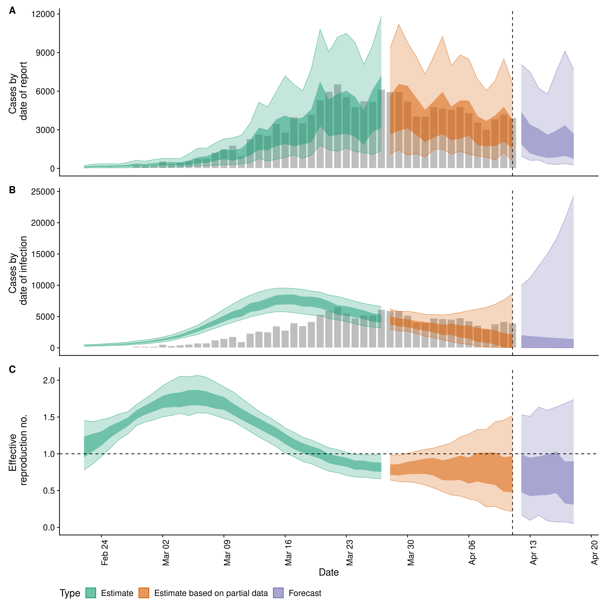
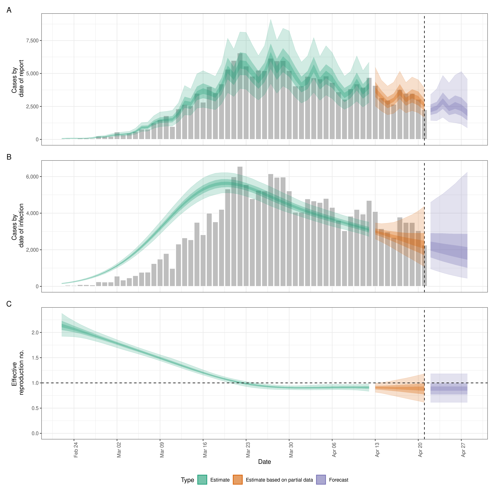

# EpiNow2: Estimate real-time case counts and time-varying epidemiological parameters

[](https://github.com/epiforecasts/EpiNow2/actions)
[](https://codecov.io/gh/epiforecasts/EpiNow2?branch=master)
[](https://zenodo.org/badge/latestdoi/247464257)

This package estimates the time-varying reproduction number, rate of
spread, and doubling time using a range of open-source tools, a novel
methodology, and current best practices. It aims to help users avoid
some of the limitations of naive implementations in a framework that is
informed by community feedback and is under active development. It
estimates the time-varying reproduction number on cases by date of
infection (using a similar approach to that implemented in the
[`{EpiEstim}`](https://github.com/annecori/EpiEstim)). Imputed
infections are then mapped to observed data (for example cases by date
of report) via a series of uncertain delay distributions (in the
examples in the package documentation these are an incubation period and
a reporting delay) and a reporting model that can include weekly
periodicity. The default model uses a non-stationary Gaussian process to
estimate the time-varying reproduction number but optionally a
stationary Gaussian process may be used (faster to estimate but reduced
performance for real time estimates) and arbitrary breakpoints can be
defined. A fixed reproduction number is also supported. When combined
with user defined breakpoints this gives the option of modelling the
time-varying reproduction number as piecewise linear. The documentation
for
[`estimate_infections`](https://epiforecasts.io/EpiNow2/reference/estimate_infections.html)
provides examples of the different options available. Propagating
uncertainty from all inputs into the final parameter estimates (helping
to mitigate spurious findings) is handled internally. Time-varying
estimates of the rate of growth are derived from the time-varying
reproduction estimates and the uncertain generation time. Optionally,
the time-varying reproduction number can be forecast forwards in time
using an integration with the
[`{EpiSoon}`](https://epiforecasts.io/EpiSoon) package and converted to
a case forecast using the renewal equation. Alternatively, the
time-varying reproduction number and cases can be forecast using a
Gaussian process. As a standalone tool non-parametric back-calculation
is also supported using a novel formulation based on a smoothed mean
delay shift of reported cases combined with a Gaussian process to
determine the most likely outbreak trajectory.

## Installation

Install the stable version of the package using
[`{drat}`](https://epiforecasts.io/drat/):

``` r
install.packages("drat")
drat:::add("epiforecasts")
install.packages("EpiNow2")
```

Install the development version of the package with:

``` r
remotes::install_github("epiforecasts/EpiNow2")
```

Windows users will need a working installation of Rtools in order to
build the package from source. See
[here](https://github.com/stan-dev/rstan/wiki/RStan-Getting-Started#checking-the-c-toolchain)
for a guide to installing Rtools for use with Stan (which is the
statistical modeling platform used for the underlying model). For simple
deployment/development a prebuilt docker image is also available (see
documentation
[here](https://github.com/epiforecasts/EpiNow2/wiki/Docker)).

## Quick start

`{EpiNow}` is designed to be used with a single function call or to be
used in an ad-hoc fashion via individual function calls. In the
following section we give an overview of the simple use case. For more
on using each function see the [function
documentation](https://epiforecasts.io/EpiNow2/reference/index.html).
The core functions are:
[`epinow`](https://epiforecasts.io/EpiNow2/reference/epinow.html),
[`regional_epinow`](https://epiforecasts.io/EpiNow2/reference/epinow.html),
[`estimate_infections`](https://epiforecasts.io/EpiNow2/reference/estimate_infections.html),
and
[`forecast_infections`](https://epiforecasts.io/EpiNow2/reference/forecast_infections.html).
[`estimate_infections`](https://epiforecasts.io/EpiNow2/reference/estimate_infections.html)
can be use on its own to infer the underlying infection case curve from
reported cases with Rt optionally returned (on by default). Estimating
the underlying infection case curve alone is substantially less
computationally demanding than also estimating Rt.

### Reporting delays, incubation period and generation time

Distributions can either be fitted using package functionality or
determined elsewhere and then defined with uncertainty for use in
`{EpiNow2}`. When data is supplied a subsampled bootstrapped lognormal
will be fit (to account for uncertainty in the observed data without
being biased by changes in incidence). An arbitrary number of delay
distributions are supported with the most common use case likely to be a
incubation period followed by a reporting delay.

``` r
reporting_delay <- EpiNow2::bootstrapped_dist_fit(rlnorm(100, log(6), 1))
## Set max allowed delay to 30 days to truncate computation
reporting_delay$max <- 30

reporting_delay
#> $mean
#> [1] 1.885566
#> 
#> $mean_sd
#> [1] 0.1940598
#> 
#> $sd
#> [1] 1.083473
#> 
#> $sd_sd
#> [1] 0.1075116
#> 
#> $max
#> [1] 30
```

Here we define the incubation period and generation time based on
literature estimates for Covid-19 (see
[here](https://github.com/epiforecasts/EpiNow/tree/master/data-raw) for
the code that generates these estimates).

``` r
generation_time <- list(mean = EpiNow2::covid_generation_times[1, ]$mean,
                        mean_sd = EpiNow2::covid_generation_times[1, ]$mean_sd,
                         sd = EpiNow2::covid_generation_times[1, ]$sd,
                         sd_sd = EpiNow2::covid_generation_times[1, ]$sd_sd,
                         max = 30)

incubation_period <- list(mean = EpiNow2::covid_incubation_period[1, ]$mean,
                          mean_sd = EpiNow2::covid_incubation_period[1, ]$mean_sd,
                          sd = EpiNow2::covid_incubation_period[1, ]$sd,
                          sd_sd = EpiNow2::covid_incubation_period[1, ]$sd_sd,
                          max = 30)
```

### [epinow](https://epiforecasts.io/EpiNow2/reference/epinow.html)

This function represents the core functionality of the package and
includes results reporting, plotting and optional saving. It requires a
data frame of cases by date of report and the distributions defined
above. An additional forecasting module is supported via `EpiSoon` and
companion packages (see documentation for an example).

Load example case data from `{EpiNow2}`.

``` r
reported_cases <- EpiNow2::example_confirmed[1:50]

head(reported_cases)
#>          date confirm
#> 1: 2020-02-22      14
#> 2: 2020-02-23      62
#> 3: 2020-02-24      53
#> 4: 2020-02-25      97
#> 5: 2020-02-26      93
#> 6: 2020-02-27      78
```

Estimate cases by date of infection, the time-varying reproduction
number, the rate of growth and forecast these estimates into the future
by 7 days. Summarise the posterior and return a summary table and plots
for reporting purposes. If a `target_folder` is supplied results can be
internally saved (with the option to also turn off explicit returning of
results). *Note that for real use cases more samples and a longer warm
up may be needed*.

``` r
estimates <- EpiNow2::epinow(reported_cases = reported_cases, 
                             generation_time = generation_time,
                             delays = list(incubation_period, reporting_delay),
                             horizon = 7, samples = 1000, warmup = 200, 
                             cores = 4, chains = 4, verbose = TRUE, 
                             adapt_delta = 0.95)

names(estimates)
#> [1] "estimates"                "estimated_reported_cases"
#> [3] "summary"                  "plots"
```

Both summary measures and posterior samples are returned for all
parameters in an easily explored format.

``` r
estimates$estimates
#> $samples
#>                 variable          parameter time       date sample    value
#>      1:       infections imputed_infections    1 2020-02-05      1    2.000
#>      2:       infections imputed_infections    2 2020-02-06      1   13.000
#>      3:       infections imputed_infections    3 2020-02-07      1   24.000
#>      4:       infections imputed_infections    4 2020-02-08      1   34.000
#>      5:       infections imputed_infections    5 2020-02-09      1   42.000
#>     ---                                                                    
#> 258070: prior_infections   prior_infections   70 2020-04-14      1 2455.553
#> 258071: prior_infections   prior_infections   71 2020-04-15      1 2394.826
#> 258072: prior_infections   prior_infections   72 2020-04-16      1 2335.601
#> 258073: prior_infections   prior_infections   73 2020-04-17      1 2277.840
#> 258074: prior_infections   prior_infections   74 2020-04-18      1 2221.508
#>         strat     type
#>      1:  <NA> estimate
#>      2:  <NA> estimate
#>      3:  <NA> estimate
#>      4:  <NA> estimate
#>      5:  <NA> estimate
#>     ---               
#> 258070:  <NA> forecast
#> 258071:  <NA> forecast
#> 258072:  <NA> forecast
#> 258073:  <NA> forecast
#> 258074:  <NA> forecast
#> 
#> $summarised
#>            date       variable strat     type      bottom         top
#>   1: 2020-02-22              R  <NA> estimate   0.5467694    1.286161
#>   2: 2020-02-23              R  <NA> estimate   0.6521650    1.304901
#>   3: 2020-02-24              R  <NA> estimate   0.7546103    1.313469
#>   4: 2020-02-25              R  <NA> estimate   0.8838421    1.342418
#>   5: 2020-02-26              R  <NA> estimate   1.0219307    1.393675
#>  ---                                                                 
#> 328: 2020-04-14 reported_cases  <NA> forecast 388.0000000 7021.000000
#> 329: 2020-04-15 reported_cases  <NA> forecast 264.0000000 5990.000000
#> 330: 2020-04-16 reported_cases  <NA> forecast 242.0000000 7410.000000
#> 331: 2020-04-17 reported_cases  <NA> forecast 154.0000000 9266.000000
#> 332: 2020-04-18 reported_cases  <NA> forecast 242.0000000 8771.000000
#>            lower       upper       median         mean           sd
#>   1:   0.7034014    1.029771    0.9072823 9.140003e-01 2.322419e-01
#>   2:   0.8171089    1.099669    0.9613683 9.689321e-01 2.029464e-01
#>   3:   0.8818499    1.119294    1.0305041 1.034429e+00 1.728571e-01
#>   4:   1.0193432    1.214194    1.1082904 1.110039e+00 1.429186e-01
#>   5:   1.1142117    1.268379    1.1949682 1.194685e+00 1.159475e-01
#>  ---                                                               
#> 328: 848.0000000 3013.000000 2674.0000000 3.656382e+03 3.975340e+03
#> 329: 445.0000000 2233.000000 2115.0000000 3.279910e+03 5.432876e+03
#> 330: 825.0000000 2899.000000 2516.0000000 4.699695e+03 1.434458e+04
#> 331: 751.0000000 3285.000000 2998.5000000 1.150776e+04 1.116779e+05
#> 332: 516.0000000 2477.000000 2345.5000000 3.256363e+04 5.940402e+05
```

Reported cases are returned separately in order to ease reporting of
forecasts and model evaluation.

``` r
estimates$estimated_reported_cases
#> $samples
#>              date sample cases  type
#>     1: 2020-02-22      1   150 gp_rt
#>     2: 2020-02-23      1   353 gp_rt
#>     3: 2020-02-24      1   292 gp_rt
#>     4: 2020-02-25      1   234 gp_rt
#>     5: 2020-02-26      1   519 gp_rt
#>    ---                              
#> 56996: 2020-04-14   1000  3003 gp_rt
#> 56997: 2020-04-15   1000  1035 gp_rt
#> 56998: 2020-04-16   1000  3866 gp_rt
#> 56999: 2020-04-17   1000  1485 gp_rt
#> 57000: 2020-04-18   1000   423 gp_rt
#> 
#> $summarised
#>           date  type bottom   top lower upper median      mean          sd
#>  1: 2020-02-22 gp_rt     24   337    75   193  167.5   188.552    111.1443
#>  2: 2020-02-23 gp_rt     36   451   113   274  225.0   251.523    150.2807
#>  3: 2020-02-24 gp_rt     42   534   117   294  250.0   285.836    173.8437
#>  4: 2020-02-25 gp_rt     43   508    88   282  253.0   282.980    172.1243
#>  5: 2020-02-26 gp_rt     36   446   126   291  245.0   268.703    154.0110
#>  6: 2020-02-27 gp_rt     47   677   159   385  315.5   362.559    223.9880
#>  7: 2020-02-28 gp_rt     93   855   174   467  401.0   447.477    269.1780
#>  8: 2020-02-29 gp_rt     45   692   153   395  337.5   388.398    240.1563
#>  9: 2020-03-01 gp_rt     82   862   173   471  409.0   479.091    290.8755
#> 10: 2020-03-02 gp_rt     40   965   165   507  450.5   525.871    334.8466
#> 11: 2020-03-03 gp_rt     72   898   194   498  426.5   495.400    316.0904
#> 12: 2020-03-04 gp_rt     64   893   214   516  421.0   487.541    313.5501
#> 13: 2020-03-05 gp_rt     61  1187   252   669  562.5   650.892    414.0864
#> 14: 2020-03-06 gp_rt    181  1675   421   997  828.0   925.804    556.0546
#> 15: 2020-03-07 gp_rt    169  1630   320   863  740.0   840.909    510.3828
#> 16: 2020-03-08 gp_rt    205  2143   409  1118  966.0  1144.323    778.3898
#> 17: 2020-03-09 gp_rt    191  2525   527  1352 1151.0  1370.412    873.2386
#> 18: 2020-03-10 gp_rt    217  2583   449  1318 1177.0  1380.036    890.2474
#> 19: 2020-03-11 gp_rt    235  2783   600  1505 1305.5  1485.954    952.6774
#> 20: 2020-03-12 gp_rt    363  3704   662  1952 1762.0  1974.768   1193.0974
#> 21: 2020-03-13 gp_rt    387  5392  1182  3024 2512.0  2913.637   1754.2430
#> 22: 2020-03-14 gp_rt    508  4702  1065  2713 2318.0  2630.658   1517.8944
#> 23: 2020-03-15 gp_rt    291  6401  1244  3561 3083.5  3603.214   2349.9933
#> 24: 2020-03-16 gp_rt    361  7293  1478  3918 3447.0  3997.599   2653.0104
#> 25: 2020-03-17 gp_rt    600  6784  1354  3710 3320.5  3796.676   2378.0071
#> 26: 2020-03-18 gp_rt    531  6631  1269  3762 3177.5  3671.629   2299.1788
#> 27: 2020-03-19 gp_rt    473  8521  1629  4758 4182.0  4736.369   2820.2003
#> 28: 2020-03-20 gp_rt    934 11059  2451  6198 5004.0  5907.992   3758.3171
#> 29: 2020-03-21 gp_rt   1106 10137  1610  4932 4452.5  5282.687   3540.8188
#> 30: 2020-03-22 gp_rt    889 11505  2587  6435 5292.5  6092.569   3747.1369
#> 31: 2020-03-23 gp_rt    860 11304  2227  6085 5329.0  6239.494   4068.0137
#> 32: 2020-03-24 gp_rt    522  9654  1889  5277 4764.5  5458.194   3299.4970
#> 33: 2020-03-25 gp_rt    521  8674  1765  4553 4145.5  4773.146   3007.6454
#> 34: 2020-03-26 gp_rt   1009 10336  2147  5909 4993.0  5728.587   3590.6238
#> 35: 2020-03-27 gp_rt    844 13076  3041  7527 6161.5  7094.678   4303.9854
#> 36: 2020-03-28 gp_rt    823 10165  1892  5484 4844.0  5586.406   3355.2740
#> 37: 2020-03-29 gp_rt    831 11039  2415  6337 5425.5  6207.469   3930.0675
#> 38: 2020-03-30 gp_rt   1243 10986  1713  5496 5129.0  6022.896   3609.6768
#> 39: 2020-03-31 gp_rt    909  9367  1910  5185 4421.5  5160.897   3149.5577
#> 40: 2020-04-01 gp_rt    348  7642  1710  4345 3744.0  4277.469   2549.6342
#> 41: 2020-04-02 gp_rt    882  9178  2083  5083 4349.5  5030.444   3092.2287
#> 42: 2020-04-03 gp_rt    887 10953  2379  6080 5180.0  5905.495   3709.7722
#> 43: 2020-04-04 gp_rt    505  8371  1645  4654 4169.5  4767.936   3193.6315
#> 44: 2020-04-05 gp_rt    549  9173  2354  5675 4347.5  5066.003   3179.3633
#> 45: 2020-04-06 gp_rt    629  8390  2010  4934 4097.5  4741.014   3097.1787
#> 46: 2020-04-07 gp_rt    574  7508  1423  3823 3422.5  4056.744   2575.7189
#> 47: 2020-04-08 gp_rt    593  6301  1415  3536 2868.5  3371.607   2072.2361
#> 48: 2020-04-09 gp_rt    358  7413  1365  3921 3385.0  4000.069   2595.5031
#> 49: 2020-04-10 gp_rt    451  8899  1423  4664 4064.0  4817.742   3330.3820
#> 50: 2020-04-11 gp_rt    367  6993  1344  3715 3072.0  3705.694   2456.8170
#> 51: 2020-04-12 gp_rt    448  8041  1085  3627 3337.0  4230.349   3306.0647
#> 52: 2020-04-13 gp_rt    327  7557  1566  3954 3151.0  4064.422   3366.0997
#> 53: 2020-04-14 gp_rt    388  7021   848  3013 2674.0  3656.382   3975.3395
#> 54: 2020-04-15 gp_rt    264  5990   445  2233 2115.0  3279.910   5432.8762
#> 55: 2020-04-16 gp_rt    242  7410   825  2899 2516.0  4699.695  14344.5823
#> 56: 2020-04-17 gp_rt    154  9266   751  3285 2998.5 11507.764 111677.8802
#> 57: 2020-04-18 gp_rt    242  8771   516  2477 2345.5 32563.633 594040.1764
#>           date  type bottom   top lower upper median      mean          sd
```

A summary table is returned for rapidly understanding the results and
for reporting purposes.

``` r
estimates$summary
#>                                  measure              estimate numeric_estimate
#> 1: New confirmed cases by infection date      1772 (2 -- 8917)     <data.table>
#> 2:        Expected change in daily cases                Unsure             0.71
#> 3:            Effective reproduction no.      0.8 (0.1 -- 1.5)     <data.table>
#> 4:                        Rate of growth -0.07 (-0.29 -- 0.14)     <data.table>
#> 5:          Doubling/halving time (days)   -10.1 (4.9 -- -2.4)     <data.table>
```

A range of plots are returned (with the single summary plot shown
below).

``` r
estimates$plots$summary
```

<!-- -->

### [Regional epinow](https://epiforecasts.io/EpiNow2/reference/regional_epinow.html)

This function runs the the `epinow` function across multiple regions in
an efficient manner.

Define cases in multiple regions delineated by the region variable.

``` r
reported_cases <- data.table::rbindlist(list(
   data.table::copy(reported_cases)[, region := "testland"],
   reported_cases[, region := "realland"]))

head(reported_cases)
#>          date confirm   region
#> 1: 2020-02-22      14 testland
#> 2: 2020-02-23      62 testland
#> 3: 2020-02-24      53 testland
#> 4: 2020-02-25      97 testland
#> 5: 2020-02-26      93 testland
#> 6: 2020-02-27      78 testland
```

Run the pipeline on each region in turn. The commented code (requires
the `{future}` package) can be used to run regions in parallel (when in
most scenarios `cores` should be set to 1).

``` r
## future::plan("multisession")
estimates <- EpiNow2::regional_epinow(reported_cases = reported_cases, 
                                      generation_time = generation_time,
                                      delays = list(incubation_period, reporting_delay),
                                      horizon = 7, samples = 1000, warmup = 200,
                                      cores = 4, chains = 4, adapt_delta = 0.95,
                                      verbose = TRUE)
```

Results from each region are stored in a `regional` list with across
region summary measures and plots stored in a `summary` list. All
results can be set to be internally saved by setting the `target_folder`
and `summary_dir` arguments.

Summary measures that are returned include a table formatted for
reporting (along with raw results for further processing).

``` r
estimates$summary$summarised_results$table
#>      Region New confirmed cases by infection date
#> 1: realland                    1632 (21 -- 10366)
#> 2: testland                    1819 (12 -- 11225)
#>    Expected change in daily cases Effective reproduction no.
#> 1:                         Unsure           0.7 (0.1 -- 1.6)
#> 2:                         Unsure           0.8 (0.1 -- 1.6)
#>           Rate of growth Doubling/halving time (days)
#> 1:  -0.08 (-0.3 -- 0.16)           -9.2 (4.4 -- -2.3)
#> 2: -0.07 (-0.31 -- 0.17)          -10.2 (4.1 -- -2.3)
```

A range of plots are again returned (with the single summary plot shown
below).

``` r
estimates$summary$summary_plot
```

<!-- -->

### Reporting templates

Rmarkdown templates are provided in the package (`templates`) for
semi-automated reporting of estimates. These are currently undocumented
but an example integration can be seen
[here](https://github.com/epiforecasts/covid/blob/master/_posts/national/united-kingdom/united-kingdom.Rmd).
If using these templates to report your results please highlight our
[limitations](https://epiforecasts.io/covid/) as these are key to
understanding our results.

## Contributing

File an issue [here](https://github.com/epiforecasts/EpiNow2/issues) if
you have identified an issue with the package. Please note that due to
operational constraints priority will be given to users informing
government policy or offering methodological insights. We welcome all
contributions, in particular those that improve the approach or the
robustness of the code base.
