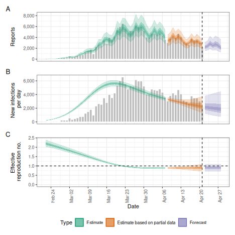

# Getting started with EpiNow2

## Quick start

In the following section we give an overview of the simple use case for
[`epinow()`](https://epiforecasts.io/EpiNow2/reference/epinow.md) and
[`regional_epinow()`](https://epiforecasts.io/EpiNow2/reference/regional_epinow.md).

The first step to using the package is to load it as follows.

``` r
library(EpiNow2)
```

### Reporting delays, incubation period and generation time

Distributions can be supplied in two ways. First, one can supply delay
data to
[`estimate_delay()`](https://epiforecasts.io/EpiNow2/reference/estimate_delay.md),
where a subsampled bootstrapped lognormal will be fit to account for
uncertainty in the observed data without being biased by changes in
incidence (see `?EpiNow2::estimate_delay()`).

Second, one can specify predetermined delays with uncertainty using the
distribution functions such as `Gamma` or `Lognormal`. An arbitrary
number of delay distributions are supported in `dist_spec()` with a
common use case being an incubation period followed by a reporting
delay. For more information on specifying distributions see (see
[`?EpiNow2::Distributions`](https://epiforecasts.io/EpiNow2/reference/Distributions.md)).

For example if data on the delay between onset and infection was
available we could fit a distribution to it, using
[`estimate_delay()`](https://epiforecasts.io/EpiNow2/reference/estimate_delay.md),
with appropriate uncertainty as follows (note this is a synthetic
example),

``` r
reporting_delay <- estimate_delay(
  rlnorm(1000, log(2), 1),
  max_value = 14, bootstraps = 1
)
```

If data was not available we could instead specify an informed estimate
of the likely delay using the distribution functions `Gamma` or
`LogNormal`. To demonstrate, we choose a lognormal distribution with
mean 2, standard deviation 1 and a maximum of 10. *This is just an
example and unlikely to apply in any particular use case*.

``` r
reporting_delay <- LogNormal(mean = 2, sd = 1, max = 10)
reporting_delay
#> - lognormal distribution (max: 10):
#>   meanlog:
#>     0.58
#>   sdlog:
#>     0.47
```

For the rest of this vignette, we will use inbuilt example literature
estimates for the incubation period and generation time of Covid-19 (see
[here](https://github.com/epiforecasts/EpiNow2/tree/main/data-raw) for
the code that generates these estimates). *These distributions are
unlikely to be applicable for your use case. We strongly recommend
investigating what might be the best distributions to use in any given
use case.*

``` r
example_generation_time
#> - gamma distribution (max: 14):
#>   shape:
#>     - normal distribution:
#>       mean:
#>         1.4
#>       sd:
#>         0.48
#>   rate:
#>     - normal distribution:
#>       mean:
#>         0.38
#>       sd:
#>         0.25
example_incubation_period
#> - lognormal distribution (max: 14):
#>   meanlog:
#>     - normal distribution:
#>       mean:
#>         1.6
#>       sd:
#>         0.064
#>   sdlog:
#>     - normal distribution:
#>       mean:
#>         0.42
#>       sd:
#>         0.069
```

Users can also pass a non-parametric delay distribution vector using the
`NonParametric` option for both the generation interval and reporting
delays. It is important to note that if doing so, both delay
distributions are 0-indexed, meaning the first element corresponds to
the probability mass at day 0 of an individual’s infection. Because the
discretised renewal equation doesn’t support mass on day 0, the
generation interval should be passed in as a 0-indexed vector with a
mass of zero on day 0.

``` r
example_non_parametric_gi <-  NonParametric(pmf = c(0, 0.3, 0.5, 0.2))

example_non_parametric_delay <- NonParametric(pmf = c(0.01, 0.1, 0.5, 0.3, 0.09))
```

These distributions are passed to downstream functions in the same way
that the parametric distributions are.

Now, to the functions.

### [epinow()](https://epiforecasts.io/EpiNow2/reference/epinow.html)

This function represents the core functionality of the package and
includes results reporting, plotting, and optional saving. It requires a
data frame of cases by date of report and the distributions defined
above.

Load example case data from [EpiNow2](https://epiforecasts.io/EpiNow2/).

``` r
reported_cases <- example_confirmed[1:60]
head(reported_cases)
#>          date confirm
#>        <Date>   <num>
#> 1: 2020-02-22      14
#> 2: 2020-02-23      62
#> 3: 2020-02-24      53
#> 4: 2020-02-25      97
#> 5: 2020-02-26      93
#> 6: 2020-02-27      78
```

Estimate cases by date of infection, the time-varying reproduction
number, the rate of growth, and forecast these estimates into the future
by 7 days. Summarise the posterior and return a summary table and plots
for reporting purposes. If a `target_folder` is supplied results can be
internally saved (with the option to also turn off explicit returning of
results). Here we use the default model parameterisation that
prioritises real-time performance over run-time or other considerations.
For other formulations see the documentation for
[`estimate_infections()`](https://epiforecasts.io/EpiNow2/reference/estimate_infections.md).

``` r
estimates <- epinow(
  data = reported_cases,
  generation_time = gt_opts(example_generation_time),
  delays = delay_opts(example_incubation_period + reporting_delay),
  rt = rt_opts(prior = LogNormal(mean = 2, sd = 0.2)),
  stan = stan_opts(cores = 4),
  verbose = interactive()
)
names(estimates)
#> [1] "fit"          "args"         "observations" "timing"
```

Both summary measures and posterior samples are returned for all
parameters in an easily explored format which can be accessed using
`summary`. The default is to return a summary table of estimates for key
parameters at the latest date partially supported by data.

``` r
knitr::kable(summary(estimates))
```

| measure                      | estimate                |
|:-----------------------------|:------------------------|
| New infections per day       | 2236 (1364 – 3747)      |
| Expected change in reports   | Likely decreasing       |
| Effective reproduction no.   | 0.89 (0.71 – 1.1)       |
| Rate of growth               | -0.029 (-0.098 – 0.037) |
| Doubling/halving time (days) | -24 (19 – -7.1)         |

Summarised parameter estimates can also easily be returned, either
filtered for a single parameter or for all parameters.

``` r
head(summary(estimates, type = "parameters", params = "R"))
#>          date variable strat     type   median     mean         sd lower_90
#>        <Date>   <char> <int>   <char>    <num>    <num>      <num>    <num>
#> 1: 2020-02-22        R    NA estimate 2.189648 2.196213 0.11336185 2.023501
#> 2: 2020-02-23        R    NA estimate 2.153710 2.159198 0.10259863 1.998873
#> 3: 2020-02-24        R    NA estimate 2.118107 2.120663 0.09411365 1.974120
#> 4: 2020-02-25        R    NA estimate 2.078305 2.080785 0.08768269 1.941711
#> 5: 2020-02-26        R    NA estimate 2.037962 2.039743 0.08296362 1.909825
#> 6: 2020-02-27        R    NA estimate 1.995351 1.997715 0.07954817 1.874942
#>    lower_50 lower_20 upper_20 upper_50 upper_90
#>       <num>    <num>    <num>    <num>    <num>
#> 1: 2.116083 2.163518 2.221263 2.267635 2.391763
#> 2: 2.086574 2.128094 2.182408 2.224640 2.333380
#> 3: 2.054704 2.092117 2.140637 2.180685 2.279482
#> 4: 2.019448 2.055093 2.099769 2.136280 2.230685
#> 5: 1.981584 2.015820 2.057302 2.089886 2.182033
#> 6: 1.941424 1.975040 2.014929 2.046460 2.135327
```

Reported cases can be extracted using
[`get_predictions()`](https://epiforecasts.io/EpiNow2/reference/get_predictions.md)
which returns summarised estimates by default.

``` r
head(get_predictions(estimates))
#>          date median     mean       sd lower_90 lower_50 lower_20 upper_20
#>        <Date>  <num>    <num>    <num>    <num>    <num>    <num>    <num>
#> 1: 2020-02-22     35  36.3825  9.99996       22    29.75       33       38
#> 2: 2020-02-23     52  53.0555 13.09439       34    44.00       49       55
#> 3: 2020-02-24     65  65.6955 15.56759       42    55.00       60       69
#> 4: 2020-02-25     72  72.8700 16.93146       48    61.00       68       76
#> 5: 2020-02-26     83  83.5495 18.01854       54    72.00       78       87
#> 6: 2020-02-27    120 121.3125 25.71222       82   103.00      113      126
#>    upper_50 upper_90
#>       <num>    <num>
#> 1:       42       54
#> 2:       61       77
#> 3:       75       93
#> 4:       83      104
#> 5:       95      115
#> 6:      137      167
```

A range of plots are returned (with the single summary plot shown
below). These plots can also be generated using the following `plot`
method.

``` r
plot(estimates)
```



plot of chunk plot_estimates

### [regional_epinow()](https://epiforecasts.io/EpiNow2/reference/regional_epinow.html)

The
[`regional_epinow()`](https://epiforecasts.io/EpiNow2/reference/regional_epinow.md)
function runs the
[`epinow()`](https://epiforecasts.io/EpiNow2/reference/epinow.md)
function across multiple regions in an efficient manner.

Define cases in multiple regions delineated by the region variable.

``` r
reported_cases <- data.table::rbindlist(list(
  data.table::copy(reported_cases)[, region := "testland"],
  reported_cases[, region := "realland"]
))
head(reported_cases)
#>          date confirm   region
#>        <Date>   <num>   <char>
#> 1: 2020-02-22      14 testland
#> 2: 2020-02-23      62 testland
#> 3: 2020-02-24      53 testland
#> 4: 2020-02-25      97 testland
#> 5: 2020-02-26      93 testland
#> 6: 2020-02-27      78 testland
```

Calling
[`regional_epinow()`](https://epiforecasts.io/EpiNow2/reference/regional_epinow.md)
runs the
[`epinow()`](https://epiforecasts.io/EpiNow2/reference/epinow.md) on
each region in turn (or in parallel depending on the settings used).
Here we switch to using a weekly random walk rather than the full
Gaussian process model giving us piecewise constant estimates by week.
We also assign “testland” a different ascertainment of 50%, using the
[`opts_list()`](https://epiforecasts.io/EpiNow2/reference/opts_list.md)
function, which is used to assign region-specific settings.

``` r
obs <- opts_list(
  obs_opts(),
  reported_cases,
  testland = obs_opts(scale = Fixed(0.5))
)

estimates <- regional_epinow(
  data = reported_cases,
  generation_time = gt_opts(example_generation_time),
  delays = delay_opts(example_incubation_period + reporting_delay),
  rt = rt_opts(prior = LogNormal(mean = 2, sd = 0.2), rw = 7),
  obs = obs,
  gp = NULL,
  stan = stan_opts(cores = 4, warmup = 250, samples = 1000),
  logs = NULL
)
```

Results from each region are stored in a `regional` list with across
region summary measures and plots stored in a `summary` list. All
results can be set to be internally saved by setting the `target_folder`
and `summary_dir` arguments. Each region can be estimated in parallel
using the [future](https://future.futureverse.org) package (when in most
scenarios `cores` should be set to 1). For routine use each MCMC chain
can also be run in parallel (with `future` = `TRUE`) with a time out
(`max_execution_time`) allowing for partial results to be returned if a
subset of chains is running longer than expected. See the documentation
for the [`{future}`](https://future.futureverse.org/) package for
details on nested futures.

Summary measures that are returned include a table formatted for
reporting (along with raw results for further processing).

``` r
knitr::kable(estimates$summary$summarised_results$table)
```

| Region   | New infections per day | Expected change in reports | Effective reproduction no. | Rate of growth         | Doubling/halving time (days) |
|:---------|:-----------------------|:---------------------------|:---------------------------|:-----------------------|:-----------------------------|
| realland | 2002 (1078 – 3830)     | Likely decreasing          | 0.85 (0.63 – 1.1)          | -0.041 (-0.11 – 0.035) | -17 (20 – -6.3)              |
| testland | 3977 (2069 – 7977)     | Likely decreasing          | 0.85 (0.61 – 1.2)          | -0.043 (-0.11 – 0.042) | -16 (16 – -6.1)              |

A range of plots are again returned (with the single summary plot shown
below).

``` r
estimates$summary$summary_plot
```


plot of chunk plot_regional_epinow_summary
