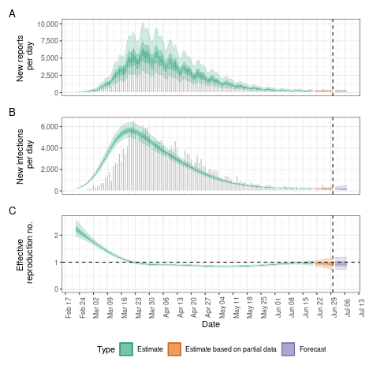

# Workflow for Rt estimation and forecasting

This vignette describes the typical workflow for estimating reproduction
numbers and performing short-term forecasts for a disease spreading in a
given setting using *EpiNow2*. The vignette uses the default
non-stationary Gaussian process model included in the package. See other
vignettes for a more thorough exploration of [alternative model
variants](https://epiforecasts.io/EpiNow2/articles/estimate_infections_options.md)
and [theoretical
background](https://epiforecasts.io/EpiNow2/articles/estimate_infections.md).

## Data

Obtaining a good and full understanding of the data being used is an
important first step in any inference procedure such as the one applied
here. *EpiNow2* expects data in the format of a data frame with two
columns, `date` and `confirm`, where `confirm` stands for the number of
reports - which could be confirmed case counts although in reality this
can be applied to any data including suspected cases and lab-confirmed
outcomes. The user might already have the data as such a time series
provided, for example, on public dashboards or directly from public
health authorities. Alternatively, they can be constructed from
individual-level data, for example using the
[incidence2](https://CRAN.R-project.org/package=incidence2) R package.
An example data set called `example_confirmed` is included in the
package:

``` r
head(EpiNow2::example_confirmed)
#>          date confirm
#>        <Date>   <num>
#> 1: 2020-02-22      14
#> 2: 2020-02-23      62
#> 3: 2020-02-24      53
#> 4: 2020-02-25      97
#> 5: 2020-02-26      93
#> 6: 2020-02-27      78
```

Any estimation procedure is only as good as the data that feeds into it.
A thorough understanding of the data that is used for *EpiNow2* and its
limitations is a prerequisite for its use. This includes but is not
limited to biases in the population groups that are represented
(*EpiNow2* assumes a closed population with all infections being caused
by other infections in the same population), reporting artefacts and
delays, and completeness of reporting. Some of these can be mitigated
using the routines available in *EpiNow2* as described below, but others
will cause biases in the results and need to be carefully considered
when interpreting the results.

## Set up

We first load the *EpiNow2* package.

``` r
library("EpiNow2")
#> 
#> Attaching package: 'EpiNow2'
#> The following object is masked from 'package:stats':
#> 
#>     Gamma
```

We then set the number of cores to use. We will want to run 4 MCMC
chains in parallel so we set this to 4.

``` r
options(mc.cores = 4)
```

If we had fewer than 4 available or wanted to run fewer than 4 chains
(at the expense of some robustness), or had fewer than 4 computing cores
available we could set it to that. To find out the number of cores
available one can use the
[detectCores](https://rdrr.io/r/parallel/detectCores.html) function from
the `parallel` package.

## Parameters

Once a data set has been identified, a number of relevant parameters
need to be considered before using *EpiNow2*. As these will affect any
results, it is worth spending some time investigating what their values
should be.

### Delay distributions

*EpiNow2* works with different delays that apply to different parts of
the infection and observation process. They are defined using a common
interface that involves functions that are named after the probability
distributions,
i.e. [`LogNormal()`](https://epiforecasts.io/EpiNow2/reference/Distributions.md),
[`Gamma()`](https://epiforecasts.io/EpiNow2/reference/Distributions.md),
etc. For help with this function, see its manual page

``` r
?EpiNow2::Distributions
```

In all cases, the distributions given can be *fixed* (i.e. have no
uncertainty) or *variable* (i.e. have associated uncertainty). For
example, to define a fixed gamma distribution with mean 3, standard
deviation (sd) 1 and maximum value 10, you would write

``` r
fixed_gamma <- Gamma(mean = 3, sd = 1, max = 10)
fixed_gamma
#> - gamma distribution (max: 10):
#>   shape:
#>     9
#>   rate:
#>     3
```

which looks like this when plotted

``` r
plot(fixed_gamma)
```


plot of chunk plot_fixed_gamma

If distributions are variable, the values with uncertainty are treated
as [prior probability
densities](https://en.wikipedia.org/wiki/Prior_probability) in the
Bayesian inference framework used by *EpiNow2*, i.e. they are estimated
as part of the inference. For example, to define a variable gamma
distribution where uncertainty in the shape is given by a normal
distribution with mean 3 and sd 2, and uncertainty in the rate is given
by a normal distribution with mean 1 and sd 0.1, with a maximum value
10, you would write

``` r
uncertain_gamma <- Gamma(shape = Normal(3, 2), rate = Normal(1, 0.1), max = 10)
uncertain_gamma
#> - gamma distribution (max: 10):
#>   shape:
#>     - normal distribution:
#>       mean:
#>         3
#>       sd:
#>         2
#>   rate:
#>     - normal distribution:
#>       mean:
#>         1
#>       sd:
#>         0.1
```

which looks like this when plotted

``` r
plot(uncertain_gamma)
```


There are various ways the specific delay distributions mentioned below
might be obtained. Often, they will come directly from the existing
literature reviewed by the user and studies conducted elsewhere.
Sometimes it might be possible to obtain them from existing databases,
e.g. using the
[epiparameter](https://github.com/epiverse-trace/epiparameter) R
package. Alternatively they might be obtainable from raw data,
e.g. line-listed individual-level records. The *EpiNow2* package
contains functionality for estimating delay distributions from observed
delays in the
[`estimate_delay()`](https://epiforecasts.io/EpiNow2/reference/estimate_delay.md)
function. For a more comprehensive treatment of delays and their
estimation avoiding common biases one can also consider the
[epidist](https://epidist.epinowcast.org/index.html) R package.

#### Generation intervals

The generation interval is a delay distribution that describes the
amount of time that passes between an individual becoming infected and
infecting someone else. In *EpiNow2*, the generation time distribution
is defined by a call to
[`gt_opts()`](https://epiforecasts.io/EpiNow2/reference/generation_time_opts.md),
a function that takes a single argument defined as a `dist_spec` object
(returned by the function corresponding to the probability distribution,
i.e. [`LogNormal()`](https://epiforecasts.io/EpiNow2/reference/Distributions.md),
[`Gamma()`](https://epiforecasts.io/EpiNow2/reference/Distributions.md),
etc.). For example, to define the generation time as gamma distributed
with uncertain mean centered on 3 and sd centered on 1 with some
uncertainty, a maximum value of 10 and weighted by the number of case
data points we could use the shape and rate parameters suggested above
(though notes that this will only very approximately produce the
uncertainty in mean and standard deviation stated there):

``` r
generation_time <- Gamma(
  shape = Normal(9, 2.5), rate = Normal(3, 1.4), max = 10
)
gt_opts(generation_time)
```

#### Reporting delays

*EpiNow2* calculates reproduction numbers based on the trajectory of
infection incidence. Usually this is not observed directly. Instead, we
calculate case counts based on, for example, onset of symptoms, lab
confirmations, hospitalisations, etc. In order to estimate the
trajectory of infection incidence from this we need to either know or
estimate the distribution of delays from infection to count. Often, such
counts are composed of multiple delays for which we only have separate
information, for example the incubation period (time from infection to
symptom onset) and reporting delay (time from symptom onset to being a
case in the data, e.g. via lab confirmation, if counts are not by the
date of symptom onset). In this case, we can combine multiple delays
with the plus (`+`) operator, e.g.

``` r
incubation_period <- LogNormal(
  meanlog = Normal(1.6, 0.05),
  sdlog = Normal(0.5, 0.05),
  max = 14
)
reporting_delay <- LogNormal(meanlog = 0.5, sdlog = 0.5, max = 10)
combined_delays <- incubation_period + reporting_delay
combined_delays
#> Composite distribution:
#> - lognormal distribution (max: 14):
#>   meanlog:
#>     - normal distribution:
#>       mean:
#>         1.6
#>       sd:
#>         0.05
#>   sdlog:
#>     - normal distribution:
#>       mean:
#>         0.5
#>       sd:
#>         0.05
#> - lognormal distribution (max: 10):
#>   meanlog:
#>     0.5
#>   sdlog:
#>     0.5
```

We can visualise this combined delay

``` r
plot(combined_delays)
```


plot of chunk plot_combined_delay

In *EpiNow2*, the reporting delay distribution is defined by a call to
[`delay_opts()`](https://epiforecasts.io/EpiNow2/reference/delay_opts.md),
a function that takes a single argument defined as a `dist_spec` object
(returned by
[`LogNormal()`](https://epiforecasts.io/EpiNow2/reference/Distributions.md),
[`Gamma()`](https://epiforecasts.io/EpiNow2/reference/Distributions.md)
etc.). For example, if our observations were by symptom onset we would
use

``` r
delay_opts(incubation_period)
```

If they were by date of lab confirmation that happens with a delay given
by `reporting_delay`, we would use

``` r
delay <- incubation_period + reporting_delay
delay_opts(delay)
```

#### Truncation

Besides the delay from infection to the event that is recorded in the
data, there can also be a delay from that event to being recorded in the
data. For example, data reported by symptom onset may only become part
of the dataset once lab confirmation has occurred, or even a day or two
after that confirmation. Statistically, this means our data is
right-truncated. In practice, it means that recent data will be unlikely
to be complete.

The amount of such truncation that exists in the data can be estimated
from multiple snapshots of the data, i.e. what the data looked like at
multiple past dates. One can then use methods that use the amount of
backfilling that occurred 1, 2, … days after data for a date are first
reported. In *EpiNow2*, this can be done using the
[`estimate_truncation()`](https://epiforecasts.io/EpiNow2/reference/estimate_truncation.md)
method which returns, amongst others, posterior estimates of the
truncation distribution. For more details on the model used for this,
see the
[estimate_truncation](https://epiforecasts.io/EpiNow2/articles/estimate_truncation.md)
vignette.

``` r
?estimate_truncation
```

In the
[`estimate_infections()`](https://epiforecasts.io/EpiNow2/reference/estimate_infections.md)
function, the truncation distribution is defined by a call to
[`trunc_opts()`](https://epiforecasts.io/EpiNow2/reference/trunc_opts.md),
a function that takes a single argument defined as a `dist_spec` (either
defined by the user or obtained from a call to
[`estimate_truncation()`](https://epiforecasts.io/EpiNow2/reference/estimate_truncation.md)
or any other method for estimating right truncation). This will then be
used to correct for right truncation in the data.

The separation of estimation of right truncation on the one hand and
estimation of the reproduction number on the other may be attractive for
practical purposes but is questionable statistically as it separates two
processes that are not strictly separable, potentially introducing a
bias. An alternative approach where these are estimated jointly is being
implemented in the [epinowcast](https://package.epinowcast.org/)
package, which is being developed by the *EpiNow2* developers with
collaborators.

### Completeness of reporting

Another issue affecting the progression from infections to reported
outcomes is underreporting, i.e. the fact that not all infections are
reported as cases. This varies both by pathogen and population (and
e.g. the proportion of infections that are asymptomatic) as well as the
specific outcome used as data and where it is located on the severity
pyramid (e.g. hospitalisations vs. community cases). In *EpiNow2* we can
specify the proportion of infections that we expect to be observed (with
uncertainty assumed represented by a truncated normal distribution with
bounds at 0 and 1) using the `scale` argument to the
[`obs_opts()`](https://epiforecasts.io/EpiNow2/reference/obs_opts.md)
function. For example, if we think that 40% (with standard deviation 1%)
of infections end up in the data as observations we could specify.

``` r
obs_scale <- Normal(mean = 0.4, sd = 0.01)
obs_opts(scale = obs_scale)
```

### Initial reproduction number

The default model that
[`estimate_infections()`](https://epiforecasts.io/EpiNow2/reference/estimate_infections.md)
uses to estimate reproduction numbers requires specification of a prior
probability distribution for the initial reproduction number. This
represents the user’s initial belief of the value of the reproduction
number, where there is no data yet to inform its value. By default this
is assumed to be represented by a lognormal distribution with mean and
standard deviation of 1. It can be changed using the
[`rt_opts()`](https://epiforecasts.io/EpiNow2/reference/rt_opts.md)
function. For example, if the user believes that at the very start of
the data the reproduction number was 2, with uncertainty in this belief
represented by a standard deviation of 1, they would use

``` r
rt_prior <- LogNormal(mean = 2, sd = 1)
rt_opts(prior = rt_prior)
```

### Weighing delay priors

When providing uncertain delay distributions one can end up in a
situation where the estimated means are shifted a long way from the
given distribution means, and possibly further than is deemed realistic
by the user. In that case, one could specify narrower prior
distributions (e.g., smaller `mean_sd`) in order to keep the estimated
means closer to the given mean, but this can be difficult to do in a
principled manner in practice. As a more straightforward alternative,
one can choose to weigh the generation time priors by the number of data
points in the case data set by setting `weigh_delay_priors = TRUE` (the
default).

## Estimation and forecasting

All the options are combined in a call to the
[`estimate_infections()`](https://epiforecasts.io/EpiNow2/reference/estimate_infections.md)
function. For example, using some of the options described above one
could call

``` r
reported_cases <- example_confirmed[1:60]
def <- estimate_infections(
  reported_cases,
  generation_time = gt_opts(generation_time),
  delays = delay_opts(delay),
  rt = rt_opts(prior = rt_prior),
  forecast = forecast_opts(horizon = 7)
)
```

Alternatively, for production environments, we recommend using the
[`epinow()`](https://epiforecasts.io/EpiNow2/reference/epinow.md)
function. It uses
[`estimate_infections()`](https://epiforecasts.io/EpiNow2/reference/estimate_infections.md)
internally and provides functionality for logging and saving results and
plots in dedicated directories in the user’s file system.

### Forecasting secondary outcomes

The
[`estimate_infections()`](https://epiforecasts.io/EpiNow2/reference/estimate_infections.md)
function works with a single time series of outcomes such as cases by
symptom onset or hospitalisations. Sometimes one wants to further create
forecasts of other secondary outcomes such as deaths. The package
contains functionality to estimate the delay and scaling between
multiple time series with the
[`estimate_secondary()`](https://epiforecasts.io/EpiNow2/reference/estimate_secondary.md)
function, as well as for using this to make forecasts with the
[`forecast_secondary()`](https://epiforecasts.io/EpiNow2/reference/forecast_secondary.md)
function.

## Interpretation

To visualise the results one can use the
[`plot()`](https://rdrr.io/r/graphics/plot.default.html) function that
comes with the package

``` r
plot(def)
```



plot of chunk results

The results returned by the `estimate_infections` model depend on the
values assigned to all to parameters discussed in this vignette,
i.e. delays, scaling, and reproduction numbers, as well as the model
variant used and its parameters. Any interpretation of the results will
therefore need to bear these in mind, as well as any properties of the
data and/or the subpopulations that it represents. See the [Model
options](https://epiforecasts.io/EpiNow2/articles/estimate_infections_options.md)
vignette for an illustration of the impact of model choice.

### Evaluating forecasts with scoringutils

Forecast evaluation is useful for comparing the predictive performance
of different models or assessing how accuracy changes at different
forecast horizons. The
[`get_predictions()`](https://epiforecasts.io/EpiNow2/reference/get_predictions.md)
function supports a `format = "sample"` argument to return raw posterior
samples compatible with the
[scoringutils](https://epiforecasts.io/scoringutils/) package.

Since we fitted on only the first 60 days of `example_confirmed`, we can
score the 7-day forecast against the full dataset. Here we show forecast
scores by horizon:

``` r
library(scoringutils)

# Get sample-based predictions for the forecast period
preds <- get_predictions(def, format = "sample")
forecasts <- preds[horizon > 0]

# Add observed data
forecasts <- merge(forecasts, example_confirmed, by = "date")

# Score forecasts by horizon
forecast_obj <- as_forecast_sample(
  forecasts,
  forecast_unit = "horizon",
  observed = "confirm",
  sample_id = "sample"
)
score(forecast_obj)
#>    horizon    bias      dss     crps overprediction underprediction dispersion
#>      <num>   <num>    <num>    <num>          <num>           <num>      <num>
#> 1:       1 -0.6505 13.31003 305.8814          0.000         190.593   115.2884
#> 2:       2 -0.8755 15.26973 657.2073          0.000         529.589   127.6183
#> 3:       3  0.2560 13.38751 190.0780         28.593           0.000   161.4850
#> 4:       4 -0.5490 13.53322 317.1630          0.000         166.370   150.7930
#> 5:       5  0.3910 13.79891 254.7470         70.291           0.000   184.4560
#> 6:       6  0.1640 13.68110 204.2124         12.438           0.000   191.7744
#> 7:       7  0.4320 13.76404 252.2392         78.715           0.000   173.5242
#>    log_score      mad ae_median   se_mean
#>        <num>    <num>     <num>     <num>
#> 1:  7.756721 475.1733     528.5 220416.63
#> 2:  8.763339 539.6664     990.0 850682.48
#> 3:  7.476291 688.6677     211.0  87562.73
#> 4:  7.945295 643.4484     543.0 203621.15
#> 5:  7.620958 768.7281     354.5 224057.86
#> 6:  7.573535 795.4149     146.5  89926.22
#> 7:  7.522562 733.8870     363.5 246446.22
```
