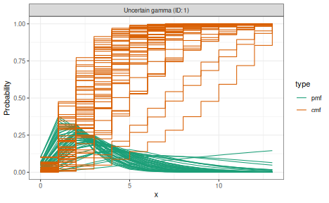
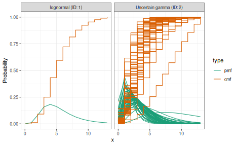
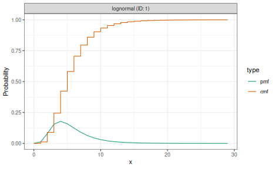
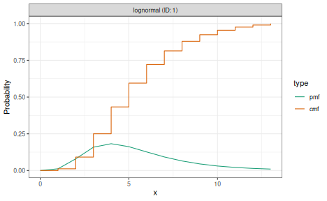

# Understanding delay distributions in EpiNow2

## What delay distributions represent

Infectious disease surveillance data are shaped by delays between events
that cannot be directly observed. The *generation time* is the interval
between infection of a primary case and infection of a secondary case it
causes. The *incubation period* is the time from infection to symptom
onset. The *reporting delay* is the time from symptom onset (or another
observable event) to the case appearing in surveillance data.

*EpiNow2* uses these delay distributions when estimating the
time-varying reproduction number and when producing forecasts and
nowcasts. Each delay shifts and smooths the relationship between
underlying infections and the observations available to analysts, so
getting them right matters for inference.

## Specifying delays

Delays are specified as `dist_spec` objects using the distribution
constructors
[`LogNormal()`](https://epiforecasts.io/EpiNow2/dev/reference/Distributions.md),
[`Gamma()`](https://epiforecasts.io/EpiNow2/dev/reference/Distributions.md),
[`Normal()`](https://epiforecasts.io/EpiNow2/dev/reference/Distributions.md),
[`Fixed()`](https://epiforecasts.io/EpiNow2/dev/reference/Distributions.md),
and
[`NonParametric()`](https://epiforecasts.io/EpiNow2/dev/reference/Distributions.md).
Parameters can be given as fixed values or with uncertainty expressed
through
[`Normal()`](https://epiforecasts.io/EpiNow2/dev/reference/Distributions.md)
priors on the natural parameters.

``` r

library(EpiNow2)
#> 
#> Attaching package: 'EpiNow2'
#> The following object is masked from 'package:stats':
#> 
#>     Gamma

# Fixed lognormal delay
incubation_period <- LogNormal(
  meanlog = 1.6, sdlog = 0.5, max = 14
)

# Gamma delay with uncertain parameters
reporting_delay <- Gamma(
  shape = Normal(3, 0.5),
  rate = Normal(1, 0.25),
  max = 14
)

# Fixed (delta) distribution for a known constant delay
fixed_delay <- Fixed(value = 3)

# Nonparametric distribution given directly as a PMF
# (zero-indexed: first element is P(delay = 0))
known_pmf <- NonParametric(c(0.0, 0.1, 0.4, 0.3, 0.2))
```

We can visualise any `dist_spec` object using
[`plot()`](https://rdrr.io/r/graphics/plot.default.html).

``` r

plot(incubation_period)
```


plot of chunk plot-distributions

``` r

plot(reporting_delay)
```



plot of chunk plot-distributions

The `max` argument right-truncates the distribution at a given value,
discarding probability mass beyond that point and renormalising.
Alternatively, `cdf_cutoff` can be used to set the truncation point
based on a tail probability threshold.

When parameters carry uncertainty, *EpiNow2* samples from the prior
during fitting, propagating that uncertainty into the final estimates.

## Why naive discretisation is biased

Delay distributions are often defined in continuous time, but
surveillance data record events in discrete time windows (typically
days). *EpiNow2* operates at daily resolution, so both observation
windows are set to 1 day. A common approach to discretisation is CDF
differencing, where the probability mass for day $`d`$ is computed as
$`F(d+1) - F(d)`$. This treats the primary event as though it occurred
at a known, exact time, typically the start of the interval.

In practice, both the primary event (e.g. infection) and the secondary
event (e.g. symptom onset) are interval-censored. The primary event
could have occurred at any point within its observation window. CDF
differencing ignores this *primary event censoring* and introduces
systematic bias, particularly for short delays where the censoring
window is large relative to the delay itself^(\[1,2\]).

Right truncation also introduces bias: recent events with long delays
are systematically missing from surveillance data because the secondary
event has not yet been observed.

## How primarycensored corrects this

*EpiNow2* computes delay PMFs using the `primarycensored`
package^(\[3\]), which accounts for primary event censoring explicitly.
The approach integrates the delay CDF over all possible primary event
times within the primary window, producing an adjusted CDF. The PMF is
then obtained by differencing this adjusted CDF at successive days.

For common distribution and primary event combinations (e.g. lognormal
delay with uniform primary events), analytical solutions are available,
making the computation fast. When no closed-form solution exists,
numerical integration is used as a fallback.

The resulting PMF correctly represents the probability of observing a
delay of $`d`$ days given that both events are recorded in daily
intervals. This is the PMF used internally by *EpiNow2*’s Stan model
when computing the likelihood.

## Composing multiple delays

When the observation process involves more than one delay, the
individual delay PMFs are convolved to produce a combined delay. In
*EpiNow2* this is done by adding `dist_spec` objects together with the
`+` operator.

``` r

# Combined delay from infection to report
combined_delay <- incubation_period + reporting_delay
plot(combined_delay)
```



plot of chunk convolution

The `+` operator signals to the model that these delays should be
convolved. The [`c()`](https://rdrr.io/r/base/c.html) function, by
contrast, collects independent delay distributions without convolving
them (e.g. for separate delay and truncation distributions passed to
different parts of the model).

Convolution of nonparametric PMFs is performed directly in discrete
space. For parametric distributions with uncertain parameters, the
convolution is handled within the Stan model at each iteration of the
sampler.

## Truncation

Delay distributions must be truncated to a finite support for use in the
discrete-time model. Shorter distributions reduce the cost of the
convolution step in the model, so choosing a sensible truncation point
can noticeably improve run time. The `max` argument right-truncates the
distribution at a given value, discarding probability mass beyond that
point and renormalising. Alternatively, `cdf_cutoff` sets the truncation
point at the value where the CDF reaches a given threshold.

``` r

# Long tail retained
dist_long <- LogNormal(meanlog = 1.6, sdlog = 0.5, max = 30)

# Truncated at a tighter bound
dist_short <- LogNormal(meanlog = 1.6, sdlog = 0.5, max = 14)

plot(dist_long)
```



plot of chunk truncation

``` r

plot(dist_short)
```



plot of chunk truncation

Right truncation is also important when estimating delay distributions
from real-time data, because recent cases with long delays have not yet
been observed.
[`estimate_dist()`](https://epiforecasts.io/EpiNow2/dev/reference/estimate_dist.md)
accounts for this; see
[`vignette("estimate_dist")`](https://epiforecasts.io/EpiNow2/dev/articles/estimate_dist.md)
for the model definition and
[`vignette("estimate_dist_workflow")`](https://epiforecasts.io/EpiNow2/dev/articles/estimate_dist_workflow.md)
for a worked example.

Left truncation excludes delays below a threshold, which is useful when
zero-day delays are epidemiologically implausible (e.g. generation
times). A
[`NonParametric()`](https://epiforecasts.io/EpiNow2/dev/reference/Distributions.md)
distribution can encode this directly by setting early entries to zero.
For parametric distributions, `primarycensored` handles left truncation
analytically when computing the adjusted CDF, so the resulting PMF
already accounts for the truncation without ad hoc zeroing and
renormalising.

## Fitting delay distributions from data

When line-list data with individual-level event dates are available,
[`estimate_dist()`](https://epiforecasts.io/EpiNow2/dev/reference/estimate_dist.md)
can be used to fit a delay distribution that properly accounts for
interval censoring and right truncation. See
[`vignette("estimate_dist")`](https://epiforecasts.io/EpiNow2/dev/articles/estimate_dist.md)
for the model definition and
[`vignette("estimate_dist_workflow")`](https://epiforecasts.io/EpiNow2/dev/articles/estimate_dist_workflow.md)
for a worked example.

## References

1\.

Charniga, K., Park, S. W., Akhmetzhanov, A. R., Cori, A., Dushoff, J.,
Funk, S., Gostic, K. M., Linton, N. M., Lison, A., Overton, C. E.,
Pulliam, J. R. C., Ward, T., Cauchemez, S., & Abbott, S. (2024). Best
practices for estimating and reporting epidemiological delay
distributions of infectious diseases. *PLoS Comput. Biol.*, *20*(10),
e1012520. <https://doi.org/10.1371/journal.pcbi.1012520>

2\.

Park, S. W., Akhmetzhanov, A. R., Charniga, K., Cori, A., Davies, N. G.,
Dushoff, J., Funk, S., Gostic, K., Grenfell, B., Linton, N. M.,
Lipsitch, M., Lison, A., Overton, C. E., Ward, T., & Abbott, S. (2024).
Estimating epidemiological delay distributions for infectious diseases.
*medRxiv*. <https://doi.org/10.1101/2024.01.12.24301247>

3\.

Abbott, S., Brand, S., Azam, J. M., Pearson, C., Funk, S., & Charniga,
K. (2026). *Primarycensored: Primary event censored distributions*.
<https://doi.org/10.5281/zenodo.13632839>
