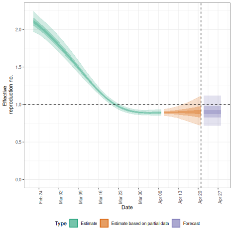

# Using epinow() for running in production mode

The *EpiNow2* package contains functionality to run
[`estimate_infections()`](https://epiforecasts.io/EpiNow2/dev/reference/estimate_infections.md)
in production mode, i.e. with full logging and saving all relevant
outputs and plots to dedicated folders in the hard drive. This is done
with the
[`epinow()`](https://epiforecasts.io/EpiNow2/dev/reference/epinow.md)
function, that takes the same options as
[`estimate_infections()`](https://epiforecasts.io/EpiNow2/dev/reference/estimate_infections.md)
with some additional options that determine, for example, where output
gets stored and what output exactly. The function can be a useful option
when, e.g., running the model daily with updated data on a
high-performance computing server to feed into a dashboard. For more
detail on the various model options available, see the
[Examples](https://epiforecasts.io/EpiNow2/dev/articles/estimate_infections_options.md)
vignette, for more on the general modelling approach the
[Workflow](https://epiforecasts.io/EpiNow2/dev/articles/estimate_infections_workflow.md),
and for theoretical background the [Model
definitions](https://epiforecasts.io/EpiNow2/dev/articles/estimate_infections.md)
vignette

## Running the model on a single region

To run the model in production mode for a single region, set the
parameters up in the same way as for
[`estimate_infections()`](https://epiforecasts.io/EpiNow2/dev/reference/estimate_infections.md)
(see the
[Workflow](https://epiforecasts.io/EpiNow2/dev/articles/estimate_infections_workflow.md)
vignette). Here we use the example delay and generation time
distributions that come with the package. This should be replaced with
parameters relevant to the system that is being studied.

``` r
library("EpiNow2")
#> 
#> Attaching package: 'EpiNow2'
#> The following object is masked from 'package:stats':
#> 
#>     Gamma
options(mc.cores = 4)
reported_cases <- example_confirmed[1:60]
reporting_delay <- LogNormal(mean = 2, sd = 1, max = 10)
delay <- example_incubation_period + reporting_delay
rt_prior <- LogNormal(mean = 2, sd = 1)
```

We can then run the
[`epinow()`](https://epiforecasts.io/EpiNow2/dev/reference/epinow.md)
function with the same arguments as
[`estimate_infections()`](https://epiforecasts.io/EpiNow2/dev/reference/estimate_infections.md).

``` r
res <- epinow(reported_cases,
  generation_time = gt_opts(example_generation_time),
  delays = delay_opts(delay),
  rt = rt_opts(prior = rt_prior),
  logs = NULL
)
plot(res)
```



plot of chunk epinow

By default, logging messages are printed to the console indicating the
progress of the model fitting and where log files can be found. Here we
have set `logs = NULL` to suppress these messages. If you want
summarised results and plots to be written out where they can be
accessed later you can use the `target_folder` argument.

## Running the model simultaneously on multiple regions

The package also contains functionality to conduct inference
contemporaneously (if separately) in production mode on multiple time
series, e.g. to run the model on multiple regions. This is done with the
[`regional_epinow()`](https://epiforecasts.io/EpiNow2/dev/reference/regional_epinow.md)
function.

Say, for example, we construct a dataset containing two regions,
`testland` and `realland` (in this simple example both containing the
same case data).

``` r
cases <- example_confirmed[1:60]
cases <- data.table::rbindlist(list(
  data.table::copy(cases)[, region := "testland"],
  cases[, region := "realland"]
 ))
```

To then run this on multiple regions using the default options above, we
could use

``` r
region_rt <- regional_epinow(
  data = cases,
  generation_time = gt_opts(example_generation_time),
  delays = delay_opts(delay),
  rt = rt_opts(prior = rt_prior),
  logs = NULL
)
## summary
region_rt$summary$summarised_results$table
#>      Region New infections per day Expected change in reports
#>      <char>                 <char>                     <fctr>
#> 1: realland    2237 (1380 -- 3751)          Likely decreasing
#> 2: testland    2226 (1344 -- 3648)          Likely decreasing
#>    Effective reproduction no.          Rate of growth
#>                        <char>                  <char>
#> 1:         0.89 (0.71 -- 1.1) -0.03 (-0.095 -- 0.041)
#> 2:          0.89 (0.7 -- 1.1) -0.03 (-0.097 -- 0.039)
#>    Doubling/halving time (days)
#>                          <char>
#> 1:             -23 (17 -- -7.3)
#> 2:             -23 (18 -- -7.1)
## plot
region_rt$summary$plots$R
```


plot of chunk regional_epinow

If instead, we wanted to use the Gaussian Process for `testland` and a
weekly random walk for `realland` we could specify these separately
using the
[`opts_list()`](https://epiforecasts.io/EpiNow2/dev/reference/opts_list.md)
function from the package and
[`modifyList()`](https://rdrr.io/r/utils/modifyList.html) from `R`.

``` r
gp <- opts_list(gp_opts(), cases)
gp <- modifyList(gp, list(realland = NULL), keep.null = TRUE)
rt <- opts_list(rt_opts(), cases, realland = rt_opts(rw = 7))
region_separate_rt <- regional_epinow(
  data = cases,
  generation_time = gt_opts(example_generation_time),
  delays = delay_opts(delay),
  rt = rt, gp = gp,
  logs = NULL
)
## summary
region_separate_rt$summary$summarised_results$table
#>      Region New infections per day Expected change in reports
#>      <char>                 <char>                     <fctr>
#> 1: realland    2006 (1070 -- 4068)          Likely decreasing
#> 2: testland    2252 (1414 -- 3790)          Likely decreasing
#>    Effective reproduction no.          Rate of growth
#>                        <char>                  <char>
#> 1:         0.85 (0.61 -- 1.2) -0.042 (-0.11 -- 0.042)
#> 2:          0.9 (0.72 -- 1.1) -0.027 (-0.09 -- 0.038)
#>    Doubling/halving time (days)
#>                          <char>
#> 1:             -17 (17 -- -6.3)
#> 2:             -25 (18 -- -7.7)
## plot
region_separate_rt$summary$plots$R
```


plot of chunk regional_epinow_multiple
