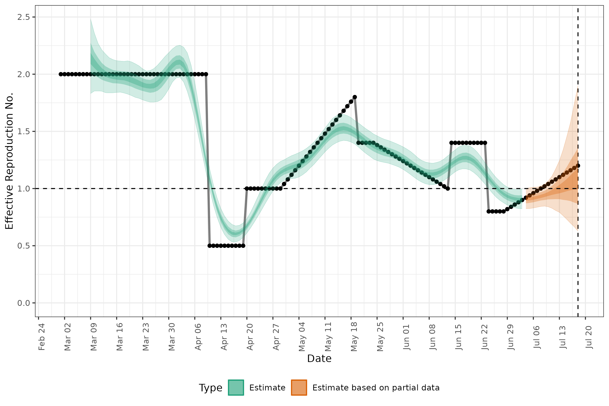
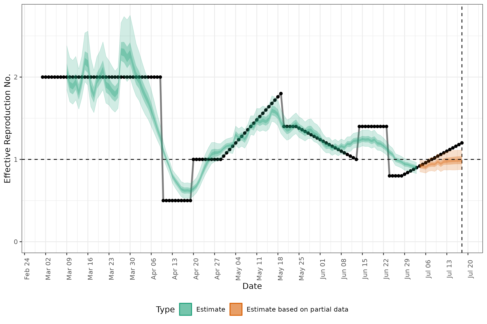
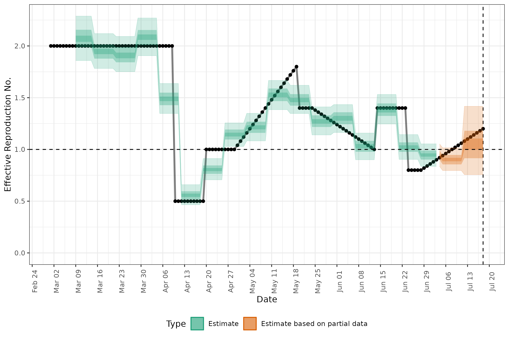
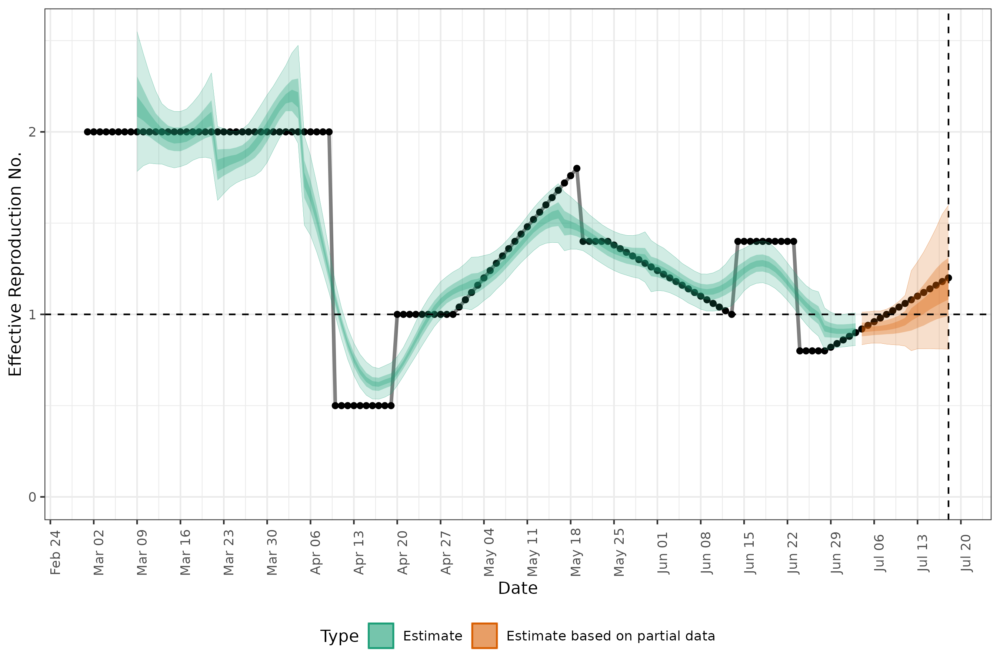

# Synthetic Recovery visual results

This file combines the figures generated in `rt.R` into a single file, used to 
confirm that the fits to synthetic data with different EpiNow2
specifications work as expected. 

In all figures, the black dots indicate the ground truth R(t) estimate, used to 
generate the synthetic data used for model fitting. 

### Estimate from the default Gaussian Process settings using the No-U-Turn (NUTS) sampler

### Estimate from back-calculation

### Estimate from a weekly random walk, with no Gaussian process

### Estimate from a monthly random walk + a stationary Gaussian process

### Comparison of different model specifications
CRPS over time evaluated against known R(t)

CRPS over time evaluated against infections

