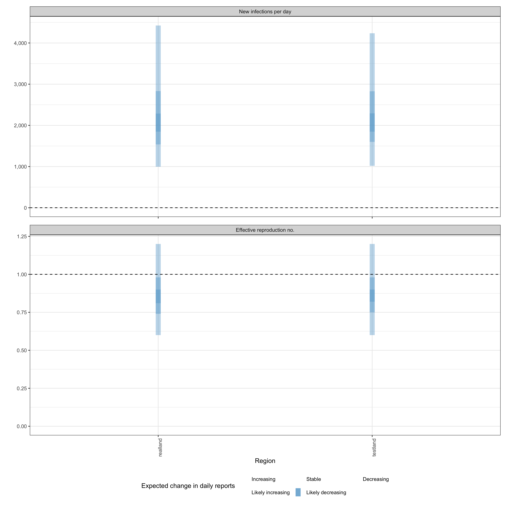

## Quick start

In the following section we give an overview of the simple use case for `epinow()` and `regional_epinow()`.

The first step to using the package is to load it as follows.


```r
library(EpiNow2)
```

### Reporting delays, incubation period and generation time

Distributions can be supplied in two ways. First, one can supplying delay data to `estimate_delay()`, where a subsampled bootstrapped lognormal will be fit to account for uncertainty in the observed data without being biased by changes in incidence (see `?EpiNow2::estimate_delay()`).

Second, one can specify predetermined delays with uncertainty using the distribution functions such as `Gamma` or `Lognormal`. An arbitrary number of delay distributions are supported in `dist_spec()` with a common use case being an incubation period followed by a reporting delay. For more information on specifying distributions see (see `?EpiNow2::Distributions`).

For example if data on the delay between onset and infection was available we could fit a distribution to it, using `estimate_delay()`, with appropriate uncertainty as follows (note this is a synthetic example),

```r
reporting_delay <- estimate_delay(
  rlnorm(1000, log(2), 1),
  max_value = 14, bootstraps = 1
)
```

If data was not available we could instead specify an informed estimate of the likely delay using the distribution functions `Gamma` or `LogNormal`. 
To demonstrate, we choose a lognormal distribution with mean 2, standard deviation 1 and a maximum of 10. *This is just an example and unlikely to apply in any particular use case*.


```r
reporting_delay <- LogNormal(mean = 2, sd = 1, max = 10)
reporting_delay
#> - lognormal distribution (max: 10):
#>   meanlog:
#>     0.58
#>   sdlog:
#>     0.47
```

For the rest of this vignette, we will use inbuilt example literature estimates for the incubation period and generation time of Covid-19 (see [here](https://github.com/epiforecasts/EpiNow2/tree/main/data-raw) for the code that generates these estimates). *These distributions are unlikely to be applicable for your use case. We strongly recommend investigating what might be the best distributions to use in any given use case.*


```r
example_generation_time
#> - gamma distribution (max: 14):
#>   shape:
#>     - normal distribution:
#>       mean:
#>         1.4
#>       sd:
#>         0.48
#>   rate:
#>     - normal distribution:
#>       mean:
#>         0.38
#>       sd:
#>         0.25
example_incubation_period
#> - lognormal distribution (max: 14):
#>   meanlog:
#>     - normal distribution:
#>       mean:
#>         1.6
#>       sd:
#>         0.064
#>   sdlog:
#>     - normal distribution:
#>       mean:
#>         0.42
#>       sd:
#>         0.069
```

Now, to the functions.

### [epinow()](https://epiforecasts.io/EpiNow2/reference/epinow.html)

This function represents the core functionality of the package and includes results reporting, plotting, and optional saving. It requires a data frame of cases by date of report and the distributions defined above.

Load example case data from `{EpiNow2}`.


```r
reported_cases <- example_confirmed[1:60]
head(reported_cases)
#>          date confirm
#>        <Date>   <num>
#> 1: 2020-02-22      14
#> 2: 2020-02-23      62
#> 3: 2020-02-24      53
#> 4: 2020-02-25      97
#> 5: 2020-02-26      93
#> 6: 2020-02-27      78
```

Estimate cases by date of infection, the time-varying reproduction number, the rate of growth, and forecast these estimates into the future by 7 days. Summarise the posterior and return a summary table and plots for reporting purposes. If a `target_folder` is supplied results can be internally saved (with the option to also turn off explicit returning of results). Here we use the default model parameterisation that prioritises real-time performance over run-time or other considerations. For other formulations see the documentation for `estimate_infections()`.


```r
estimates <- epinow(
  data = reported_cases,
  generation_time = gt_opts(example_generation_time),
  delays = delay_opts(example_incubation_period + reporting_delay),
  rt = rt_opts(prior = list(mean = 2, sd = 0.2)),
  stan = stan_opts(cores = 4, control = list(adapt_delta = 0.99)),
  verbose = interactive()
)
names(estimates)
#> [1] "estimates"                "estimated_reported_cases"
#> [3] "summary"                  "plots"                   
#> [5] "timing"
```

Both summary measures and posterior samples are returned for all parameters in an easily explored format which can be accessed using `summary`. The default is to return a summary table of estimates for key parameters at the latest date partially supported by data. 


```r
knitr::kable(summary(estimates))
```


|measure                          |estimate                |
|:--------------------------------|:-----------------------|
|New infections per day           |2199 (962 -- 4757)      |
|Expected change in daily reports |Likely decreasing       |
|Effective reproduction no.       |0.88 (0.58 -- 1.2)      |
|Rate of growth                   |-0.034 (-0.15 -- 0.076) |
|Doubling/halving time (days)     |-20 (9.1 -- -4.6)       |


Summarised parameter estimates can also easily be returned, either filtered for a single parameter or for all parameters.


```r
head(summary(estimates, type = "parameters", params = "R"))
#>          date variable  strat     type   median     mean        sd lower_90
#>        <Date>   <char> <char>   <char>    <num>    <num>     <num>    <num>
#> 1: 2020-02-22        R   <NA> estimate 2.288484 2.293707 0.1613209 2.044132
#> 2: 2020-02-23        R   <NA> estimate 2.254878 2.259642 0.1403568 2.040359
#> 3: 2020-02-24        R   <NA> estimate 2.217611 2.222709 0.1251234 2.026980
#> 4: 2020-02-25        R   <NA> estimate 2.174854 2.182984 0.1150322 2.002758
#> 5: 2020-02-26        R   <NA> estimate 2.132196 2.140643 0.1089983 1.974475
#> 6: 2020-02-27        R   <NA> estimate 2.088958 2.095945 0.1056741 1.933753
#>    lower_50 lower_20 upper_20 upper_50 upper_90
#>       <num>    <num>    <num>    <num>    <num>
#> 1: 2.181696 2.246458 2.328439 2.398968 2.574407
#> 2: 2.162459 2.217716 2.289158 2.349965 2.508728
#> 3: 2.136181 2.184912 2.247679 2.303535 2.440930
#> 4: 2.101307 2.148035 2.204825 2.256175 2.381675
#> 5: 2.064946 2.108764 2.160005 2.207901 2.331636
#> 6: 2.023783 2.062603 2.114298 2.159626 2.285821
```

Reported cases are returned in a separate data frame in order to streamline the reporting of forecasts and for model evaluation.


```r
head(summary(estimates, output = "estimated_reported_cases"))
#>          date   type median     mean       sd lower_90 lower_50 lower_20
#>        <Date> <char>  <num>    <num>    <num>    <num>    <num>    <num>
#> 1: 2020-02-22  gp_rt   74.0  76.9430 21.47422       46       62     70.0
#> 2: 2020-02-23  gp_rt   87.0  89.5820 24.71017       54       72     82.0
#> 3: 2020-02-24  gp_rt   86.0  88.6670 24.76764       53       71     80.6
#> 4: 2020-02-25  gp_rt   81.0  82.6625 22.56520       49       66     75.0
#> 5: 2020-02-26  gp_rt   79.0  81.8240 23.31905       48       65     75.0
#> 6: 2020-02-27  gp_rt  107.5 111.2375 30.27595       69       89    101.0
#>    upper_20 upper_50 upper_90
#>       <num>    <num>    <num>
#> 1:       79       89   116.00
#> 2:       92      104   135.00
#> 3:       92      103   133.00
#> 4:       87       96   121.00
#> 5:       85       96   121.05
#> 6:      115      129   166.00
```

A range of plots are returned (with the single summary plot shown below). These plots can also be generated using the following `plot` method.


```r
plot(estimates)
```


### [regional_epinow()](https://epiforecasts.io/EpiNow2/reference/regional_epinow.html)

The `regional_epinow()` function runs the `epinow()` function across multiple regions in
an efficient manner.

Define cases in multiple regions delineated by the region variable.


```r
reported_cases <- data.table::rbindlist(list(
  data.table::copy(reported_cases)[, region := "testland"],
  reported_cases[, region := "realland"]
))
head(reported_cases)
#>          date confirm   region
#>        <Date>   <num>   <char>
#> 1: 2020-02-22      14 testland
#> 2: 2020-02-23      62 testland
#> 3: 2020-02-24      53 testland
#> 4: 2020-02-25      97 testland
#> 5: 2020-02-26      93 testland
#> 6: 2020-02-27      78 testland
```

Calling `regional_epinow()` runs the `epinow()` on each region in turn (or in parallel depending on the settings used). Here we switch to using a weekly random walk rather than the full Gaussian process model giving us piecewise constant estimates by week.


```r
estimates <- regional_epinow(
  data = reported_cases,
  generation_time = gt_opts(example_generation_time),
  delays = delay_opts(example_incubation_period + reporting_delay),
  rt = rt_opts(prior = list(mean = 2, sd = 0.2), rw = 7),
  gp = NULL,
  stan = stan_opts(cores = 4, warmup = 250, samples = 1000)
)
#> INFO [2024-05-10 07:58:14] Producing following optional outputs: regions, summary, samples, plots, latest
#> INFO [2024-05-10 07:58:14] Reporting estimates using data up to: 2020-04-21
#> INFO [2024-05-10 07:58:14] No target directory specified so returning output
#> INFO [2024-05-10 07:58:14] Producing estimates for: testland, realland
#> INFO [2024-05-10 07:58:14] Regions excluded: none
#> INFO [2024-05-10 07:58:29] Completed estimates for: testland
#> INFO [2024-05-10 07:58:41] Completed estimates for: realland
#> INFO [2024-05-10 07:58:41] Completed regional estimates
#> INFO [2024-05-10 07:58:41] Regions with estimates: 2
#> INFO [2024-05-10 07:58:41] Regions with runtime errors: 0
#> INFO [2024-05-10 07:58:41] Producing summary
#> INFO [2024-05-10 07:58:41] No summary directory specified so returning summary output
#> INFO [2024-05-10 07:58:41] No target directory specified so returning timings
```

Results from each region are stored in a `regional` list with across region summary measures and plots stored in a `summary` list. All results can be set to be internally saved by setting the `target_folder` and `summary_dir` arguments. Each region can be estimated in parallel using the `{future}` package (when in most scenarios `cores` should be set to 1). For routine use each MCMC chain can also be run in parallel (with `future` = TRUE) with a time out (`max_execution_time`) allowing for partial results to be returned if a subset of chains is running longer than expected. See the documentation for the `{future}` package for details on nested futures.

Summary measures that are returned include a table formatted for reporting (along with raw results for further processing). Futures updated will extend the S3 methods used above to smooth access to this output.


```r
knitr::kable(estimates$summary$summarised_results$table)
```


|Region   |New infections per day |Expected change in daily reports |Effective reproduction no. |Rate of growth          |Doubling/halving time (days) |
|:--------|:----------------------|:--------------------------------|:--------------------------|:-----------------------|:----------------------------|
|realland |2060 (1007 -- 4579)    |Likely decreasing                |0.86 (0.59 -- 1.2)         |-0.039 (-0.12 -- 0.056) |-18 (12 -- -5.9)             |
|testland |2136 (1050 -- 4356)    |Likely decreasing                |0.86 (0.62 -- 1.2)         |-0.036 (-0.11 -- 0.048) |-19 (14 -- -6.4)             |


A range of plots are again returned (with the single summary plot shown below).


```r
estimates$summary$summary_plot
```


