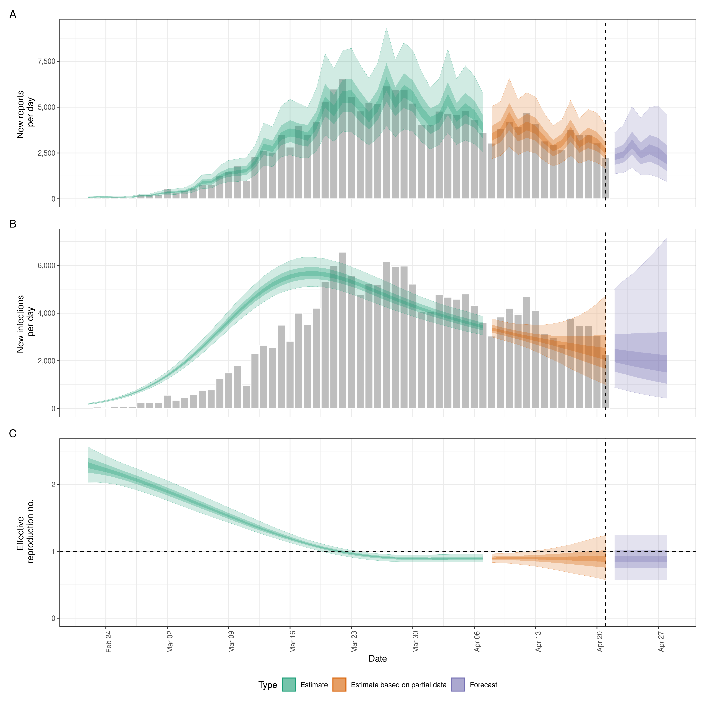
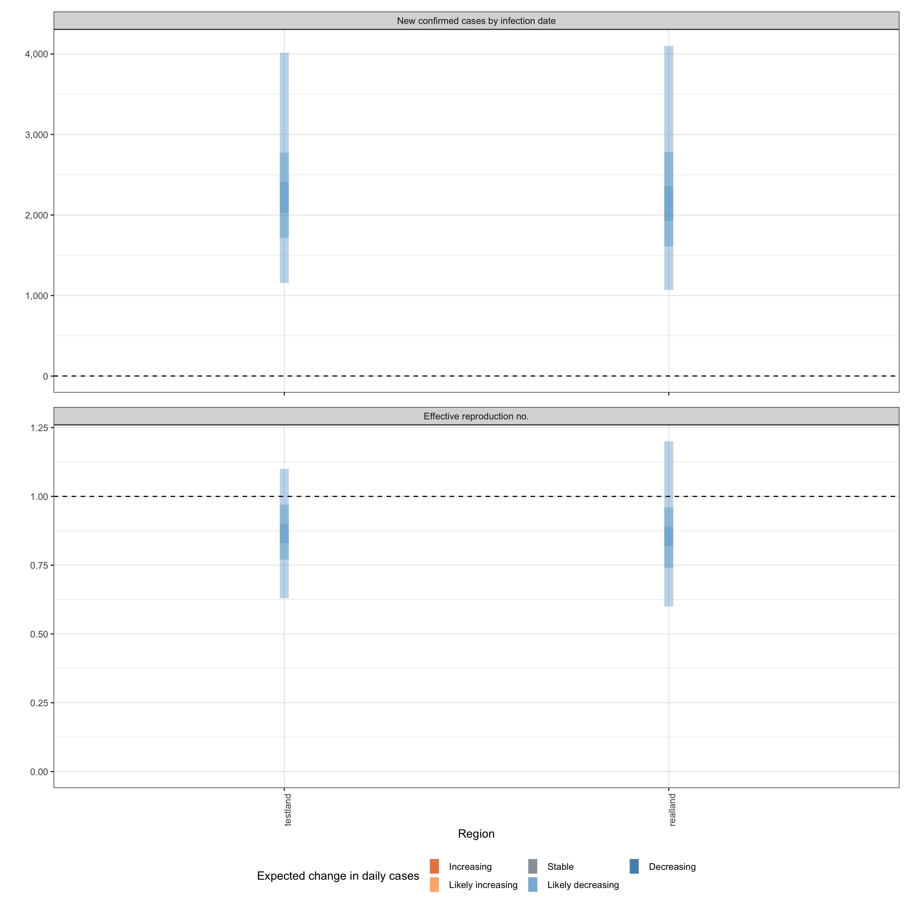

## Quick start

In the following section we give an overview of the simple use case for `epinow()` and `regional_epinow()`.

The first step to using the package is to load it as follows.


```r
library(EpiNow2)
```

### Reporting delays, incubation period and generation time

Distributions can be supplied in two ways. First, one can supplying delay data to `estimate_delay()`, where a subsampled bootstrapped lognormal will be fit to account for uncertainty in the observed data without being biased by changes in incidence (see `?EpiNow2::estimate_delay()`).

Second, one can specify predetermined delays with uncertainty using the distribution functions such as `Gamma` or `Lognormal`. An arbitrary number of delay distributions are supported in `dist_spec()` with a common use case being an incubation period followed by a reporting delay. For more information on specifying distributions see (see `?EpiNow2::Distributions`).

For example if data on the delay between onset and infection was available we could fit a distribution to it, using `estimate_delay()`, with appropriate uncertainty as follows (note this is a synthetic example),

```r
reporting_delay <- estimate_delay(
  rlnorm(1000, log(2), 1),
  max_value = 14, bootstraps = 1
)
```

If data was not available we could instead specify an informed estimate of the likely delay using the distribution functions `Gamma` or `LogNormal`. 
To demonstrate, we choose a lognormal distribution with mean 2, standard deviation 1 and a maximum of 10. *This is just an example and unlikely to apply in any particular use case*.


```r
reporting_delay <- LogNormal(mean = 2, sd = 1, max = 10)
reporting_delay
```

```
## - lognormal distribution (max: 10):
##   meanlog:
##     0.58
##   sdlog:
##     0.47
```

For the rest of this vignette, we will use inbuilt example literature estimates for the incubation period and generation time of Covid-19 (see [here](https://github.com/epiforecasts/EpiNow2/tree/main/data-raw) for the code that generates these estimates). *These distributions are unlikely to be applicable for your use case. We strongly recommend investigating what might be the best distributions to use in any given use case.*


```r
example_generation_time
```

```
## - gamma distribution (max: 14):
##   shape:
##     - normal distribution:
##       mean:
##         1.4
##       sd:
##         0.48
##   rate:
##     - normal distribution:
##       mean:
##         0.38
##       sd:
##         0.25
```

```r
example_incubation_period
```

```
## - lognormal distribution (max: 14):
##   meanlog:
##     - normal distribution:
##       mean:
##         1.6
##       sd:
##         0.064
##   sdlog:
##     - normal distribution:
##       mean:
##         0.42
##       sd:
##         0.069
```

Now, to the functions.

### [epinow()](https://epiforecasts.io/EpiNow2/reference/epinow.html)

This function represents the core functionality of the package and includes results reporting, plotting, and optional saving. It requires a data frame of cases by date of report and the distributions defined above.

Load example case data from `{EpiNow2}`.


```r
reported_cases <- example_confirmed[1:60]
head(reported_cases)
```

```
##          date confirm
##        <Date>   <num>
## 1: 2020-02-22      14
## 2: 2020-02-23      62
## 3: 2020-02-24      53
## 4: 2020-02-25      97
## 5: 2020-02-26      93
## 6: 2020-02-27      78
```

Estimate cases by date of infection, the time-varying reproduction number, the rate of growth, and forecast these estimates into the future by 7 days. Summarise the posterior and return a summary table and plots for reporting purposes. If a `target_folder` is supplied results can be internally saved (with the option to also turn off explicit returning of results). Here we use the default model parameterisation that prioritises real-time performance over run-time or other considerations. For other formulations see the documentation for `estimate_infections()`.


```r
estimates <- epinow(
  reported_cases = reported_cases,
  generation_time = generation_time_opts(example_generation_time),
  delays = delay_opts(example_incubation_period + reporting_delay),
  rt = rt_opts(prior = list(mean = 2, sd = 0.2)),
  stan = stan_opts(cores = 4, control = list(adapt_delta = 0.99)),
  verbose = interactive()
)
```

```
## DEBUG [2024-03-06 10:56:48] epinow: Running in exact mode for 2000 samples (across 4 chains each with a warm up of 250 iterations each) and 81 time steps of which 7 are a forecast
```

```r
names(estimates)
```

```
## [1] "estimates"                "estimated_reported_cases"
## [3] "summary"                  "plots"                   
## [5] "timing"
```

Both summary measures and posterior samples are returned for all parameters in an easily explored format which can be accessed using `summary`. The default is to return a summary table of estimates for key parameters at the latest date partially supported by data. 


```r
knitr::kable(summary(estimates))
```


|measure                               |estimate               |
|:-------------------------------------|:----------------------|
|New confirmed cases by infection date |2275 (1119 -- 4289)    |
|Expected change in daily cases        |Likely decreasing      |
|Effective reproduction no.            |0.88 (0.59 -- 1.2)     |
|Rate of growth                        |-0.026 (-0.1 -- 0.034) |
|Doubling/halving time (days)          |-26 (20 -- -6.8)       |

Summarised parameter estimates can also easily be returned, either filtered for a single parameter or for all parameters.


```r
head(summary(estimates, type = "parameters", params = "R"))
```

```
##          date variable  strat     type   median     mean         sd lower_90
##        <Date>   <char> <char>   <char>    <num>    <num>      <num>    <num>
## 1: 2020-02-22        R   <NA> estimate 2.235313 2.242778 0.15785751 1.994122
## 2: 2020-02-23        R   <NA> estimate 2.204258 2.206780 0.13441775 1.994963
## 3: 2020-02-24        R   <NA> estimate 2.165179 2.168790 0.11730902 1.983866
## 4: 2020-02-25        R   <NA> estimate 2.123195 2.128927 0.10599589 1.958182
## 5: 2020-02-26        R   <NA> estimate 2.081865 2.087395 0.09931082 1.931449
## 6: 2020-02-27        R   <NA> estimate 2.038602 2.044461 0.09574420 1.896977
##    lower_50 lower_20 upper_20 upper_50 upper_90
##       <num>    <num>    <num>    <num>    <num>
## 1: 2.133553 2.196041 2.273706 2.343048 2.510622
## 2: 2.117524 2.168279 2.232611 2.295411 2.431460
## 3: 2.092001 2.134802 2.192621 2.247227 2.364333
## 4: 2.057449 2.099115 2.151714 2.200477 2.308683
## 5: 2.018154 2.055255 2.107715 2.153086 2.256241
## 6: 1.978879 2.014504 2.063162 2.107575 2.208615
```

Reported cases are returned in a separate data frame in order to streamline the reporting of forecasts and for model evaluation.


```r
head(summary(estimates, output = "estimated_reported_cases"))
```

```
##          date   type median     mean       sd lower_90 lower_50 lower_20
##        <Date> <char>  <num>    <num>    <num>    <num>    <num>    <num>
## 1: 2020-02-22  gp_rt     69  70.3425 18.36240    43.95       58     64.0
## 2: 2020-02-23  gp_rt     77  79.1820 20.80436    48.00       64     73.0
## 3: 2020-02-24  gp_rt     76  77.5690 20.52722    48.00       63     71.0
## 4: 2020-02-25  gp_rt     73  74.9525 19.90978    46.95       61     68.0
## 5: 2020-02-26  gp_rt     77  79.1355 20.81427    50.00       64     72.0
## 6: 2020-02-27  gp_rt    111 112.9385 28.65963    70.00       93    103.6
##    upper_20 upper_50 upper_90
##       <num>    <num>    <num>
## 1:       73       81   102.00
## 2:       83       92   116.00
## 3:       81       90   113.05
## 4:       78       87   110.00
## 5:       82       92   116.00
## 6:      118      130   165.00
```

A range of plots are returned (with the single summary plot shown below). These plots can also be generated using the following `plot` method.


```r
plot(estimates)
```




### [regional_epinow()](https://epiforecasts.io/EpiNow2/reference/regional_epinow.html)

The `regional_epinow()` function runs the `epinow()` function across multiple regions in
an efficient manner.

Define cases in multiple regions delineated by the region variable.


```r
reported_cases <- data.table::rbindlist(list(
  data.table::copy(reported_cases)[, region := "testland"],
  reported_cases[, region := "realland"]
))
head(reported_cases)
```

```
##          date confirm   region
##        <Date>   <num>   <char>
## 1: 2020-02-22      14 testland
## 2: 2020-02-23      62 testland
## 3: 2020-02-24      53 testland
## 4: 2020-02-25      97 testland
## 5: 2020-02-26      93 testland
## 6: 2020-02-27      78 testland
```

Calling `regional_epinow()` runs the `epinow()` on each region in turn (or in parallel depending on the settings used). Here we switch to using a weekly random walk rather than the full Gaussian process model giving us piecewise constant estimates by week.


```r
estimates <- regional_epinow(
  reported_cases = reported_cases,
  generation_time = generation_time_opts(example_generation_time),
  delays = delay_opts(example_incubation_period + reporting_delay),
  rt = rt_opts(prior = list(mean = 2, sd = 0.2), rw = 7),
  gp = NULL,
  stan = stan_opts(cores = 4, warmup = 250, samples = 1000)
)
```

```
## INFO [2024-03-06 10:57:48] Producing following optional outputs: regions, summary, samples, plots, latest
## INFO [2024-03-06 10:57:48] Reporting estimates using data up to: 2020-04-21
## INFO [2024-03-06 10:57:48] No target directory specified so returning output
## INFO [2024-03-06 10:57:48] Producing estimates for: testland, realland
## INFO [2024-03-06 10:57:48] Regions excluded: none
## DEBUG [2024-03-06 10:57:48] testland: Running in exact mode for 1000 samples (across 4 chains each with a warm up of 250 iterations each) and 81 time steps of which 7 are a forecast
## WARN [2024-03-06 10:57:59] testland (chain: 1): Bulk Effective Samples Size (ESS) is too low, indicating posterior means and medians may be unreliable.
## Running the chains for more iterations may help. See
## https://mc-stan.org/misc/warnings.html#bulk-ess - 
## WARN [2024-03-06 10:58:00] testland (chain: 1): Tail Effective Samples Size (ESS) is too low, indicating posterior variances and tail quantiles may be unreliable.
## Running the chains for more iterations may help. See
## https://mc-stan.org/misc/warnings.html#tail-ess - 
## INFO [2024-03-06 10:58:00] Completed estimates for: testland
## DEBUG [2024-03-06 10:58:00] realland: Running in exact mode for 1000 samples (across 4 chains each with a warm up of 250 iterations each) and 81 time steps of which 7 are a forecast
## WARN [2024-03-06 10:58:10] realland (chain: 1): Bulk Effective Samples Size (ESS) is too low, indicating posterior means and medians may be unreliable.
## Running the chains for more iterations may help. See
## https://mc-stan.org/misc/warnings.html#bulk-ess - 
## INFO [2024-03-06 10:58:11] Completed estimates for: realland
## INFO [2024-03-06 10:58:11] Completed regional estimates
## INFO [2024-03-06 10:58:11] Regions with estimates: 2
## INFO [2024-03-06 10:58:11] Regions with runtime errors: 0
## INFO [2024-03-06 10:58:11] Producing summary
## INFO [2024-03-06 10:58:11] No summary directory specified so returning summary output
## INFO [2024-03-06 10:58:11] No target directory specified so returning timings
```

Results from each region are stored in a `regional` list with across region summary measures and plots stored in a `summary` list. All results can be set to be internally saved by setting the `target_folder` and `summary_dir` arguments. Each region can be estimated in parallel using the `{future}` package (when in most scenarios `cores` should be set to 1). For routine use each MCMC chain can also be run in parallel (with `future` = TRUE) with a time out (`max_execution_time`) allowing for partial results to be returned if a subset of chains is running longer than expected. See the documentation for the `{future}` package for details on nested futures.

Summary measures that are returned include a table formatted for reporting (along with raw results for further processing). Futures updated will extend the S3 methods used above to smooth access to this output.


```r
knitr::kable(estimates$summary$summarised_results$table)
```


|Region   |New confirmed cases by infection date |Expected change in daily cases |Effective reproduction no. |Rate of growth           |Doubling/halving time (days) |
|:--------|:-------------------------------------|:------------------------------|:--------------------------|:------------------------|:----------------------------|
|realland |2160 (1134 -- 4105)                   |Likely decreasing              |0.86 (0.62 -- 1.1)         |-0.032 (-0.093 -- 0.03)  |-22 (23 -- -7.5)             |
|testland |2137 (1110 -- 4238)                   |Likely decreasing              |0.86 (0.62 -- 1.2)         |-0.032 (-0.097 -- 0.032) |-22 (22 -- -7.2)             |

A range of plots are again returned (with the single summary plot shown below).


```r
estimates$summary$summary_plot
```


