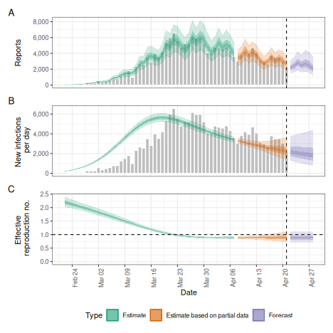
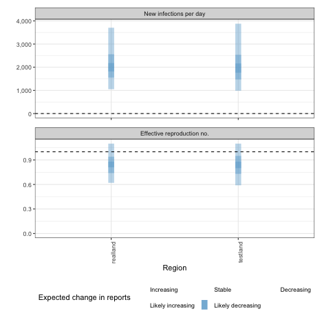

## Quick start

In the following section we give an overview of the simple use case for `epinow()` and `regional_epinow()`.

The first step to using the package is to load it as follows.


``` r
library(EpiNow2)
```

### Reporting delays, incubation period and generation time

Distributions can be supplied in two ways. First, one can supply delay data to `estimate_delay()`, where a subsampled bootstrapped lognormal will be fit to account for uncertainty in the observed data without being biased by changes in incidence (see `?EpiNow2::estimate_delay()`).

Second, one can specify predetermined delays with uncertainty using the distribution functions such as `Gamma` or `Lognormal`. An arbitrary number of delay distributions are supported in `dist_spec()` with a common use case being an incubation period followed by a reporting delay. For more information on specifying distributions see (see `?EpiNow2::Distributions`).

For example if data on the delay between onset and infection was available we could fit a distribution to it, using `estimate_delay()`, with appropriate uncertainty as follows (note this is a synthetic example),

``` r
reporting_delay <- estimate_delay(
  rlnorm(1000, log(2), 1),
  max_value = 14, bootstraps = 1
)
```

If data was not available we could instead specify an informed estimate of the likely delay using the distribution functions `Gamma` or `LogNormal`. 
To demonstrate, we choose a lognormal distribution with mean 2, standard deviation 1 and a maximum of 10. *This is just an example and unlikely to apply in any particular use case*.


``` r
reporting_delay <- LogNormal(mean = 2, sd = 1, max = 10)
reporting_delay
#> - lognormal distribution (max: 10):
#>   meanlog:
#>     0.58
#>   sdlog:
#>     0.47
```

For the rest of this vignette, we will use inbuilt example literature estimates for the incubation period and generation time of Covid-19 (see [here](https://github.com/epiforecasts/EpiNow2/tree/main/data-raw) for the code that generates these estimates). *These distributions are unlikely to be applicable for your use case. We strongly recommend investigating what might be the best distributions to use in any given use case.*


``` r
example_generation_time
#> - gamma distribution (max: 14):
#>   shape:
#>     - normal distribution:
#>       mean:
#>         1.4
#>       sd:
#>         0.48
#>   rate:
#>     - normal distribution:
#>       mean:
#>         0.38
#>       sd:
#>         0.25
example_incubation_period
#> - lognormal distribution (max: 14):
#>   meanlog:
#>     - normal distribution:
#>       mean:
#>         1.6
#>       sd:
#>         0.064
#>   sdlog:
#>     - normal distribution:
#>       mean:
#>         0.42
#>       sd:
#>         0.069
```

Users can also pass a non-parametric delay distribution vector using the `NonParametric` option 
for both the generation interval and reporting delays. It is important to note that if doing so,
both delay distributions are 0-indexed, meaning the first element corresponds to the probability mass
at day 0 of an individual's infection. Because the discretised renewal equation doesn't support mass on day 0, the generation interval should be passed in as a 0-indexed vector with a mass of zero on day 0. 


``` r
example_non_parametric_gi <-  NonParametric(pmf = c(0, 0.3, 0.5, 0.2))

example_non_parametric_delay <- NonParametric(pmf = c(0.01, 0.1, 0.5, 0.3, 0.09))
```
These distributions are passed to downstream functions in the same way that the 
parametric distributions are. 

Now, to the functions.

### [epinow()](https://epiforecasts.io/EpiNow2/reference/epinow.html)

This function represents the core functionality of the package and includes results reporting, plotting, and optional saving. It requires a data frame of cases by date of report and the distributions defined above.

Load example case data from `{EpiNow2}`.


``` r
reported_cases <- example_confirmed[1:60]
head(reported_cases)
#>          date confirm
#>        <Date>   <num>
#> 1: 2020-02-22      14
#> 2: 2020-02-23      62
#> 3: 2020-02-24      53
#> 4: 2020-02-25      97
#> 5: 2020-02-26      93
#> 6: 2020-02-27      78
```

Estimate cases by date of infection, the time-varying reproduction number, the rate of growth, and forecast these estimates into the future by 7 days. Summarise the posterior and return a summary table and plots for reporting purposes. If a `target_folder` is supplied results can be internally saved (with the option to also turn off explicit returning of results). Here we use the default model parameterisation that prioritises real-time performance over run-time or other considerations. For other formulations see the documentation for `estimate_infections()`.


``` r
estimates <- epinow(
  data = reported_cases,
  generation_time = gt_opts(example_generation_time),
  delays = delay_opts(example_incubation_period + reporting_delay),
  rt = rt_opts(prior = LogNormal(mean = 2, sd = 0.2)),
  stan = stan_opts(cores = 4),
  verbose = interactive()
)
names(estimates)
#> [1] "estimates"                "estimated_reported_cases"
#> [3] "summary"                  "plots"                   
#> [5] "timing"
```

Both summary measures and posterior samples are returned for all parameters in an easily explored format which can be accessed using `summary`. The default is to return a summary table of estimates for key parameters at the latest date partially supported by data. 


``` r
knitr::kable(summary(estimates))
```


|measure                      |estimate                 |
|:----------------------------|:------------------------|
|New infections per day       |2252 (1329 -- 3710)      |
|Expected change in reports   |Likely decreasing        |
|Effective reproduction no.   |0.9 (0.71 -- 1.1)        |
|Rate of growth               |-0.029 (-0.099 -- 0.041) |
|Doubling/halving time (days) |-24 (17 -- -7)           |


Summarised parameter estimates can also easily be returned, either filtered for a single parameter or for all parameters.


``` r
head(summary(estimates, type = "parameters", params = "R"))
#>          date variable  strat     type   median     mean         sd lower_90
#>        <Date>   <char> <char>   <char>    <num>    <num>      <num>    <num>
#> 1: 2020-02-22        R   <NA> estimate 2.193149 2.200104 0.11564102 2.026658
#> 2: 2020-02-23        R   <NA> estimate 2.156483 2.163207 0.10618602 1.999641
#> 3: 2020-02-24        R   <NA> estimate 2.119311 2.124673 0.09873534 1.970767
#> 4: 2020-02-25        R   <NA> estimate 2.079198 2.084685 0.09291826 1.940114
#> 5: 2020-02-26        R   <NA> estimate 2.038397 2.043437 0.08830928 1.906665
#> 6: 2020-02-27        R   <NA> estimate 1.998369 2.001131 0.08449804 1.868863
#>    lower_50 lower_20 upper_20 upper_50 upper_90
#>       <num>    <num>    <num>    <num>    <num>
#> 1: 2.119776 2.166101 2.224954 2.275779 2.399584
#> 2: 2.089983 2.131102 2.183989 2.231205 2.348724
#> 3: 2.057821 2.095834 2.144507 2.188966 2.301283
#> 4: 2.022479 2.057438 2.103773 2.145735 2.252112
#> 5: 1.982156 2.017405 2.062424 2.100924 2.202118
#> 6: 1.941095 1.977819 2.019560 2.055478 2.149323
```

Reported cases are returned in a separate data frame in order to streamline the reporting of forecasts and for model evaluation.


``` r
head(summary(estimates, output = "estimated_reported_cases"))
#>          date   type median     mean        sd lower_90 lower_50 lower_20
#>        <Date> <char>  <num>    <num>     <num>    <num>    <num>    <num>
#> 1: 2020-02-22  gp_rt     35  35.9195  9.812653    21.00       29     33.0
#> 2: 2020-02-23  gp_rt     52  53.0605 13.018548    33.00       44     49.0
#> 3: 2020-02-24  gp_rt     65  65.5190 15.426102    42.00       54     60.0
#> 4: 2020-02-25  gp_rt     72  73.0850 16.844543    48.00       61     68.0
#> 5: 2020-02-26  gp_rt     82  83.7130 18.736359    55.95       70     78.0
#> 6: 2020-02-27  gp_rt    118 120.1015 25.542071    83.00      102    112.6
#>    upper_20 upper_50 upper_90
#>       <num>    <num>    <num>
#> 1:       38       42       53
#> 2:       55       61       76
#> 3:       68       75       93
#> 4:       77       83      103
#> 5:       87       95      117
#> 6:      124      136      166
```

A range of plots are returned (with the single summary plot shown below). These plots can also be generated using the following `plot` method.


``` r
plot(estimates)
```




### [regional_epinow()](https://epiforecasts.io/EpiNow2/reference/regional_epinow.html)

The `regional_epinow()` function runs the `epinow()` function across multiple regions in
an efficient manner.

Define cases in multiple regions delineated by the region variable.


``` r
reported_cases <- data.table::rbindlist(list(
  data.table::copy(reported_cases)[, region := "testland"],
  reported_cases[, region := "realland"]
))
head(reported_cases)
#>          date confirm   region
#>        <Date>   <num>   <char>
#> 1: 2020-02-22      14 testland
#> 2: 2020-02-23      62 testland
#> 3: 2020-02-24      53 testland
#> 4: 2020-02-25      97 testland
#> 5: 2020-02-26      93 testland
#> 6: 2020-02-27      78 testland
```

Calling `regional_epinow()` runs the `epinow()` on each region in turn (or in parallel depending on the settings used). Here we switch to using a weekly random walk rather than the full Gaussian process model giving us piecewise constant estimates by week. We also assign "testland" a different ascertainment of 0.5, using the `opts_list()` function, which is used to assign region-specific settings.


``` r
obs <- opts_list(
  obs_opts(),
  reported_cases,
  testland = obs_opts(scale = Fixed(0.5))
)

estimates <- regional_epinow(
  data = reported_cases,
  generation_time = gt_opts(example_generation_time),
  delays = delay_opts(example_incubation_period + reporting_delay),
  rt = rt_opts(prior = LogNormal(mean = 2, sd = 0.2), rw = 7),
  obs = obs,
  gp = NULL,
  stan = stan_opts(cores = 4, warmup = 250, samples = 1000)
)
#> INFO [2025-03-14 16:45:19] Producing following optional outputs: regions, summary, samples, plots, latest
#> INFO [2025-03-14 16:45:19] Reporting estimates using data up to: 2020-04-21
#> INFO [2025-03-14 16:45:19] No target directory specified so returning output
#> INFO [2025-03-14 16:45:19] Producing estimates for: testland, realland
#> INFO [2025-03-14 16:45:19] Regions excluded: none
#> INFO [2025-03-14 16:45:29] Completed estimates for: testland
#> INFO [2025-03-14 16:45:37] Completed estimates for: realland
#> INFO [2025-03-14 16:45:37] Completed regional estimates
#> INFO [2025-03-14 16:45:37] Regions with estimates: 2
#> INFO [2025-03-14 16:45:37] Regions with runtime errors: 0
#> INFO [2025-03-14 16:45:37] Producing summary
#> INFO [2025-03-14 16:45:37] No summary directory specified so returning summary output
#> INFO [2025-03-14 16:45:37] No target directory specified so returning timings
```

Results from each region are stored in a `regional` list with across region summary measures and plots stored in a `summary` list. All results can be set to be internally saved by setting the `target_folder` and `summary_dir` arguments. Each region can be estimated in parallel using the `{future}` package (when in most scenarios `cores` should be set to 1). For routine use each MCMC chain can also be run in parallel (with `future` = `TRUE`) with a time out (`max_execution_time`) allowing for partial results to be returned if a subset of chains is running longer than expected. See the documentation for the [`{future}`](https://future.futureverse.org/) package for details on nested futures.

Summary measures that are returned include a table formatted for reporting (along with raw results for further processing). Futures updated will extend the S3 methods used above to smooth access to this output.


``` r
knitr::kable(estimates$summary$summarised_results$table)
```


|Region   |New infections per day |Expected change in reports |Effective reproduction no. |Rate of growth          |Doubling/halving time (days) |
|:--------|:----------------------|:--------------------------|:--------------------------|:-----------------------|:----------------------------|
|realland |1996 (1051 -- 3704)    |Likely decreasing          |0.85 (0.62 -- 1.1)         |-0.041 (-0.11 -- 0.031) |-17 (22 -- -6.1)             |
|testland |3930 (1974 -- 7757)    |Likely decreasing          |0.84 (0.59 -- 1.1)         |-0.044 (-0.12 -- 0.035) |-16 (20 -- -5.8)             |


A range of plots are again returned (with the single summary plot shown below).


``` r
estimates$summary$summary_plot
```


