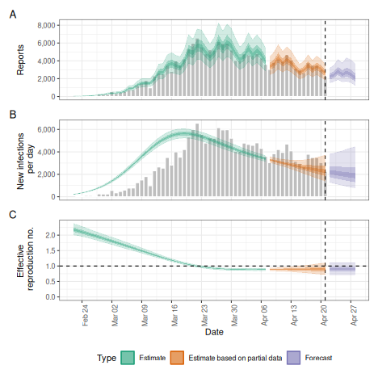
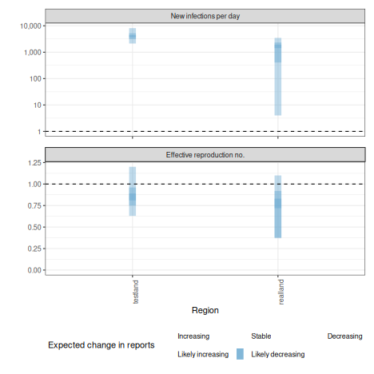

## Quick start

In the following section we give an overview of the simple use case for `epinow()` and `regional_epinow()`.

The first step to using the package is to load it as follows.


``` r
library(EpiNow2)
```

### Reporting delays, incubation period and generation time

Distributions can be supplied in two ways. First, one can supply delay data to `estimate_delay()`, where a subsampled bootstrapped lognormal will be fit to account for uncertainty in the observed data without being biased by changes in incidence (see `?EpiNow2::estimate_delay()`).

Second, one can specify predetermined delays with uncertainty using the distribution functions such as `Gamma` or `LogNormal`. An arbitrary number of delay distributions are supported in `dist_spec()` with a common use case being an incubation period followed by a reporting delay. For more information on specifying distributions see `?EpiNow2::Distributions` or the [delays vignette](delays.html).

For example if data on the delay between onset and infection was available we could fit a distribution to it, using `estimate_delay()`, with appropriate uncertainty as follows (note this is a synthetic example),

``` r
reporting_delay <- estimate_delay(
  rlnorm(1000, log(2), 1),
  max_value = 14, bootstraps = 1
)
```

If data was not available we could instead specify an informed estimate of the likely delay using the distribution functions `Gamma` or `LogNormal`. 
To demonstrate, we choose a lognormal distribution with mean 2, standard deviation 1 and a maximum of 10. *This is just an example and unlikely to apply in any particular use case*.


``` r
reporting_delay <- LogNormal(mean = 2, sd = 1, max = 10)
reporting_delay
#> - lognormal distribution (max: 10):
#>   meanlog:
#>     0.58
#>   sdlog:
#>     0.47
```

For the rest of this vignette, we will use inbuilt example literature estimates for the incubation period and generation time of Covid-19 (see [here](https://github.com/epiforecasts/EpiNow2/tree/main/data-raw) for the code that generates these estimates). *These distributions are unlikely to be applicable for your use case. We strongly recommend investigating what might be the best distributions to use in any given use case.*


``` r
example_generation_time
#> - gamma distribution (max: 14):
#>   shape:
#>     - normal distribution:
#>       mean:
#>         1.4
#>       sd:
#>         0.48
#>   rate:
#>     - normal distribution:
#>       mean:
#>         0.38
#>       sd:
#>         0.25
example_incubation_period
#> - lognormal distribution (max: 14):
#>   meanlog:
#>     - normal distribution:
#>       mean:
#>         1.6
#>       sd:
#>         0.064
#>   sdlog:
#>     - normal distribution:
#>       mean:
#>         0.42
#>       sd:
#>         0.069
```

Users can also pass a non-parametric delay distribution vector using the `NonParametric` option 
for both the generation interval and reporting delays. It is important to note that if doing so,
both delay distributions are 0-indexed, meaning the first element corresponds to the probability mass
at day 0 of an individual's infection. Because the discretised renewal equation doesn't support mass on day 0, the generation interval should be passed in as a 0-indexed vector with a mass of zero on day 0. 


``` r
example_non_parametric_gi <-  NonParametric(pmf = c(0, 0.3, 0.5, 0.2))

example_non_parametric_delay <- NonParametric(pmf = c(0.01, 0.1, 0.5, 0.3, 0.09))
```
These distributions are passed to downstream functions in the same way that the 
parametric distributions are. 

Now, to the functions.

### [epinow()](https://epiforecasts.io/EpiNow2/reference/epinow.html)

This function represents the core functionality of the package and includes results reporting, plotting, and optional saving. It requires a data frame of cases by date of report and the distributions defined above.

Load example case data from `{EpiNow2}`.


``` r
reported_cases <- example_confirmed[1:60]
head(reported_cases)
#>          date confirm
#>        <Date>   <num>
#> 1: 2020-02-22      14
#> 2: 2020-02-23      62
#> 3: 2020-02-24      53
#> 4: 2020-02-25      97
#> 5: 2020-02-26      93
#> 6: 2020-02-27      78
```

Estimate cases by date of infection, the time-varying reproduction number, the rate of growth, and forecast these estimates into the future by 7 days. Summarise the posterior and return a summary table and plots for reporting purposes. If a `target_folder` is supplied results can be internally saved (with the option to also turn off explicit returning of results).


``` r
estimates <- epinow(
  data = reported_cases,
  generation_time = gt_opts(example_generation_time),
  delays = delay_opts(example_incubation_period + reporting_delay),
  rt = rt_opts(prior = GP(init = LogNormal(mean = 2, sd = 0.2))),
  stan = stan_opts(cores = 4),
  verbose = interactive()
)
names(estimates)
#> [1] "fit"          "args"         "observations" "timing"
```

The default model uses a Gaussian process to estimate time-varying transmission, which provides flexible estimates but can take several minutes to run. If speed is a priority, there are several alternatives:

- Use a random walk instead of the Gaussian process (`rt = rt_opts(prior = RW(...))`), as shown in the `regional_epinow()` example below.
- Use variational inference for fast but unreliable approximate results (`stan = stan_opts(method = "vb")`).
- Reduce the accuracy of the Gaussian process approximation (see the `basis_prop` argument of `?GP`).

For examples of different model configurations, see the [estimate_infections_options](estimate_infections_options.html) vignette.

Both summary measures and posterior samples are returned for all parameters in an easily explored format which can be accessed using `summary`. The default is to return a summary table of estimates for key parameters at the latest date partially supported by data. 


``` r
knitr::kable(summary(estimates))
```


|measure                      |estimate                 |
|:----------------------------|:------------------------|
|New infections per day       |2258 (1396 -- 3669)      |
|Expected change in reports   |Likely decreasing        |
|Effective reproduction no.   |0.9 (0.72 -- 1.1)        |
|Rate of growth               |-0.027 (-0.094 -- 0.037) |
|Doubling/halving time (days) |-26 (19 -- -7.4)         |


Summarised parameter estimates can also easily be returned, either filtered for a single parameter or for all parameters.


``` r
head(summary(estimates, type = "parameters", params = "R"))
#>          date variable strat     type   median     mean         sd lower_90
#>        <Date>   <char> <int>   <char>    <num>    <num>      <num>    <num>
#> 1: 2020-02-22        R    NA estimate 2.176019 2.183666 0.11586621 2.009778
#> 2: 2020-02-23        R    NA estimate 2.138413 2.146013 0.10627408 1.981473
#> 3: 2020-02-24        R    NA estimate 2.099667 2.106954 0.09873043 1.958666
#> 4: 2020-02-25        R    NA estimate 2.059165 2.066688 0.09289832 1.927610
#> 5: 2020-02-26        R    NA estimate 2.018162 2.025419 0.08837572 1.892391
#> 6: 2020-02-27        R    NA estimate 1.976874 1.983338 0.08475357 1.856917
#>    lower_50 lower_20 upper_20 upper_50 upper_90
#>       <num>    <num>    <num>    <num>    <num>
#> 1: 2.102628 2.148147 2.206870 2.256218 2.386487
#> 2: 2.071767 2.112972 2.165709 2.213490 2.334249
#> 3: 2.036739 2.074359 2.126323 2.170331 2.283441
#> 4: 2.001497 2.035088 2.085108 2.125370 2.232792
#> 5: 1.964655 1.995453 2.043140 2.079722 2.184592
#> 6: 1.924149 1.955805 1.999858 2.036117 2.134826
```

Reported cases can be extracted using `get_predictions()` which returns summarised estimates by default.


``` r
head(get_predictions(estimates))
#>          date median     mean       sd lower_90 lower_50 lower_20 upper_20
#>        <Date>  <num>    <num>    <num>    <num>    <num>    <num>    <num>
#> 1: 2020-02-22     35  35.7100  9.77490    21.00       29       33       37
#> 2: 2020-02-23     52  52.8535 12.94263    33.95       44       49       55
#> 3: 2020-02-24     64  65.3105 15.44216    42.00       54       60       68
#> 4: 2020-02-25     72  73.3130 16.49245    49.00       62       68       76
#> 5: 2020-02-26     82  83.1480 18.23248    56.00       70       77       86
#> 6: 2020-02-27    118 120.4305 25.52820    82.00      103      112      125
#>    upper_50 upper_90
#>       <num>    <num>
#> 1:       42       52
#> 2:       61       76
#> 3:       75       93
#> 4:       83      103
#> 5:       95      114
#> 6:      136      165
```

A range of plots are returned (with the single summary plot shown below). These plots can also be generated using the following `plot` method.


``` r
plot(estimates)
```




### [regional_epinow()](https://epiforecasts.io/EpiNow2/reference/regional_epinow.html)

The `regional_epinow()` function runs the `epinow()` function across multiple regions in
an efficient manner.

Define cases in multiple regions delineated by the region variable.


``` r
reported_cases <- data.table::rbindlist(list(
  data.table::copy(reported_cases)[, region := "testland"],
  reported_cases[, region := "realland"]
))
head(reported_cases)
#>          date confirm   region
#>        <Date>   <num>   <char>
#> 1: 2020-02-22      14 testland
#> 2: 2020-02-23      62 testland
#> 3: 2020-02-24      53 testland
#> 4: 2020-02-25      97 testland
#> 5: 2020-02-26      93 testland
#> 6: 2020-02-27      78 testland
```

Calling `regional_epinow()` runs the `epinow()` on each region in turn (or in parallel depending on the settings used). Here we switch to using a weekly random walk rather than the full Gaussian process model giving us piecewise constant estimates by week. We also assign "testland" a different ascertainment of 50%, using the `opts_list()` function, which is used to assign region-specific settings.


``` r
obs <- opts_list(
  obs_opts(),
  reported_cases,
  testland = obs_opts(scale = Fixed(0.5))
)

estimates <- regional_epinow(
  data = reported_cases,
  generation_time = gt_opts(example_generation_time),
  delays = delay_opts(example_incubation_period + reporting_delay),
  rt = rt_opts(prior = RW(init = LogNormal(mean = 2, sd = 0.2), period = 7)),
  obs = obs,
  stan = stan_opts(cores = 4, warmup = 250, samples = 1000),
  logs = NULL
)
```

Results from each region are stored in a `regional` list with across region summary measures and plots stored in a `summary` list. All results can be set to be internally saved by setting the `target_folder` and `summary_dir` arguments. Each region can be estimated in parallel using the `{future}` package (when in most scenarios `cores` should be set to 1). For routine use each MCMC chain can also be run in parallel (with `future` = `TRUE`) with a time out (`max_execution_time`) allowing for partial results to be returned if a subset of chains is running longer than expected. See the documentation for the [`{future}`](https://future.futureverse.org/) package for details on nested futures.

Summary measures that are returned include a table formatted for reporting (along with raw results for further processing).


``` r
knitr::kable(estimates$summary$summarised_results$table)
```


|Region   |New infections per day |Expected change in reports |Effective reproduction no. |Rate of growth          |Doubling/halving time (days) |
|:--------|:----------------------|:--------------------------|:--------------------------|:-----------------------|:----------------------------|
|realland |2005 (1110 -- 3979)    |Likely decreasing          |0.85 (0.62 -- 1.2)         |-0.042 (-0.11 -- 0.04)  |-17 (17 -- -6.4)             |
|testland |3998 (2043 -- 7742)    |Likely decreasing          |0.86 (0.6 -- 1.2)          |-0.041 (-0.12 -- 0.045) |-17 (15 -- -6)               |


A range of plots are again returned (with the single summary plot shown below).


``` r
estimates$summary$summary_plot
```


