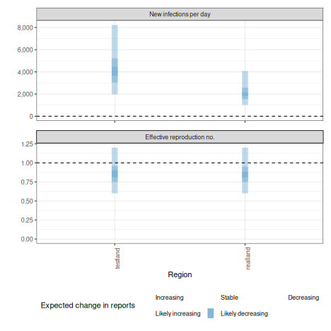

## Quick start

In the following section we give an overview of the simple use case for `epinow()` and `regional_epinow()`.

The first step to using the package is to load it as follows.


``` r
library(EpiNow2)
```

### Reporting delays, incubation period and generation time

Distributions can be supplied in two ways. First, one can supply delay data to `estimate_delay()`, where a subsampled bootstrapped lognormal will be fit to account for uncertainty in the observed data without being biased by changes in incidence (see `?EpiNow2::estimate_delay()`).

Second, one can specify predetermined delays with uncertainty using the distribution functions such as `Gamma` or `Lognormal`. An arbitrary number of delay distributions are supported in `dist_spec()` with a common use case being an incubation period followed by a reporting delay. For more information on specifying distributions see (see `?EpiNow2::Distributions`).

For example if data on the delay between onset and infection was available we could fit a distribution to it, using `estimate_delay()`, with appropriate uncertainty as follows (note this is a synthetic example),

``` r
reporting_delay <- estimate_delay(
  rlnorm(1000, log(2), 1),
  max_value = 14, bootstraps = 1
)
```

If data was not available we could instead specify an informed estimate of the likely delay using the distribution functions `Gamma` or `LogNormal`. 
To demonstrate, we choose a lognormal distribution with mean 2, standard deviation 1 and a maximum of 10. *This is just an example and unlikely to apply in any particular use case*.


``` r
reporting_delay <- LogNormal(mean = 2, sd = 1, max = 10)
reporting_delay
#> - lognormal distribution (max: 10):
#>   meanlog:
#>     0.58
#>   sdlog:
#>     0.47
```

For the rest of this vignette, we will use inbuilt example literature estimates for the incubation period and generation time of Covid-19 (see [here](https://github.com/epiforecasts/EpiNow2/tree/main/data-raw) for the code that generates these estimates). *These distributions are unlikely to be applicable for your use case. We strongly recommend investigating what might be the best distributions to use in any given use case.*


``` r
example_generation_time
#> - gamma distribution (max: 14):
#>   shape:
#>     - normal distribution:
#>       mean:
#>         1.4
#>       sd:
#>         0.48
#>   rate:
#>     - normal distribution:
#>       mean:
#>         0.38
#>       sd:
#>         0.25
example_incubation_period
#> - lognormal distribution (max: 14):
#>   meanlog:
#>     - normal distribution:
#>       mean:
#>         1.6
#>       sd:
#>         0.064
#>   sdlog:
#>     - normal distribution:
#>       mean:
#>         0.42
#>       sd:
#>         0.069
```

Users can also pass a non-parametric delay distribution vector using the `NonParametric` option 
for both the generation interval and reporting delays. It is important to note that if doing so,
both delay distributions are 0-indexed, meaning the first element corresponds to the probability mass
at day 0 of an individual's infection. Because the discretised renewal equation doesn't support mass on day 0, the generation interval should be passed in as a 0-indexed vector with a mass of zero on day 0. 


``` r
example_non_parametric_gi <-  NonParametric(pmf = c(0, 0.3, 0.5, 0.2))

example_non_parametric_delay <- NonParametric(pmf = c(0.01, 0.1, 0.5, 0.3, 0.09))
```
These distributions are passed to downstream functions in the same way that the 
parametric distributions are. 

Now, to the functions.

### [epinow()](https://epiforecasts.io/EpiNow2/reference/epinow.html)

This function represents the core functionality of the package and includes results reporting, plotting, and optional saving. It requires a data frame of cases by date of report and the distributions defined above.

Load example case data from `{EpiNow2}`.


``` r
reported_cases <- example_confirmed[1:60]
head(reported_cases)
#>          date confirm
#>        <Date>   <num>
#> 1: 2020-02-22      14
#> 2: 2020-02-23      62
#> 3: 2020-02-24      53
#> 4: 2020-02-25      97
#> 5: 2020-02-26      93
#> 6: 2020-02-27      78
```

Estimate cases by date of infection, the time-varying reproduction number, the rate of growth, and forecast these estimates into the future by 7 days. Summarise the posterior and return a summary table and plots for reporting purposes. If a `target_folder` is supplied results can be internally saved (with the option to also turn off explicit returning of results). Here we use the default model parameterisation that prioritises real-time performance over run-time or other considerations. For other formulations see the documentation for `estimate_infections()`.


``` r
estimates <- epinow(
  data = reported_cases,
  generation_time = gt_opts(example_generation_time),
  delays = delay_opts(example_incubation_period + reporting_delay),
  rt = rt_opts(prior = LogNormal(mean = 2, sd = 0.2)),
  stan = stan_opts(cores = 4),
  verbose = interactive()
)
names(estimates)
#> [1] "fit"          "args"         "observations" "timing"
```

Both summary measures and posterior samples are returned for all parameters in an easily explored format which can be accessed using `summary`. The default is to return a summary table of estimates for key parameters at the latest date partially supported by data. 


``` r
knitr::kable(summary(estimates))
```


|measure                      |estimate                 |
|:----------------------------|:------------------------|
|New infections per day       |1813 (765 -- 4538)       |
|Expected change in reports   |Likely decreasing        |
|Effective reproduction no.   |0.89 (0.71 -- 1.1)       |
|Rate of growth               |-0.029 (-0.086 -- 0.027) |
|Doubling/halving time (days) |-24 (26 -- -8.1)         |


Summarised parameter estimates can also easily be returned, either filtered for a single parameter or for all parameters.


``` r
head(summary(estimates, type = "parameters", params = "R"))
#>          date variable strat     type   median     mean         sd lower_90
#>        <Date>   <char> <int>   <char>    <num>    <num>      <num>    <num>
#> 1: 2020-02-22        R    NA estimate 2.189648 2.196213 0.11336185 2.023501
#> 2: 2020-02-23        R    NA estimate 2.153710 2.159198 0.10259863 1.998873
#> 3: 2020-02-24        R    NA estimate 2.118107 2.120663 0.09411365 1.974120
#> 4: 2020-02-25        R    NA estimate 2.078305 2.080785 0.08768269 1.941711
#> 5: 2020-02-26        R    NA estimate 2.037962 2.039743 0.08296362 1.909825
#> 6: 2020-02-27        R    NA estimate 1.995351 1.997715 0.07954817 1.874942
#>    lower_50 lower_20 upper_20 upper_50 upper_90
#>       <num>    <num>    <num>    <num>    <num>
#> 1: 2.116083 2.163518 2.221263 2.267635 2.391763
#> 2: 2.086574 2.128094 2.182408 2.224640 2.333380
#> 3: 2.054704 2.092117 2.140637 2.180685 2.279482
#> 4: 2.019448 2.055093 2.099769 2.136280 2.230685
#> 5: 1.981584 2.015820 2.057302 2.089886 2.182033
#> 6: 1.941424 1.975040 2.014929 2.046460 2.135327
```

Reported cases are returned in a separate data frame in order to streamline the reporting of forecasts and for model evaluation.


``` r
head(summary(estimates, output = "estimated_reported_cases"))
#> Warning: The `output` argument of `summary.epinow()` is deprecated as of EpiNow2 1.8.0.
#> ℹ Please use the `type` argument instead.
#> ℹ The epinow object now inherits from estimate_infections. Use type =
#>   'snapshot' or type = 'parameters'. For estimated_reported_cases, use
#>   estimates_by_report_date().
#> This warning is displayed once every 8 hours.
#> Call `lifecycle::last_lifecycle_warnings()` to see where this warning was
#> generated.
#> $samples
#>               date sample cases   type
#>             <Date>  <int> <num> <char>
#>      1: 2020-02-22      1    23  gp_rt
#>      2: 2020-02-23      1    37  gp_rt
#>      3: 2020-02-24      1    39  gp_rt
#>      4: 2020-02-25      1    61  gp_rt
#>      5: 2020-02-26      1    88  gp_rt
#>     ---                               
#> 133996: 2020-04-24   2000  4353  gp_rt
#> 133997: 2020-04-25   2000  2743  gp_rt
#> 133998: 2020-04-26   2000  3688  gp_rt
#> 133999: 2020-04-27   2000  2575  gp_rt
#> 134000: 2020-04-28   2000  2639  gp_rt
#> 
#> $summarised
#>           date   type median      mean         sd lower_90 lower_50 lower_20
#>         <Date> <char>  <num>     <num>      <num>    <num>    <num>    <num>
#>  1: 2020-02-22  gp_rt   35.0   36.3825    9.99996    22.00    29.75     33.0
#>  2: 2020-02-23  gp_rt   52.0   53.0555   13.09439    34.00    44.00     49.0
#>  3: 2020-02-24  gp_rt   65.0   65.6955   15.56759    42.00    55.00     60.0
#>  4: 2020-02-25  gp_rt   72.0   72.8700   16.93146    48.00    61.00     68.0
#>  5: 2020-02-26  gp_rt   83.0   83.5495   18.01854    54.00    72.00     78.0
#>  6: 2020-02-27  gp_rt  120.0  121.3125   25.71222    82.00   103.00    113.0
#>  7: 2020-02-28  gp_rt  187.5  189.9340   38.37981   131.00   163.00    178.0
#>  8: 2020-02-29  gp_rt  213.0  215.4205   42.64826   151.00   186.00    202.0
#>  9: 2020-03-01  gp_rt  308.0  314.1360   63.21700   219.00   270.75    292.6
#> 10: 2020-03-02  gp_rt  365.0  371.1340   71.86744   267.95   321.00    347.0
#> 11: 2020-03-03  gp_rt  397.0  402.8820   77.69250   281.00   350.00    379.0
#> 12: 2020-03-04  gp_rt  435.0  440.2290   82.11203   316.00   380.00    415.0
#> 13: 2020-03-05  gp_rt  596.0  606.4675  117.37716   432.95   524.00    570.0
#> 14: 2020-03-06  gp_rt  890.0  904.8815  167.34007   655.95   787.00    854.0
#> 15: 2020-03-07  gp_rt  960.5  975.4975  182.57875   703.95   854.75    920.0
#> 16: 2020-03-08  gp_rt 1307.5 1323.8295  248.04267   944.90  1155.00   1250.0
#> 17: 2020-03-09  gp_rt 1462.0 1484.9355  266.92898  1091.00  1293.00   1397.0
#> 18: 2020-03-10  gp_rt 1475.0 1508.4225  283.02982  1076.95  1311.00   1416.0
#> 19: 2020-03-11  gp_rt 1512.0 1529.2705  284.15421  1102.00  1328.00   1440.0
#> 20: 2020-03-12  gp_rt 1960.0 1984.6145  377.94396  1420.95  1722.00   1872.6
#> 21: 2020-03-13  gp_rt 2765.0 2786.6305  525.46093  2002.95  2425.50   2627.6
#> 22: 2020-03-14  gp_rt 2757.0 2793.9620  528.34585  1968.00  2441.00   2627.6
#> 23: 2020-03-15  gp_rt 3520.0 3562.4225  659.28201  2549.95  3109.75   3370.0
#> 24: 2020-03-16  gp_rt 3639.5 3688.6975  681.53165  2680.95  3196.00   3485.0
#> 25: 2020-03-17  gp_rt 3457.0 3504.5270  670.20315  2504.70  3036.75   3294.6
#> 26: 2020-03-18  gp_rt 3291.0 3326.9175  621.47094  2390.00  2881.00   3133.0
#> 27: 2020-03-19  gp_rt 3916.5 3979.6645  744.96939  2854.70  3453.00   3743.0
#> 28: 2020-03-20  gp_rt 5135.5 5201.5965  953.95704  3783.95  4522.75   4902.8
#> 29: 2020-03-21  gp_rt 4820.0 4889.7455  900.18043  3529.95  4246.00   4593.6
#> 30: 2020-03-22  gp_rt 5718.0 5818.1865 1112.53741  4167.00  5057.00   5452.8
#> 31: 2020-03-23  gp_rt 5577.0 5617.2715 1021.26254  4044.00  4901.75   5321.0
#> 32: 2020-03-24  gp_rt 4954.0 4995.0625  917.16853  3559.85  4361.00   4745.4
#> 33: 2020-03-25  gp_rt 4371.5 4430.9255  806.64303  3204.90  3865.00   4175.6
#> 34: 2020-03-26  gp_rt 4970.0 5037.7730  911.97679  3664.85  4414.75   4764.0
#> 35: 2020-03-27  gp_rt 6104.5 6176.9335 1150.14752  4431.00  5367.75   5813.0
#> 36: 2020-03-28  gp_rt 5423.0 5490.0620 1037.65629  3977.75  4768.75   5148.6
#> 37: 2020-03-29  gp_rt 6105.5 6181.5710 1124.52352  4479.80  5417.50   5837.6
#> 38: 2020-03-30  gp_rt 5654.5 5747.8200 1050.84079  4143.90  5035.75   5417.6
#> 39: 2020-03-31  gp_rt 4803.5 4858.1930  914.07023  3426.55  4247.75   4597.6
#> 40: 2020-04-01  gp_rt 4162.5 4197.0495  750.87721  3038.90  3676.00   3970.6
#> 41: 2020-04-02  gp_rt 4513.5 4585.5515  841.72216  3304.90  4001.25   4323.6
#> 42: 2020-04-03  gp_rt 5379.5 5462.5230 1072.54499  3890.90  4735.75   5112.6
#> 43: 2020-04-04  gp_rt 4661.5 4712.9220  897.19177  3371.95  4067.50   4456.2
#> 44: 2020-04-05  gp_rt 5166.0 5247.2355  994.46811  3786.85  4566.50   4930.0
#> 45: 2020-04-06  gp_rt 4713.0 4773.6135  842.97775  3473.95  4205.50   4508.0
#> 46: 2020-04-07  gp_rt 3924.5 3990.1530  741.58948  2890.95  3485.00   3753.2
#> 47: 2020-04-08  gp_rt 3344.5 3412.9440  626.68011  2459.95  3006.00   3209.0
#> 48: 2020-04-09  gp_rt 3652.5 3701.0755  686.19479  2667.00  3225.00   3484.6
#> 49: 2020-04-10  gp_rt 4334.0 4399.3240  824.14446  3194.40  3831.75   4152.0
#> 50: 2020-04-11  gp_rt 3759.0 3813.1660  697.21342  2769.85  3334.00   3594.0
#> 51: 2020-04-12  gp_rt 4162.5 4219.8485  789.78256  3060.95  3657.75   3949.0
#> 52: 2020-04-13  gp_rt 3778.5 3810.6615  698.97734  2741.95  3319.00   3604.0
#> 53: 2020-04-14  gp_rt 3164.0 3218.6810  595.89220  2313.95  2822.75   3036.6
#> 54: 2020-04-15  gp_rt 2684.5 2725.8830  504.74088  1980.95  2385.00   2560.6
#> 55: 2020-04-16  gp_rt 2966.5 3001.0820  538.79523  2155.00  2623.00   2830.6
#> 56: 2020-04-17  gp_rt 3508.0 3539.9255  658.54506  2525.75  3087.75   3344.8
#> 57: 2020-04-18  gp_rt 3033.0 3070.6635  579.04568  2180.80  2677.00   2893.0
#> 58: 2020-04-19  gp_rt 3329.0 3390.4295  642.99674  2395.95  2943.00   3174.0
#> 59: 2020-04-20  gp_rt 3087.0 3137.3765  615.57993  2202.70  2712.75   2944.0
#> 60: 2020-04-21  gp_rt 2561.5 2611.8980  523.06330  1846.90  2249.00   2444.6
#> 61: 2020-04-22  gp_rt 2191.5 2240.0405  480.89083  1532.95  1893.00   2082.0
#> 62: 2020-04-23  gp_rt 2373.5 2440.2250  558.80685  1638.90  2054.75   2247.2
#> 63: 2020-04-24  gp_rt 2814.0 2903.6860  706.57311  1867.90  2410.00   2663.0
#> 64: 2020-04-25  gp_rt 2434.0 2536.0710  695.79867  1593.00  2072.75   2284.0
#> 65: 2020-04-26  gp_rt 2698.5 2813.6895  790.78334  1698.90  2258.75   2525.6
#> 66: 2020-04-27  gp_rt 2478.5 2611.3855  822.32565  1541.00  2045.75   2304.6
#> 67: 2020-04-28  gp_rt 2086.0 2214.4985  784.21066  1200.90  1675.75   1913.0
#>           date   type median      mean         sd lower_90 lower_50 lower_20
#>         <Date> <char>  <num>     <num>      <num>    <num>    <num>    <num>
#>     upper_20 upper_50 upper_90
#>        <num>    <num>    <num>
#>  1:     38.0    42.00    54.00
#>  2:     55.0    61.00    77.00
#>  3:     69.0    75.00    93.00
#>  4:     76.0    83.00   104.00
#>  5:     87.0    95.00   115.00
#>  6:    126.0   137.00   167.00
#>  7:    196.0   213.00   257.00
#>  8:    223.0   241.00   290.00
#>  9:    326.0   353.00   426.00
#> 10:    382.4   413.00   498.05
#> 11:    418.0   453.00   533.00
#> 12:    457.0   492.00   587.00
#> 13:    625.4   676.00   822.00
#> 14:    933.0  1010.00  1203.05
#> 15:   1003.0  1084.00  1303.20
#> 16:   1365.4  1465.25  1760.05
#> 17:   1533.0  1648.25  1955.00
#> 18:   1561.0  1690.00  2014.10
#> 19:   1577.4  1710.00  2027.15
#> 20:   2051.4  2211.00  2632.05
#> 21:   2881.4  3090.25  3723.25
#> 22:   2896.4  3120.25  3710.10
#> 23:   3676.2  3963.25  4682.40
#> 24:   3812.8  4102.00  4899.10
#> 25:   3614.4  3904.25  4668.15
#> 26:   3436.0  3724.25  4373.05
#> 27:   4118.4  4450.25  5255.35
#> 28:   5380.4  5804.00  6904.15
#> 29:   5060.0  5464.25  6497.20
#> 30:   6007.2  6514.00  7763.15
#> 31:   5828.4  6275.00  7315.50
#> 32:   5185.8  5559.25  6587.10
#> 33:   4559.8  4936.25  5837.10
#> 34:   5194.0  5615.50  6582.70
#> 35:   6378.4  6911.00  8130.25
#> 36:   5652.4  6110.50  7282.00
#> 37:   6366.0  6865.25  8185.30
#> 38:   5941.0  6423.00  7592.05
#> 39:   5024.4  5435.50  6410.30
#> 40:   4348.4  4673.50  5487.00
#> 41:   4718.4  5096.25  6059.10
#> 42:   5626.4  6098.50  7394.15
#> 43:   4873.0  5319.00  6271.50
#> 44:   5402.0  5834.25  7011.30
#> 45:   4939.0  5305.25  6213.15
#> 46:   4113.4  4440.25  5296.55
#> 47:   3525.0  3823.00  4497.20
#> 48:   3808.8  4122.00  4904.05
#> 49:   4541.0  4893.00  5845.15
#> 50:   3936.0  4218.50  5043.10
#> 51:   4353.4  4699.50  5629.05
#> 52:   3955.4  4246.00  5027.10
#> 53:   3323.4  3568.00  4277.00
#> 54:   2803.0  3033.00  3596.35
#> 55:   3097.0  3350.00  3930.00
#> 56:   3669.4  3930.00  4706.25
#> 57:   3177.8  3429.25  4086.20
#> 58:   3499.0  3792.00  4545.10
#> 59:   3243.0  3513.75  4218.10
#> 60:   2688.0  2936.00  3548.25
#> 61:   2324.4  2524.00  3096.45
#> 62:   2510.0  2766.25  3452.20
#> 63:   2986.8  3329.00  4152.30
#> 64:   2603.2  2877.25  3824.80
#> 65:   2914.4  3255.50  4289.05
#> 66:   2672.0  3041.00  4145.35
#> 67:   2265.6  2589.25  3700.10
#>     upper_20 upper_50 upper_90
#>        <num>    <num>    <num>
```

A range of plots are returned (with the single summary plot shown below). These plots can also be generated using the following `plot` method.


``` r
plot(estimates)
```


### [regional_epinow()](https://epiforecasts.io/EpiNow2/reference/regional_epinow.html)

The `regional_epinow()` function runs the `epinow()` function across multiple regions in
an efficient manner.

Define cases in multiple regions delineated by the region variable.


``` r
reported_cases <- data.table::rbindlist(list(
  data.table::copy(reported_cases)[, region := "testland"],
  reported_cases[, region := "realland"]
))
head(reported_cases)
#>          date confirm   region
#>        <Date>   <num>   <char>
#> 1: 2020-02-22      14 testland
#> 2: 2020-02-23      62 testland
#> 3: 2020-02-24      53 testland
#> 4: 2020-02-25      97 testland
#> 5: 2020-02-26      93 testland
#> 6: 2020-02-27      78 testland
```

Calling `regional_epinow()` runs the `epinow()` on each region in turn (or in parallel depending on the settings used). Here we switch to using a weekly random walk rather than the full Gaussian process model giving us piecewise constant estimates by week. We also assign "testland" a different ascertainment of 50%, using the `opts_list()` function, which is used to assign region-specific settings.


``` r
obs <- opts_list(
  obs_opts(),
  reported_cases,
  testland = obs_opts(scale = Fixed(0.5))
)

estimates <- regional_epinow(
  data = reported_cases,
  generation_time = gt_opts(example_generation_time),
  delays = delay_opts(example_incubation_period + reporting_delay),
  rt = rt_opts(prior = LogNormal(mean = 2, sd = 0.2), rw = 7),
  obs = obs,
  gp = NULL,
  stan = stan_opts(cores = 4, warmup = 250, samples = 1000)
)
```

Results from each region are stored in a `regional` list with across region summary measures and plots stored in a `summary` list. All results can be set to be internally saved by setting the `target_folder` and `summary_dir` arguments. Each region can be estimated in parallel using the `{future}` package (when in most scenarios `cores` should be set to 1). For routine use each MCMC chain can also be run in parallel (with `future` = `TRUE`) with a time out (`max_execution_time`) allowing for partial results to be returned if a subset of chains is running longer than expected. See the documentation for the [`{future}`](https://future.futureverse.org/) package for details on nested futures.

Summary measures that are returned include a table formatted for reporting (along with raw results for further processing).


``` r
knitr::kable(estimates$summary$summarised_results$table)
```


|Region   |New infections per day |Expected change in reports |Effective reproduction no. |Rate of growth          |Doubling/halving time (days) |
|:--------|:----------------------|:--------------------------|:--------------------------|:-----------------------|:----------------------------|
|realland |1491 (496 -- 4809)     |Likely decreasing          |0.85 (0.63 -- 1.1)         |-0.042 (-0.11 -- 0.036) |-17 (19 -- -6.1)             |
|testland |2934 (929 -- 10558)    |Likely decreasing          |0.85 (0.61 -- 1.2)         |-0.043 (-0.12 -- 0.043) |-16 (16 -- -5.9)             |


A range of plots are again returned (with the single summary plot shown below).


``` r
estimates$summary$summary_plot
```


