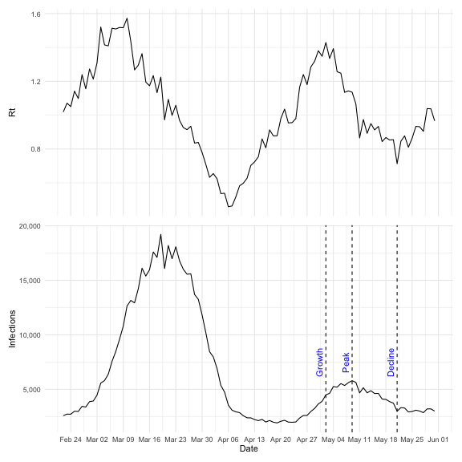
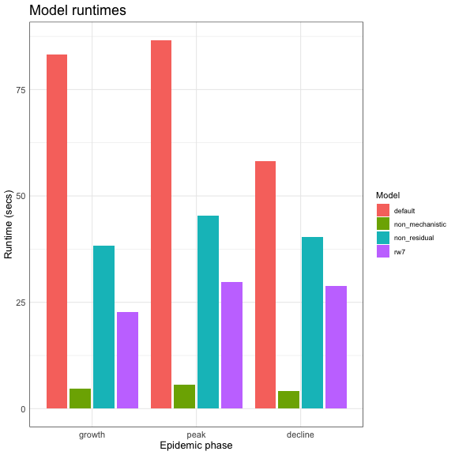
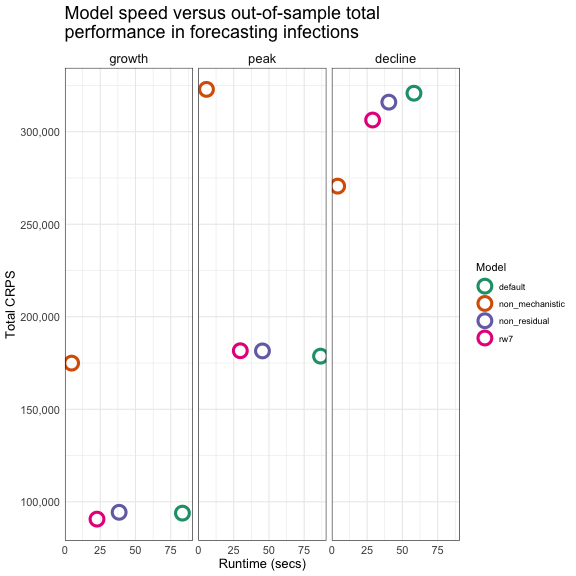
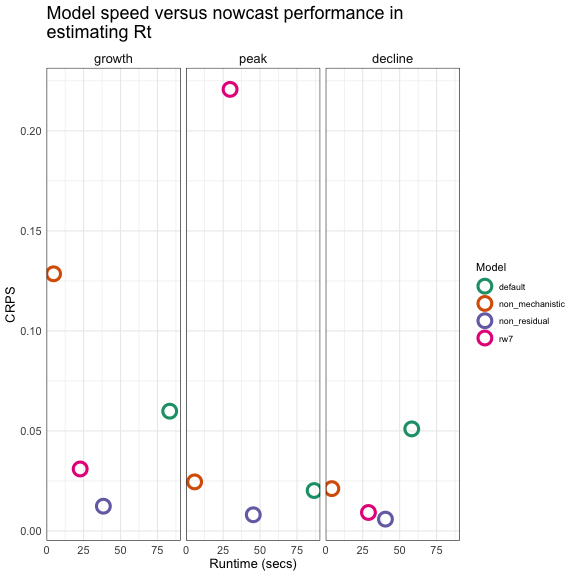
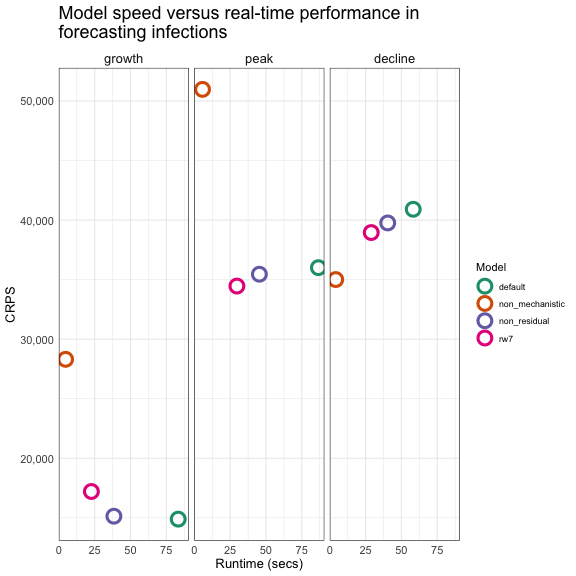
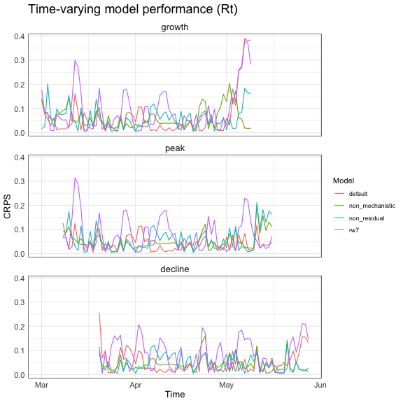
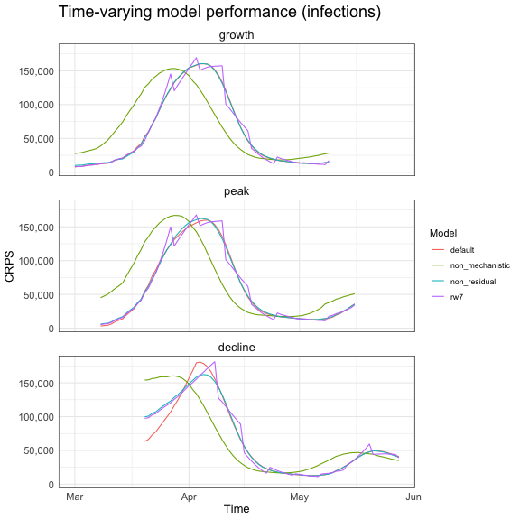

``` r
library(EpiNow2)
library(scoringutils)
library(data.table)
library(rstan)
library(cmdstanr)
library(ggplot2)
library(dplyr)
library(tidyr)
library(purrr)
library(lubridate)
library(scales)
library(posterior)
library(parallel)
library(patchwork)
set.seed(9876)
```

In using `{EpiNow2}`, users will often need to balance between speeding up models and reasonable model fits. `{EpiNow2}` provides a range of customisations of the default model to suit these decision points.

The aim of this vignette is to show how these model customisations affect the speed, nowcasting, and forecasting performance of the models. We will benchmark four (4) `{EpiNow2}` model options, including the default model and customisations in the default prior on how $R_t$ is generated and evolves over time. These models are chosen to cover a range of use cases.

We will compare the models in terms of their total performance in forecasting unseen data, nowcasting $R_t$, and real-time forecasting of the latest infections. 

The models will be fitted with stan's default [MCMC sampling algorithm](https://mc-stan.org/docs/reference-manual/mcmc.html) and three (3) additional non-mcmc algorithms: [Automatic Differentiation Variational Inference](https://mc-stan.org/docs/cmdstan-guide/variational_config.html), [Pathfinder method](https://mc-stan.org/docs/cmdstan-guide/pathfinder_config.html), and [Laplace sampling](https://mc-stan.org/docs/cmdstan-guide/laplace_sample_config.html). Note that the non-mcmc algorithms are currently unstable in the stan ecosystem hence not recommended for use in production pipelines.

## Data

To compare the models, we will simulate epidemic data and generate three training data scenarios representing the three phases of an epidemic curve: growth, peak, and decline.

<details><summary> Simulation steps </summary>

Throughout this vignette, several argument values, including the observation model options and the $R_t$ model prior will be reused, so we will define them here. Note that we use 5 cores out of 6 cores and this affects the time it takes to run the models.


``` r
# Observation model options
obs <- obs_opts(
  scale = Normal(0.1, 0.025),
  return_likelihood = TRUE
)
# Rt prior
rt_prior_default <- Normal(2, 0.1)
# Number of cores
options(mc.cores = detectCores() - 1)
```

Let's start by creating the "true" $R_t$ and infections data/trajectories.

We will use `{EpiNow2}`'s `forecast_infections()` function. This function allows us to generate a posterior that can be re-used to generate infections by changing the Rt trajectory.

`forecast_infections()` requires a fitted "estimates"" object from `epinow()` with the `output` argument set to "fit", the trajectory of the reproduction number, `R`, and the number of samples to simulate.

To obtain the `estimates` object, we will run the `epinow()` function using real-world observed data and delay distributions to recover realistic parameter values. For the `data`, we will use the first $60$ observations of the `example_confirmed` data set. We will use the `example_generation_time` for the generation time, and the sum of the incubation period (`example_incubation_period`) and reporting delay (`example_reporting_delay`) as the delay. These delays come with the package.

For the $R_t$ prior, we will use a 14-day random walk, with a mean of $2$ and standard deviation of $0.1$. Lastly, as we only want to generate estimates, we will turn off forecasting by setting `horizon = 0`.

We'll now generate the `estimates` object from the observed data (`example_confirmed`).

``` r
cases <- example_confirmed[1:60]
estimates <- epinow(
  data = cases,
  generation_time = generation_time_opts(example_generation_time),
  delays = delay_opts(example_incubation_period + example_reporting_delay),
  rt = rt_opts(prior = rt_prior_default, rw = 14),
  gp = NULL,
  obs = obs,
  forecast = forecast_opts(horizon = 0), # no forecasting
  output = "fit"
)
```

That's it for the estimates object. Next, we'll create the `R` data using an arbitrary trajectory that has some Gaussian noise added to it. We'll use it to simulate the true infections data by sampling from $1$ posterior sample.

```{.r .fold-hide}
# Arbitrary reproduction number trajectory
R <- c(
    seq(1, 1.5, length.out = 15),  # Rising to peak 1
    seq(1.5, 1, length.out = 15),  # Falling back to 1
    seq(1, 0.5, length.out = 15),  # Dropping to valley
    seq(0.5, 1, length.out = 15),  # Rising back to 1
    seq(1, 1.4, length.out = 10),  # Smaller peak
    seq(1.4, 1, length.out = 10),  # Back to 1
    seq(1, 0.8, length.out = 10),  # Small dip
    seq(0.8, 1, length.out = 10)   # Returning to 1
)
# Add Gaussian noise
R_noisy <- R * rnorm(length(R), 1, 0.05)

# Forecast infections and the trajectory of Rt
forecast <- forecast_infections(
  estimates$estimates,
  R = R_noisy,
  samples = 1
)
```

Now, we can extract and plot the true $R_t$ and infections data. These will be used for the evaluations later on.

``` r
# Extract and prepare the simulated true infections
infections_true <- forecast$summarised[variable == "infections", .(date, confirm = ceiling(mean))]

# Prepare the simulated true Rt
R_true <- data.frame(date = infections_true$date, R = R_noisy)
```

From the Rt data, the following dates in the second wave represent epidemic growth, peak, and decline. We will use these to create data snapshots later on. We use the second wave so we have enough prior data to fit the models.

``` r
snapshot_dates <- c(
    "growth" = as.Date("2020-05-02"),
    "peak" = as.Date("2020-05-09"),
    "decline" = as.Date("2020-05-21")
)
```

</details>

Here is the simulated data. The dotted lines show the chosen growth, peak, and decline phase in infections. These also represent the scenarios that the models will be fit to.

```{.r .fold-hide}
# Rt plot
R_traj <- ggplot(data = R_true) +
  geom_line(aes(x = date, y = R)) +
    labs(x = "Date",
         y = "R",
         title = "Time-varying reproduction number"
    )

# Infections plot
infections_traj <- ggplot(data = infections_true) +
  geom_line(aes(x = date, y = confirm)) +
  geom_vline(xintercept = snapshot_dates, linetype = "dashed") +
  annotate("text", x = snapshot_dates["growth"], y = 7500, label = "Growth", color = "red",
           angle = 90, vjust = -0.5) +
  annotate("text", x = snapshot_dates["peak"], y = 7500, label = "Peak", color = "red",
           angle = 90, vjust = -0.5) +
  annotate("text", x = snapshot_dates["decline"], y = 7500, label = "Decline", color = "red",
           angle = 90, vjust = -0.5) +
  scale_y_continuous(label = scales::label_comma()) +
    labs(title = "Infections",
         y = "Infections",
         x = "Date"
    )

# Compose the plots
(R_traj/infections_traj) +
    plot_layout(axes = "collect") &
    scale_x_date(date_labels = "%b %d", date_breaks = "1 weeks") &
    theme_minimal()
```



Let's proceed to the next step where we will define the models, fit them to the true data, and evaluate their performance.

## Models

### Descriptions

Below we describe each model.


Table: Model options

|model                      |description                                                                        |
|:--------------------------|:----------------------------------------------------------------------------------|
|default_mcmc               |Default model (non-stationary prior on $R_t$) ; fitting with mcmc                  |
|default_vb                 |Default model (non-stationary prior on $R_t$) ; fitting with variational bayes     |
|default_pathfinder         |Default model (non-stationary prior on $R_t$) ; fitting with pathfinder algorithm  |
|default_laplace            |Default model (non-stationary prior on $R_t$) ; fitting with laplace approximation |
|non_mechanistic_mcmc       |no mechanistic prior on $R_t$ ; fitting with mcmc                                  |
|non_mechanistic_vb         |no mechanistic prior on $R_t$ ; fitting with variational bayes                     |
|non_mechanistic_pathfinder |no mechanistic prior on $R_t$ ; fitting with pathfinder algorithm                  |
|non_mechanistic_laplace    |no mechanistic prior on $R_t$ ; fitting with laplace approximation                 |
|rw7_mcmc                   |7-day random walk prior on $R_t$ ; fitting with mcmc                               |
|rw7_vb                     |7-day random walk prior on $R_t$ ; fitting with variational bayes                  |
|rw7_pathfinder             |7-day random walk prior on $R_t$ ; fitting with pathfinder algorithm               |
|rw7_laplace                |7-day random walk prior on $R_t$ ; fitting with laplace approximation              |
|non_residual_mcmc          |Stationary prior on $R_t$ ; fitting with mcmc                                      |
|non_residual_vb            |Stationary prior on $R_t$ ; fitting with variational bayes                         |
|non_residual_pathfinder    |Stationary prior on $R_t$ ; fitting with pathfinder algorithm                      |
|non_residual_laplace       |Stationary prior on $R_t$ ; fitting with laplace approximation                     |


<details><summary> Model components </summary>


Table: Model components

|model                      |rt_gp_prior    |fitting    |package  |
|:--------------------------|:--------------|:----------|:--------|
|default_mcmc               |non_stationary |mcmc       |rstan    |
|default_vb                 |non_stationary |vb         |rstan    |
|default_pathfinder         |non_stationary |pathfinder |cmdstanr |
|default_laplace            |non_stationary |laplace    |cmdstanr |
|non_mechanistic_mcmc       |none           |mcmc       |rstan    |
|non_mechanistic_vb         |none           |vb         |rstan    |
|non_mechanistic_pathfinder |none           |pathfinder |cmdstanr |
|non_mechanistic_laplace    |none           |laplace    |cmdstanr |
|rw7_mcmc                   |non_stationary |mcmc       |rstan    |
|rw7_vb                     |non_stationary |vb         |rstan    |
|rw7_pathfinder             |non_stationary |pathfinder |cmdstanr |
|rw7_laplace                |non_stationary |laplace    |cmdstanr |
|non_residual_mcmc          |stationary     |mcmc       |rstan    |
|non_residual_vb            |stationary     |vb         |rstan    |
|non_residual_pathfinder    |stationary     |pathfinder |cmdstanr |
|non_residual_laplace       |stationary     |laplace    |cmdstanr |


</details>

### Configurations

We will now define the `{EpiNow2}` configurations for each model, which are modifications of the default model.

```{.r .fold-hide}
model_configs <- list(
  # The default model with MCMC fitting
  default_mcmc = list(
    rt = rt_opts(
      prior = rt_prior_default
    )
  ),
  # The default model with variational bayes fitting
  default_vb = list(
    rt = rt_opts(
      prior = rt_prior_default
    ),
    stan = stan_opts(method = "vb", backend = "rstan")
  ),
  # The default model with pathfinder fitting
  default_pathfinder = list(
    rt = rt_opts(
      prior = rt_prior_default
    ),
    stan = stan_opts(method = "pathfinder", backend = "cmdstanr")
  ),
  # The default model with laplace fitting
  default_laplace = list(
    rt = rt_opts(
      prior = rt_prior_default
    ),
    stan = stan_opts(method = "laplace", backend = "cmdstanr")
  ),
  # The non-mechanistic model with MCMC fitting
  non_mechanistic_mcmc = list(
    rt = NULL
  ),
  # The non-mechanistic model with variational bayes fitting
  non_mechanistic_vb = list(
    rt = NULL,
    stan = stan_opts(method = "vb", backend = "rstan")
  ),
  # The non-mechanistic model with pathfinder fitting
  non_mechanistic_pathfinder = list(
    rt = NULL,
    stan = stan_opts(method = "pathfinder", backend = "cmdstanr")
  ),
  # The non-mechanistic model with laplace fitting
  non_mechanistic_laplace = list(
    rt = NULL,
    stan = stan_opts(method = "laplace", backend = "cmdstanr")
  ),
  # The 7-day RW Rt model with MCMC fitting
  rw7_mcmc = list(
    rt = rt_opts(
      prior = rt_prior_default,
      rw = 7
    ),
    gp = NULL
  ),
  # The 7-day RW Rt model with variational bayes fitting
  rw7_vb = list(
    rt = rt_opts(
      prior = rt_prior_default,
      rw = 7
    ),
    gp = NULL,
    stan = stan_opts(method = "vb", backend = "rstan")
  ),
  # The 7-day RW Rt model with pathfinder fitting
  rw7_pathfinder = list(
    rt = rt_opts(
      prior = rt_prior_default,
      rw = 7
    ),
    gp = NULL,
    stan = stan_opts(method = "pathfinder", backend = "cmdstanr")
  ),
  # The 7-day RW Rt model with laplace fitting
  rw7_laplace = list(
    rt = rt_opts(
      prior = rt_prior_default,
      rw = 7
    ),
    gp = NULL,
    stan = stan_opts(method = "laplace", backend = "cmdstanr")
  ),
  # The non_residual model with MCMC fitting
  non_residual_mcmc = list(
    rt = rt_opts(
      prior = rt_prior_default,
      gp_on = "R0"
    )
  ),
  # The non_residual model with variational bayes fitting
  non_residual_vb = list(
    rt = rt_opts(
      prior = rt_prior_default,
      gp_on = "R0"
    ),
    stan = stan_opts(method = "vb", backend = "rstan")
  ),
  # The non_residual model with pathfinder fitting
  non_residual_pathfinder = list(
    rt = rt_opts(
      prior = rt_prior_default,
      gp_on = "R0"
    ),
    stan = stan_opts(method = "pathfinder", backend = "cmdstanr")
  ),
  # The non_residual model with laplace fitting
  non_residual_laplace = list(
    rt = rt_opts(
      prior = rt_prior_default,
      gp_on = "R0"
    ),
    stan = stan_opts(method = "pathfinder", backend = "cmdstanr")
  )
)
```

### Inputs

All the models will share the configuration for the generation time, incubation period, reporting delay, and the forecast horizon, so we will define them once and pass them to the models.


``` r
# Combine the incubation period and reporting delay into one delay
delay <- example_incubation_period + example_reporting_delay

# 7-day forecast window
horizon <- 7

# Combine the shared model inputs into a list for use across all the models
model_inputs <- list(
  generation_time = generation_time_opts(example_generation_time),
  delays = delay_opts(delay),
  obs = obs,
  forecast = forecast_opts(horizon = horizon),
  verbose = FALSE
)
```

## Running the models

Now, we're ready to run the models. We will use snapshots of the true infections data representing the last 10 weeks and including the growth, peak, and decline phase of the second wave.


``` r
data_length <- 70
# create the data snapshots for fitting the models using the snapshot dates. 
data_snaps <- lapply(
  snapshot_dates,
  function(snap_date) {
    tail(infections_true[date <= snap_date], data_length)
  }
)

# Create a version of epinow() that works like base::try() and works even if some models fail.
safe_epinow <- purrr::safely(epinow)
# Run the models over the different dates
results <- lapply(
  data_snaps, function(data) {
    lapply(
      model_configs,
      function(model) {
        do.call(
          safe_epinow,
          c(
            data = list(data),
            model_inputs,
            model
          )
        )
      }
    )
  }
)
```

## Evaluating model performance

We will now evaluate the models.

<details><summary> Extraction functions </summary>

We'll begin by setting up the following post-processing functions:


``` r
# Function to extract the "timing", "Rt", "infections", and "reports" variables from an
# epinow() run. It expects a model run, x, which contains a "results" or "error" component.
# If the model run successfully, "error" should be NULL.
extract_results <- function(x, variable) {
  stopifnot(
    "variable must be one of c(\"timing\", \"R\", \"infections\", \"reports\")" =
      variable %in% c("timing", "R", "infections", "reports")
  )
  # Return NA if there's an error
  if (!is.null(x$error)) {
    return(NA)
  }

  if (variable == "timing") {
    return(round(as.duration(x$result$timing), 1))
  } else {
    obj <- x$result$estimates$fit
  }

  # Extracting "Rt", "infections", and "reports" is different based on the object's class and
  # other settings
  if (inherits(obj, "stanfit")) {
    # Depending on rt_opts(use_rt = TRUE/FALSE), R shows up as R or gen_R
    if (variable == "R") {
      # The non-mechanistic model returns "gen_R" where as the others sample "R".
      if ("R[1]" %in% names(obj)) {
        return(rstan::extract(obj, "R")$R)
      } else {
        return(rstan::extract(obj, "gen_R")$gen_R)
      }
    } else {
      return(rstan::extract(obj, variable)[[variable]])
    }
  } else {
    obj_mat <- as_draws_matrix(obj)
    # Extracting R depends on the value of rt_opts(use_rt = )
    if (variable == "R") {
      if ("R[1]" %in% variables(obj_mat)) {
          return(subset_draws(obj_mat, "R"))
      } else {
        return(subset_draws(obj_mat, "gen_R"))
      }
    } else {
        return(subset_draws(obj_mat, variable))
      }
    }
}

# Apply `extract_results()` to a nested list of model runs per snapshot date.
get_model_results <- function(results_by_snapshot, variable) {
  # Get model results list
  purrr::map_depth(results_by_snapshot, 2, extract_results, variable)
}

# Re-categorise the four(4) fitting methods into either MCMC or non-mcmc.
add_fit_type <- function(data){
  data[, fit_type := ifelse(fitting == "mcmc", "mcmc", "non-mcmc")]
  data[]
}

# Function to convert all columns to factor except the specified cols in `except`
make_cols_factors <- function(data, except){
  data[
    ,
    (setdiff(names(data), except)) :=
      lapply(.SD, as.factor),
    .SDcols = setdiff(names(data), except)
  ]
  data[]
}

# Add factor levels to the `epidemic_phase` column to allow for easy ordering.
add_epidemic_phase_levels <- function(data){
  data[, epidemic_phase := factor(epidemic_phase, levels = c("growth", "peak", "decline"))]
  data[]
}

# Calculate the CRPS using the [scoringutils](https://epiforecasts.io/scoringutils/) R package. It ensures that the estimates and truth data are the same length before calculating the crps. It also returns NA if the passed estimates object is not a matrix because the extraction function above returns a matrix.
calc_crps <- function(estimates, truth) {
    # if the object is not a matrix, then it's an NA (failed run)
    if (!inherits(estimates, c("matrix"))) return(rep(NA_real_, length(truth)))
    # Assumes that the estimates object is structured with the samples as rows
    shortest_obs_length <- min(ncol(estimates), length(truth))
    reduced_truth <- head(truth, shortest_obs_length)
    estimates_transposed <- t(estimates) # transpose to have samples as columns
    reduced_estimates <- head(estimates_transposed, shortest_obs_length)
    crps_sample(reduced_truth, reduced_estimates)
}

# Calculate CRPS estimates for the nested list of model runs per snapshot date and flatten into a simple list.
process_crps <- function(results, variable, truth) {
    # Extract values
    results_by_snapshot <- get_model_results(results, variable = variable)

    # Get the dates reference from the true infections time series
    dates_ref <- infections_true$date
    # For each snapshot (growth, peak, decline)
    crps_by_snapshot <- purrr::imap(
        results_by_snapshot,
        function(results_by_model, snapshot_ref_label) {
            # Get the correct slice of truth data for this snapshot date. Note that we now
            # include the test data, i.e., the forecast horizon
            snapshot_date <- snapshot_dates[snapshot_ref_label]
            truth_slice <- tail(
                truth[1:which(dates_ref == snapshot_date + horizon)],
                data_length
            )
            
            # For each model in this snapshot, calculate CRPS comparing model estimates to truth slice
            purrr::map(results_by_model, function(res) {
                calc_crps(estimates = res, truth = truth_slice)
            })
        })
    
    # Add dates column based on snapshot length
    crps_with_dates <- purrr::imap(
        crps_by_snapshot,
        function(results_by_model, snapshot_ref_label) {
            date_end <- snapshot_dates[snapshot_ref_label] + horizon
            
            purrr::map(results_by_model, function(crps_values) {
                data.table(crps = crps_values)[,
                    date := seq.Date(
                        from = date_end - .N + 1,
                        to = date_end,
                        by = "day"
                    )]
            })
        })
    # Flatten the results into one dt
    crps_flat <- lapply(
        crps_with_dates,
        function(snapshot_results) {
            rbindlist(snapshot_results, idcol = "model")
        }) |>
        rbindlist(idcol = "snapshot_date")
    
    # Replace the snapshot dates with their description
    snapshot_date_labels <- names(snapshot_dates)
    # Replace the snapshot dates with their description
    crps_flat[, epidemic_phase := snapshot_date_labels[
        match(snapshot_date, snapshot_date_labels)
    ]]
    
    return(crps_flat[])
}

# Add the model components and descriptions to the results of `process_crps()`.
add_model_details <- function(crps_by_model){
  with_model_components <- merge.data.table(
    crps_by_model,
    model_components,
    by = "model"
  )

  # Add model descriptions
  crps_dt <- merge.data.table(
    with_model_components,
    model_descriptions,
    by = "model"
  )
  crps_dt[]
}

# Shared plot settings
plot_caption_custom <- "Where a model is not shown, it means it failed to run"
plot_theme_custom <- theme_minimal() +
    theme(plot.title = element_text(size = 18),
          strip.text = element_text(size = 13),
          axis.title = element_text(size = 13),
          axis.text = element_text(size = 11)
    )
```
</details>

### Run times (computational resources)

Let's see how long each model took to run.

```{.r .fold-hide}
# Extract the run times and reshape to dt
runtimes_by_snapshot <- get_model_results(results, "timing")

# Flatten the results
runtimes_dt <- lapply(runtimes_by_snapshot, function(x) as.data.table(x)) |>
  rbindlist(idcol = "snapshot_date", ignore.attr = TRUE)

# Reshape
runtimes_dt_long <- melt(
  runtimes_dt,
  id.vars = "snapshot_date",    # Column to keep as an identifier
  measure.vars = model_descriptions$model,  # Dynamically select model columns by pattern
  variable.name = "model",      # Name for the 'model' column
  value.name = "timing"         # Name for the 'timing' column
)

# Add model configurations
runtimes_dt_detailed <- merge(
  runtimes_dt_long,
  model_components,
  by = "model"
)

# snapshot dates dictionary
snapshot_date_labels <- names(snapshot_dates)

# Replace snapshot_date based on the dictionary
runtimes_dt_detailed[, epidemic_phase := snapshot_date_labels[match(snapshot_date, snapshot_date_labels)]]

# Add model descriptions
runtimes_dt_detailed <- merge(
  runtimes_dt_detailed,
  model_descriptions,
  by = "model"
)

# Re-categorise the factor levels
runtimes_dt_detailed <- add_fit_type(runtimes_dt_detailed)

# Make all columns except timing a factor
runtimes_dt_detailed <- make_cols_factors(runtimes_dt_detailed, except = "timing")

# Add epidemic_phase factor levels to c("growth", "peak", "decline"))
runtimes_dt_detailed <- add_epidemic_phase_levels(runtimes_dt_detailed)

# Plot the timing
timing_plot <- ggplot(data = runtimes_dt_detailed) +
  geom_point(aes(x = epidemic_phase,
                 y = timing,
                 shape = fitting,
                 color = model_basename
                 ),
             position = position_dodge(width = 0.4),
             size = 3,
             stroke = 1.2
  ) +
  labs(x = "Epidemic phase",
       y = "Runtime (secs)",
       shape = "Fitting algorithm",
       color = "Model",
       title = "Runtimes per model and fitting algorithm",
       caption = plot_caption_custom
  ) +
  scale_color_brewer(palette = "Dark2") +
  scale_shape_manual(values = c(1, 0, 6, 8)) +
  plot_theme_custom
timing_plot
#> Warning: Removed 4 rows containing missing values or values outside the scale
#> range (`geom_point()`).
```



### Evaluating model performance

We will use the [continuous ranked probability score (CRPS)](https://en.wikipedia.org/wiki/Scoring_rule#Continuous_ranked_probability_score). CRPS is a [proper scoring rule](https://en.wikipedia.org/wiki/Scoring_rule#Propriety_and_consistency) that measures the accuracy of probabilistic forecasts. When comparing models, the smaller the CRPS, the better. 

We will evaluate the overall performance out-of-sample, i.e., total CRPS in the forecasting window. Additionally, for $R_t$, we'll evaluate the nowcast value, i.e., the estimate of $R_t$ before the forecast horizon, and for infections, we will compare the 7-day forecast as a measure of real-time performance.

Note: For details on the time-varying performance of the models, see the section [Results appendix].


```{.r .fold-hide}
# Process CRPS for Rt
rt_crps <- process_crps(results, "R", R_true$R)
rt_crps_full <- add_model_details(rt_crps)

# Re-categorise fit_type column and convert to factor
rt_crps_dt <- add_fit_type(rt_crps_full)
rt_crps_dt <- make_cols_factors(rt_crps_dt, except = c("date", "crps"))
rt_crps_dt_final <- add_epidemic_phase_levels(rt_crps_dt)

# Process CRPS for infections
infections_crps <- process_crps(results, "infections", infections_true$confirm)
infections_crps_full <- add_model_details(infections_crps)

infections_crps_dt <- add_fit_type(infections_crps_full)
infections_crps_dt <- make_cols_factors(infections_crps_dt, except = c("date", "crps"))
infections_crps_dt_final <- add_epidemic_phase_levels(infections_crps_dt)
```

#### Overall model performance

Let's compare the overall/aggregated performance of the models in terms of the total CRPS for $R_t$ and infections.

<details><summary> Summary and plotting functions </summary>


``` r
# Calculate total CRPS stratified by the "by" vector
calculate_total_crps <- function(data, by) {
    evaluation_data <- data[, .SD[(.N - horizon + 1):.N], by = by]
    evaluation_data[, .(total_crps = sum(crps, na.rm = TRUE)), by = by]
}
# Plot total CRPS. It returns a ggplot object that can take further layers.
plot_total_crps <- function(data, title) {
  plot <- ggplot(data = data) +
    geom_point(
      aes(
        x = epidemic_phase,
        y = total_crps,
        color = model_basename,
        shape = fitting,
        group = interaction(fitting, model_basename)
      ),
      position = position_dodge(width = 0.4),
      size = 3,
      stroke = 1.2
    ) +
    guides(
      color = guide_legend(title = "Model"),
      shape = guide_legend(title = "Fitting algorithm")
    ) +
    labs(
      x = "Epidemic phase",
      y = "Total CRPS",
      title = title,
      caption = plot_caption_custom
    ) +
    plot_theme_custom +
    scale_color_brewer(palette = "Dark2") +
    scale_shape_manual(values = c(1, 0, 6, 8))
  return(plot)
}
```

</details>




#### Nowcast $R_t$ estimates

We'll now compare the performance of the nowcast estimates of $R_t$, i.e., the estimate of $R_t$ in `horizon = -1`.


```
#> Warning: Removed 4 rows containing missing values or values outside the scale
#> range (`geom_point()`).
```



#### Real-time infection forecast

We'll also compare the real-time performance in estimating infections.


```
#> Warning: Removed 4 rows containing missing values or values outside the scale
#> range (`geom_point()`).
```



## Considerations for choosing an appropriate model

### Model types (Semi-mechanistic vs non-mechanistic)

Estimation in `{EpiNow2}` using the semi-mechanistic approaches (putting a prior on $R_t$) is often much slower than the non-mechanistic approach. The mechanistic model is slower because it models aspects of the processes and mechanisms that drive $R_t$ estimates using the renewal equation. The non-mechanistic model, on the other hand, runs much faster but does not use the renewal equation to generate infections. Because of this none of the options defining the behaviour of the reproduction number are available in this case, limiting its flexibility.

### Fitting algorithms (Exact vs non-mcmc)

The default sampling method, set through `stan_opts()`, performs [MCMC sampling](https://en.wikipedia.org/wiki/Markov_chain_Monte_Carlo) using [`{rstan}`](https://cran.r-project.org/web/packages/rstan/vignettes/rstan.html). The MCMC sampling method is accurate but is often slow. The Laplace, pathfinder, and variational inference methods are faster because they are approximate (See, for example, a detailed explanation for [automatic variational inference in Stan](https://arxiv.org/abs/1506.03431)).

In `{EpiNow2}`, you can use variational inference with an `{rstan}` or [`{cmdstanr}`](https://mc-stan.org/cmdstanr/) backend but you must install the latter to access its functionalities. Additionally, `{EpiNow2}` supports using the [Laplace](https://mc-stan.org/docs/cmdstan-guide/laplace_sample_config.html) and [Pathfinder](https://mc-stan.org/docs/cmdstan-guide/pathfinder_config.html) approximate samplers through the `{cmdstanr}` R package but these two methods are currently experimental in `{cmdstanr}` and have not been well tested. The non-mcmc methods may not be as reliable as the default MCMC sampling method and we do not recommend using them in real-world inference.

The non-mcmc methods can be used in various ways. First, you can initialise the MCMC sampling algorithm with the fit object returned by methods such as [pathfinder](https://mc-stan.org/docs/reference-manual/pathfinder.html#using-pathfinder-for-initializing-mcmc). More details can be found in the original [pathfinder paper](https://arxiv.org/abs/2108.03782). This approach speeds up the initialisation phase of the MCMC algorithm. Second, the non-mcmc methods are also great for prototyping. For example, if you are testing out a pipeline setup, it might be more practical to switch to a method like variational bayes and only use MCMC when the pipeline is up and running.

### Smoothness/granularity of estimates

The random walk method reduces smoothness/granularity of the estimates, compared to the other methods.

## Caveats of this exercise

We generated the data using an arbitrary `R` trajectory. This represents only one of many data scenarios that the models can be benchmarked against. The data used here represents abrupt rises and falls and could favour one model type or solver over another.

The run times measured here use a crude method that compares the start and end times of each simulation. It only measures the time taken for one model run and may not be accurate. For more accurate run time measurements, we recommend using a more sophisticated approach like those provided by packages like [`{bench}`](https://cran.r-project.org/web/packages/bench/index.html) and [`{microbenchmark}`](https://cran.r-project.org/web/packages/microbenchmark/index.html).

Lastly, we used 5 cores for the simulations and so using more or fewer cores might change the run time results. We, however, expect the relative rankings to be the same or similar. To speed up the model runs, we recommend checking the number of cores available on your machine using `parallel::detectCores()` and passing a high enough number of cores to `mc.cores` through the `options()` function (See [data] for an example of how to do this).

## Results appendix {#results-appendix}

<details><summary> Model performance over time </summary>

Let's see how the $R_t$ and infections CRPS changed over time.






</details>
