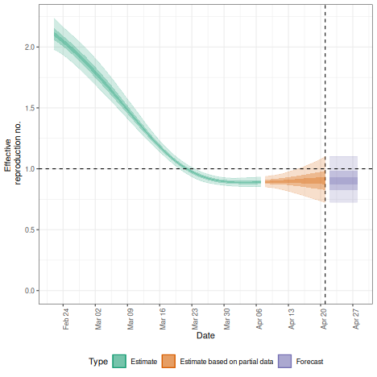
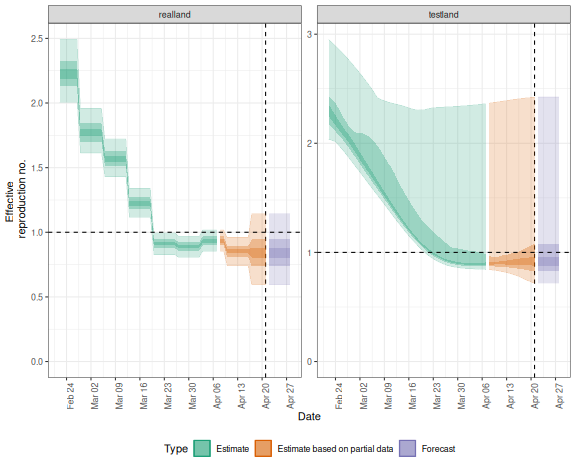

The _EpiNow2_ package contains functionality to run `estimate_infections()` in production mode, i.e. with full logging and saving all relevant outputs and plots to dedicated folders in the hard drive.
This is done with the `epinow()` function, that takes the same options as `estimate_infections()` with some additional options that determine, for example, where output gets stored and what output exactly.
The function can be a useful option when, e.g., running the model daily with updated data on a high-performance computing server to feed into a dashboard.
For more detail on the various model options available, see the [Examples](estimate_infections_options.html) vignette, for more on the general modelling approach the [Workflow](estimate_infections_workflow.html), and for theoretical background the [Model definitions](estimate_infections.html) vignette

# Running the model on a single region

To run the model in production mode for a single region, set the parameters up in the same way as for `estimate_infections()` (see the [Workflow](estimate_infections_workflow.html) vignette).
Here we use the example delay and generation time distributions that come with the package.
This should be replaced with parameters relevant to the system that is being studied.


``` r
library("EpiNow2")
options(mc.cores = 4)
reported_cases <- example_confirmed[1:60]
reporting_delay <- LogNormal(mean = 2, sd = 1, max = 10)
delay <- example_incubation_period + reporting_delay
rt_prior <- list(mean = 2, sd = 0.1)
```

We can then run the `epinow()` function with the same arguments as `estimate_infections()`.


``` r
res <- epinow(reported_cases,
  generation_time = generation_time_opts(example_generation_time),
  delays = delay_opts(delay),
  rt = rt_opts(prior = rt_prior)
)
#> Logging threshold set at INFO for the EpiNow2 logger
#> Writing EpiNow2 logs to the console and: /var/folders/vr/dn4r1_zj417drd1zr9301trw0000gp/T//Rtmpv7UfXL/regional-epinow/2020-04-21.log
#> Logging threshold set at INFO for the EpiNow2.epinow logger
#> Writing EpiNow2.epinow logs to the console and: /var/folders/vr/dn4r1_zj417drd1zr9301trw0000gp/T//Rtmpv7UfXL/epinow/2020-04-21.log
#> DEBUG [2024-06-19 18:04:28] epinow: Running in exact mode for 2000 samples (across 4 chains each with a warm up of 250 iterations each) and 81 time steps of which 7 are a forecast
#> WARN [2024-06-19 18:05:49] epinow: There were 1 divergent transitions after warmup. See
#> https://mc-stan.org/misc/warnings.html#divergent-transitions-after-warmup
#> to find out why this is a problem and how to eliminate them. - 
#> WARN [2024-06-19 18:05:49] epinow: Examine the pairs() plot to diagnose sampling problems
#>  -
```

``` r
res$plots$R
```



The initial messages here indicate where log files can be found.
If you want summarised results and plots to be written out where they can be accessed later you can use the `target_folder` argument.

# Running the model simultaneously on multiple regions

The package also contains functionality to conduct inference contemporaneously (if separately) in production mode on multiple time series, e.g. to run the model on multiple regions.
This is done with the `regional_epinow()` function.

Say, for example, we construct a dataset containing two regions, `testland` and `realland` (in this simple example both containing the same case data).


``` r
cases <- example_confirmed[1:60]
cases <- data.table::rbindlist(list(
  data.table::copy(cases)[, region := "testland"],
  cases[, region := "realland"]
 ))
```

To then run this on multiple regions using the default options above, we could use


``` r
region_rt <- regional_epinow(
  data = cases,
  generation_time = generation_time_opts(example_generation_time),
  delays = delay_opts(delay),
  rt = rt_opts(prior = rt_prior),
)
#> INFO [2024-06-19 18:05:51] Producing following optional outputs: regions, summary, samples, plots, latest
#> Logging threshold set at INFO for the EpiNow2 logger
#> Writing EpiNow2 logs to the console and: /var/folders/vr/dn4r1_zj417drd1zr9301trw0000gp/T//Rtmpv7UfXL/regional-epinow/2020-04-21.log
#> Logging threshold set at INFO for the EpiNow2.epinow logger
#> Writing EpiNow2.epinow logs to: /var/folders/vr/dn4r1_zj417drd1zr9301trw0000gp/T//Rtmpv7UfXL/epinow/2020-04-21.log
#> INFO [2024-06-19 18:05:51] Reporting estimates using data up to: 2020-04-21
#> INFO [2024-06-19 18:05:51] No target directory specified so returning output
#> INFO [2024-06-19 18:05:51] Producing estimates for: testland, realland
#> INFO [2024-06-19 18:05:51] Regions excluded: none
#> DEBUG [2024-06-19 18:05:51] testland: Running in exact mode for 2000 samples (across 4 chains each with a warm up of 250 iterations each) and 81 time steps of which 7 are a forecast
#> WARN [2024-06-19 18:06:27] testland (chain: 1): There were 13 divergent transitions after warmup. See
#> https://mc-stan.org/misc/warnings.html#divergent-transitions-after-warmup
#> to find out why this is a problem and how to eliminate them. - 
#> WARN [2024-06-19 18:06:27] testland (chain: 1): Examine the pairs() plot to diagnose sampling problems
#>  - 
#> INFO [2024-06-19 18:06:29] Completed estimates for: testland
#> DEBUG [2024-06-19 18:06:29] realland: Running in exact mode for 2000 samples (across 4 chains each with a warm up of 250 iterations each) and 81 time steps of which 7 are a forecast
#> WARN [2024-06-19 18:07:12] realland (chain: 1): There were 12 divergent transitions after warmup. See
#> https://mc-stan.org/misc/warnings.html#divergent-transitions-after-warmup
#> to find out why this is a problem and how to eliminate them. - 
#> WARN [2024-06-19 18:07:12] realland (chain: 1): Examine the pairs() plot to diagnose sampling problems
#>  - 
#> INFO [2024-06-19 18:07:14] Completed estimates for: realland
#> INFO [2024-06-19 18:07:14] Completed regional estimates
#> INFO [2024-06-19 18:07:14] Regions with estimates: 2
#> INFO [2024-06-19 18:07:14] Regions with runtime errors: 0
#> INFO [2024-06-19 18:07:14] Producing summary
#> INFO [2024-06-19 18:07:14] No summary directory specified so returning summary output
#> INFO [2024-06-19 18:07:15] No target directory specified so returning timings
```

``` r
## summary
region_rt$summary$summarised_results$table
#>      Region New infections per day Expected change in daily reports
#>      <char>                 <char>                           <fctr>
#> 1: realland    2260 (1009 -- 5055)                Likely decreasing
#> 2: testland     2237 (952 -- 4767)                Likely decreasing
#>    Effective reproduction no.          Rate of growth Doubling/halving time (days)
#>                        <char>                  <char>                       <char>
#> 1:         0.89 (0.58 -- 1.3) -0.032 (-0.15 -- 0.085)            -22 (8.2 -- -4.5)
#> 2:         0.88 (0.58 -- 1.2) -0.032 (-0.15 -- 0.077)              -21 (9 -- -4.5)
```

``` r
## plot
region_rt$summary$plots$R
```


If instead, we wanted to use the Gaussian Process for `testland` and a weekly random walk for `realland` we could specify these separately using the `opts_list()` function from the package and `modifyList()` from `R`.


``` r
gp <- opts_list(gp_opts(), cases)
gp <- modifyList(gp, list(realland = NULL), keep.null = TRUE)
rt <- opts_list(rt_opts(), cases, realland = rt_opts(rw = 7))
region_separate_rt <- regional_epinow(
  data = cases,
  generation_time = generation_time_opts(example_generation_time),
  delays = delay_opts(delay),
  rt = rt, gp = gp,
)
#> INFO [2024-06-19 18:07:15] Producing following optional outputs: regions, summary, samples, plots, latest
#> Logging threshold set at INFO for the EpiNow2 logger
#> Writing EpiNow2 logs to the console and: /var/folders/vr/dn4r1_zj417drd1zr9301trw0000gp/T//Rtmpv7UfXL/regional-epinow/2020-04-21.log
#> Logging threshold set at INFO for the EpiNow2.epinow logger
#> Writing EpiNow2.epinow logs to: /var/folders/vr/dn4r1_zj417drd1zr9301trw0000gp/T//Rtmpv7UfXL/epinow/2020-04-21.log
#> INFO [2024-06-19 18:07:15] Reporting estimates using data up to: 2020-04-21
#> INFO [2024-06-19 18:07:15] No target directory specified so returning output
#> INFO [2024-06-19 18:07:15] Producing estimates for: testland, realland
#> INFO [2024-06-19 18:07:15] Regions excluded: none
#> DEBUG [2024-06-19 18:07:15] testland: Running in exact mode for 2000 samples (across 4 chains each with a warm up of 250 iterations each) and 81 time steps of which 7 are a forecast
#> WARN [2024-06-19 18:08:04] testland (chain: 1): There were 1 divergent transitions after warmup. See
#> https://mc-stan.org/misc/warnings.html#divergent-transitions-after-warmup
#> to find out why this is a problem and how to eliminate them. - 
#> WARN [2024-06-19 18:08:04] testland (chain: 1): Examine the pairs() plot to diagnose sampling problems
#>  - 
#> INFO [2024-06-19 18:08:06] Completed estimates for: testland
#> DEBUG [2024-06-19 18:08:06] realland: Running in exact mode for 2000 samples (across 4 chains each with a warm up of 250 iterations each) and 81 time steps of which 7 are a forecast
#> INFO [2024-06-19 18:08:22] Completed estimates for: realland
#> INFO [2024-06-19 18:08:22] Completed regional estimates
#> INFO [2024-06-19 18:08:22] Regions with estimates: 2
#> INFO [2024-06-19 18:08:22] Regions with runtime errors: 0
#> INFO [2024-06-19 18:08:22] Producing summary
#> INFO [2024-06-19 18:08:22] No summary directory specified so returning summary output
#> INFO [2024-06-19 18:08:23] No target directory specified so returning timings
```

``` r
## summary
region_separate_rt$summary$summarised_results$table
#>      Region New infections per day Expected change in daily reports
#>      <char>                 <char>                           <fctr>
#> 1: realland    2026 (1030 -- 4393)                Likely decreasing
#> 2: testland     2119 (816 -- 5021)                Likely decreasing
#>    Effective reproduction no.          Rate of growth Doubling/halving time (days)
#>                        <char>                  <char>                       <char>
#> 1:          0.85 (0.6 -- 1.2) -0.041 (-0.11 -- 0.048)             -17 (15 -- -6.2)
#> 2:          0.86 (0.5 -- 1.3) -0.038 (-0.19 -- 0.095)            -18 (7.3 -- -3.6)
```

``` r
## plot
region_separate_rt$summary$plots$R
```


