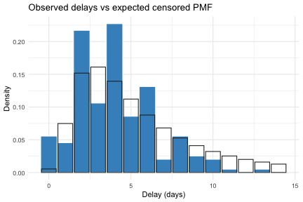
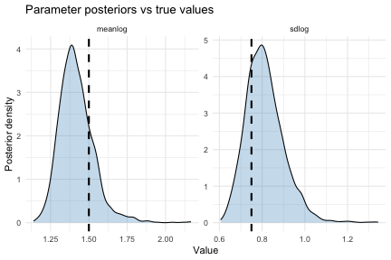
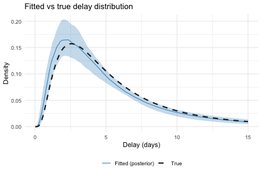

# Introduction

Epidemiological delay distributions are subject to double interval censoring: both the primary event (e.g. infection) and the secondary event (e.g. symptom onset) are observed within discrete time windows rather than at exact times [@Charniga2024; @Park2024].
If ignored, this censoring biases parameter estimates.
Right truncation introduces further bias because recent observations are systematically missing due to reporting delays.

`estimate_dist()` fits delay distributions from linelist data while accounting for both of these biases.
Event times are typically recorded at daily resolution, but the date-based interface supports arbitrary censoring window widths.
The function uses a Stan model that vendors likelihood functions from the [primarycensored](https://primarycensored.epinowcast.org/) package.
If you use `estimate_dist()`, please cite `primarycensored` in addition to `EpiNow2`.

Common use cases include estimating the incubation period (infection to symptom onset), the reporting delay (symptom onset to case report), or the serial interval (symptom onset in infector-infectee pairs).
Generation time estimation (infection to infection) typically requires known infection times for both infector and infectee, which calls for more complex models.

For more flexible delay distribution modelling, [`epidist`](https://epidist.epinowcast.org) supports time-varying delays, partial pooling across delays, regression on covariates, and a range of other models.
`primarycensored` operates at a lower level, working directly with numeric delays and censoring windows.
It supports fitting delay distributions both with and without a Stan dependency and is also useful for creating double interval censoring and truncation adjusted probability mass functions for use in other models.
`primarycensored` also supports vendoring its Stan functions into custom models, which is useful for adapting the delay estimation approach to support more complex settings such as additional observation biases, mixture models, or joint estimation with other processes.

# Set up


``` r
library(EpiNow2) # nolint: unused_import_linter.
library(primarycensored)
#> Warning: package 'primarycensored' was built under R version 4.5.2
library(ggplot2)
#> Warning: package 'ggplot2' was built under R version 4.5.2
options(mc.cores = 2)
```

# Simulating censored delay data

We simulate 200 individual delay observations from a lognormal distribution with known parameters.
Each observation has its own primary and secondary censoring window width (1 or 2 days) and its own observation time (8 to 15 days after the primary event), reflecting the kind of variation present in real data.


``` r
set.seed(42)
n <- 200

true_meanlog <- 1.5
true_sdlog <- 0.75

pwindows <- sample.int(2, n, replace = TRUE)
swindows <- sample.int(2, n, replace = TRUE)
obs_times <- sample(8:15, n, replace = TRUE)

delays <- mapply(
  function(pw, sw, D) {
    rprimarycensored(
      1, rlnorm,
      meanlog = true_meanlog, sdlog = true_sdlog,
      pwindow = pw, swindow = sw, D = D
    )
  },
  pwindows, swindows, obs_times
)

# Observations where the secondary event window extends past
# the observation time have not yet been fully observed and
# would not appear in a real linelist.
keep <- obs_times >= delays + swindows
delays <- delays[keep]
pwindows <- pwindows[keep]
swindows <- swindows[keep]
obs_times <- obs_times[keep]

pdate_lwr <- as.Date("2023-01-01") +
  sample(0:13, sum(keep), replace = TRUE)

linelist <- data.frame(
  pdate_lwr = pdate_lwr,
  pdate_upr = pdate_lwr + pwindows,
  sdate_lwr = pdate_lwr + delays,
  sdate_upr = pdate_lwr + delays + swindows,
  obs_date = pdate_lwr + obs_times
)

head(linelist)
#>    pdate_lwr  pdate_upr  sdate_lwr  sdate_upr   obs_date
#> 1 2023-01-06 2023-01-07 2023-01-14 2023-01-16 2023-01-21
#> 2 2023-01-14 2023-01-15 2023-01-18 2023-01-20 2023-01-25
#> 3 2023-01-01 2023-01-02 2023-01-11 2023-01-12 2023-01-16
#> 4 2023-01-06 2023-01-07 2023-01-10 2023-01-12 2023-01-18
#> 5 2023-01-06 2023-01-08 2023-01-09 2023-01-10 2023-01-21
#> 6 2023-01-14 2023-01-16 2023-01-17 2023-01-18 2023-01-27
```


``` r
# Compute the expected PMF under censoring and truncation
D_plot <- max(obs_times)
max_d <- D_plot - 1L
pmf <- dprimarycensored(
  0:max_d,
  plnorm,
  meanlog = true_meanlog, sdlog = true_sdlog,
  pwindow = 1, swindow = 1, D = D_plot
)

pmf_df <- data.frame(
  delay = 0:max_d,
  pmf = pmf
)

ggplot(data.frame(delay = delays), aes(x = delay)) +
  geom_histogram(
    aes(y = after_stat(density)),
    binwidth = 1, fill = "#4292C6", colour = "white"
  ) +
  geom_col(
    data = pmf_df, aes(x = delay, y = pmf),
    fill = NA, colour = "#252525", linewidth = 0.5
  ) +
  labs(
    x = "Delay (days)",
    y = "Density",
    title = "Observed delays vs expected censored PMF"
  ) +
  theme_minimal()
```



The histogram shows the observed censored delays.
The outlined bars show the expected PMF under the true distribution with censoring and truncation, computed using `primarycensored::dprimarycensored()`.

The data frame has five columns:

- `pdate_lwr`: lower bound of the primary event date (e.g. date of infection).
- `pdate_upr`: upper bound of the primary event date.
- `sdate_lwr`: lower bound of the secondary event date (e.g. date of symptom onset).
- `sdate_upr`: upper bound of the secondary event date.
- `obs_date`: the date at which the data were extracted, determining the right truncation point for each observation.

Upper bounds for the primary and secondary event windows default to one day after the lower bounds (daily censoring) if not provided.

Note that the simulation above constructs dates from numeric delays using a dummy origin date.
If you have numeric delays without dates, you can do the same thing: set `pdate_lwr` to an arbitrary origin (e.g. `as.Date("2020-01-01")`) and derive the other columns by adding the appropriate intervals.

For `obs_date`, use the date the data were sent to you, or the date data collection stopped.
If neither is available, `estimate_dist()` defaults to `max(sdate_upr)`, which is a reasonable fallback for most situations.

# Fitting the model

We pass the linelist directly to `estimate_dist()`.
Internally the function converts dates to numeric intervals, then aggregates identical delay-censoring-truncation combinations and counts their occurrences.
This aggregation reduces the number of likelihood evaluations, which speeds up fitting considerably when many observations share the same structure.


``` r
result <- estimate_dist(
  linelist,
  dist = "lognormal"
)
```

The `result` object is an `estimate_dist` object that inherits from `epinowfit`.
Printing it shows a posterior summary of the fitted parameters.


``` r
result
#> Delay distribution: lognormal (max: 14)
#> Observations: 198 (129 unique strata)
#> Primary event: uniform 
#> 
#> Parameter estimates:
#>    variable    median      mean         sd lower_90  lower_50  lower_20
#>      <char>     <num>     <num>      <num>    <num>     <num>     <num>
#> 1:  meanlog 1.4041290 1.4188660 0.11389326 1.264373 1.3420596 1.3807755
#> 2:    sdlog 0.8030721 0.8126087 0.08967779 0.683790 0.7504613 0.7839248
#>     upper_20  upper_50  upper_90
#>        <num>     <num>     <num>
#> 1: 1.4321519 1.4802847 1.6082144
#> 2: 0.8239009 0.8612665 0.9740673
```

For convergence diagnostics, the underlying Stan fit is accessible via `result$fit`.


``` r
rstan::summary(result$fit)$summary
#>                         mean     se_mean         sd         2.5%          25%
#> params[1]          1.4188660 0.004725210 0.11389326    1.2378183    1.3420596
#> params[2]          0.8126087 0.003669726 0.08967779    0.6647282    0.7504613
#> delay_params[1]    1.4188660 0.004725210 0.11389326    1.2378183    1.3420596
#> delay_params[2]    0.8126087 0.003669726 0.08967779    0.6647282    0.7504613
#> lp__            -374.4704901 0.048080995 1.14271274 -377.5303759 -374.8431346
#>                          50%          75%       97.5%    n_eff     Rhat
#> params[1]          1.4041290    1.4802847    1.692204 580.9702 1.004724
#> params[2]          0.8030721    0.8612665    1.007498 597.1762 1.002489
#> delay_params[1]    1.4041290    1.4802847    1.692204 580.9702 1.004724
#> delay_params[2]    0.8030721    0.8612665    1.007498 597.1762 1.002489
#> lp__            -374.1406768 -373.6679174 -373.383212 564.8424 1.006961
```

We can extract the fitted distribution as a `dist_spec` object using `get_parameters()`.
This is useful for passing the result directly to other `EpiNow2` functions such as `estimate_infections()` via `delay_opts()`.


``` r
params <- get_parameters(result)
params$delay
#> - lognormal distribution (max: 14):
#>   meanlog:
#>     - normal distribution:
#>       mean:
#>         1.4
#>       sd:
#>         0.11
#>   sdlog:
#>     - normal distribution:
#>       mean:
#>         0.81
#>       sd:
#>         0.09
```

# Checking parameter recovery

We can check how well the model recovers the true parameters by comparing the fitted posterior to the true distribution.


``` r
posterior <- extract_samples(
  result$fit, pars = "delay_params"
)
post_meanlog <- posterior$delay_params[, 1]
post_sdlog <- posterior$delay_params[, 2]

param_df <- data.frame(
  value = c(post_meanlog, post_sdlog),
  parameter = rep(
    c("meanlog", "sdlog"),
    each = length(post_meanlog)
  )
)

true_df <- data.frame(
  parameter = c("meanlog", "sdlog"),
  value = c(true_meanlog, true_sdlog)
)

ggplot(param_df, aes(x = value)) +
  geom_density(fill = "#4292C6", alpha = 0.3) +
  geom_vline(
    data = true_df, aes(xintercept = value),
    linetype = "dashed", linewidth = 1
  ) +
  facet_wrap(~parameter, scales = "free") +
  labs(
    x = "Value", y = "Posterior density",
    title = "Parameter posteriors vs true values"
  ) +
  theme_minimal()
```



The dashed lines mark the true parameter values.
The posteriors should concentrate around these values.

We can also compare the implied delay density from the posterior against the true distribution.


``` r
max_x <- max(delays) + 2
x_seq <- seq(0.01, max_x, length.out = 200)

set.seed(1)
draw_idx <- sample(length(post_meanlog), 100)
post_densities <- sapply(draw_idx, function(i) {
  dlnorm(x_seq, post_meanlog[i], post_sdlog[i])
})

plot_df <- data.frame(
  x = x_seq,
  true_density = dlnorm(
    x_seq, true_meanlog, true_sdlog
  ),
  post_median = apply(
    post_densities, 1, median
  ),
  post_lower = apply(
    post_densities, 1, quantile, 0.05
  ),
  post_upper = apply(
    post_densities, 1, quantile, 0.95
  )
)

ggplot(plot_df, aes(x = x)) +
  geom_ribbon(
    aes(ymin = post_lower, ymax = post_upper),
    fill = "#4292C6", alpha = 0.3
  ) +
  geom_line(
    aes(y = post_median, colour = "Fitted (posterior)")
  ) +
  geom_line(
    aes(y = true_density, colour = "True"),
    linetype = "dashed", linewidth = 1
  ) +
  scale_colour_manual(
    values = c(
      "Fitted (posterior)" = "#4292C6",
      "True" = "#252525"
    )
  ) +
  labs(
    x = "Delay (days)", y = "Density",
    colour = NULL,
    title = "Fitted vs true delay distribution"
  ) +
  theme_minimal() +
  theme(legend.position = "bottom")
```



Note that `get_parameters()` returns Normal approximations to the marginal posteriors.
The actual posterior may not be exactly normal.
For full posterior access, use `result$fit` directly with `extract_samples()`.
