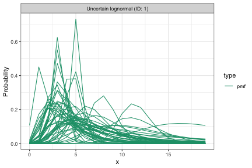
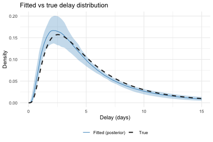

# Introduction

This vignette is a worked example of fitting a delay distribution with `estimate_dist()`.
We simulate doubly-interval-censored linelist data, set priors based on domain knowledge, fit the model, and check parameter recovery.

For the formal model, including the censored likelihood, supported families, and default priors, see `vignette("estimate_dist")`.
For the conceptual background to delay distributions in _EpiNow2_, including why naive discretisation is biased and how `primarycensored` corrects for it, see `vignette("delays")`.
If you use `estimate_dist()`, please cite [primarycensored](https://primarycensored.epinowcast.org/) [@primarycensored] in addition to _EpiNow2_.

Common use cases include estimating the incubation period (infection to symptom onset), the reporting delay (symptom onset to case report), or the serial interval (symptom onset in infector-infectee pairs).
Generation time estimation (infection to infection) typically requires known infection times for both infector and infectee, which generally calls for more complex models such as those provided by [`epidist`](https://epidist.epinowcast.org/).

# Set up


``` r
library(EpiNow2) # nolint: unused_import_linter.
library(primarycensored)
library(ggplot2)
options(mc.cores = 2)
```

# Simulating censored delay data

We simulate 200 individual delay observations from a lognormal distribution with known parameters.
Each observation has its own primary and secondary censoring window width (1 or 2 days) and its own observation time (8 to 15 days after the primary event), reflecting the kind of variation present in real data.


``` r
set.seed(42)
n <- 200

true_meanlog <- 1.5
true_sdlog <- 0.75

pwindows <- sample.int(2, n, replace = TRUE)
swindows <- sample.int(2, n, replace = TRUE)
obs_times <- sample(8:15, n, replace = TRUE)

delays <- mapply(
  function(pw, sw, D) {
    rprimarycensored(
      1, rlnorm,
      meanlog = true_meanlog, sdlog = true_sdlog,
      pwindow = pw, swindow = sw, D = D
    )
  },
  pwindows, swindows, obs_times
)

pdate_lwr <- as.Date("2023-01-01") +
  sample(0:13, n, replace = TRUE)

linelist <- data.frame(
  pdate_lwr = pdate_lwr,
  pdate_upr = pdate_lwr + pwindows,
  sdate_lwr = pdate_lwr + delays,
  sdate_upr = pdate_lwr + delays + swindows,
  obs_date = pdate_lwr + obs_times
)

# Observations where the secondary event window extends
# past the observation date are not yet fully observed and
# would not appear in a real linelist.
linelist <- linelist[linelist$obs_date >= linelist$sdate_upr, ]

head(linelist)
#>    pdate_lwr  pdate_upr  sdate_lwr  sdate_upr   obs_date
#> 1 2023-01-06 2023-01-07 2023-01-14 2023-01-16 2023-01-21
#> 2 2023-01-14 2023-01-15 2023-01-18 2023-01-20 2023-01-25
#> 3 2023-01-01 2023-01-02 2023-01-11 2023-01-12 2023-01-16
#> 4 2023-01-06 2023-01-07 2023-01-10 2023-01-12 2023-01-18
#> 5 2023-01-06 2023-01-08 2023-01-09 2023-01-10 2023-01-21
#> 6 2023-01-14 2023-01-16 2023-01-17 2023-01-18 2023-01-27
```


``` r
observed_delays <- as.numeric(
  linelist$sdate_lwr - linelist$pdate_lwr
)

ggplot(data.frame(delay = observed_delays), aes(x = delay)) +
  geom_histogram(
    aes(y = after_stat(density)),
    binwidth = 1, fill = "#4292C6", colour = "white"
  ) +
  stat_function(
    fun = dlnorm,
    args = list(
      meanlog = true_meanlog, sdlog = true_sdlog
    ),
    linewidth = 1
  ) +
  labs(
    x = "Delay (days)",
    y = "Density",
    title = "Observed delays vs true distribution"
  ) +
  theme_minimal()
```


The histogram shows the observed delay lower bounds (i.e. `sdate_lwr - pdate_lwr`) from the filtered linelist.
The solid line shows the true underlying lognormal density.
The gap between the two illustrates the bias introduced by censoring and truncation, which `estimate_dist()` corrects for.

The data frame has five columns:

- `pdate_lwr`: lower bound of the primary event date (e.g. date of infection).
- `pdate_upr`: upper bound of the primary event date.
- `sdate_lwr`: lower bound of the secondary event date (e.g. date of symptom onset).
- `sdate_upr`: upper bound of the secondary event date.
- `obs_date`: the date at which the data were extracted, determining the right truncation point for each observation.

Upper bounds for the primary and secondary event windows default to one day after the lower bounds (daily censoring) if not provided.

Note that the simulation above constructs dates from numeric delays using a dummy origin date.
If you have numeric delays without dates, you can do the same thing: set `pdate_lwr` to an arbitrary origin (e.g. `as.Date("2020-01-01")`) and derive the other columns by adding the appropriate intervals.

For `obs_date`, use the date the data were sent to you, or the date data collection stopped.
If neither is available, `estimate_dist()` defaults to `max(sdate_upr)`, which is a reasonable fallback for most situations.

# Setting priors

By default, `estimate_dist()` uses `Normal(1, 1)` for `meanlog` and `Normal(0.5, 0.5)` for `sdlog`.
These are fairly wide and may not reflect domain knowledge.
We recommend setting priors based on what you know about the delay.

For `meanlog`, the prior should reflect the expected median delay on the log scale, since `exp(meanlog)` is the median of a lognormal (the mean is `exp(meanlog + sdlog^2 / 2)`).
If you expect a delay with a median around 3--7 days, `log(5) ≈ 1.6` is a reasonable centre.
A standard deviation of 0.5 on the log scale corresponds to roughly a factor of 1.6 uncertainty (since `exp(0.5) ≈ 1.6`), so the prior covers median delays from about `5/1.6 ≈ 3` to `5 * 1.6 ≈ 8` days within one standard deviation.

For `sdlog`, it helps to think in terms of the coefficient of variation (CV).
For a lognormal distribution, `CV = sqrt(exp(sdlog²) - 1)` depends only on `sdlog`.
A `sdlog` of 0.5 gives `CV ≈ 0.53` (the standard deviation is about half the mean), while `sdlog = 1.0` gives `CV ≈ 1.3` (very dispersed).
Here we centre on 0.5 because we expect moderate variability in this delay, with a fairly tight prior (`sd = 0.25`) to rule out very large values.

We define the prior as a `dist_spec` and use `plot()` to check that the implied delay distributions are plausible before fitting.


``` r
prior_dist <- LogNormal(
  meanlog = Normal(1.6, 0.5),
  sdlog = Normal(0.5, 0.25),
  max = 20
)
```


``` r
plot(prior_dist, samples = 50, cumulative = FALSE)
```



Each line is a delay distribution drawn from the priors.
The range should cover plausible delays for the application without placing substantial weight on unrealistic values.

# Fitting the model

We pass the linelist to `estimate_dist()`, extracting the priors from our `dist_spec`.
Internally the function converts dates to numeric intervals, then aggregates identical delay-censoring-truncation combinations and counts their occurrences.
This reduces the number of likelihood evaluations, which speeds up fitting when many observations share the same structure.


``` r
result <- estimate_dist(
  linelist,
  dist = "lognormal",
  priors = get_parameters(prior_dist)
)
```

The `result` object is an `estimate_dist` object that inherits from `epinowfit`.
Printing it shows a posterior summary of the fitted parameters.


``` r
result
#> Delay distribution: lognormal (max: 14)
#> Observations: 198 (129 unique strata)
#> Primary event: uniform 
#> Max delay: 14 | Max obs time: 15
#> 
#> Parameter estimates:
#>    variable    median      mean         sd  lower_90 lower_50  lower_20
#>      <char>     <num>     <num>      <num>     <num>    <num>     <num>
#> 1:  meanlog 1.4001531 1.4068572 0.09398806 1.2655999 1.343393 1.3759575
#> 2:    sdlog 0.7813516 0.7894131 0.07509719 0.6804412 0.733925 0.7642848
#>     upper_20  upper_50  upper_90
#>        <num>     <num>     <num>
#> 1: 1.4214566 1.4611444 1.5759207
#> 2: 0.8008999 0.8365392 0.9237593
```

For convergence diagnostics, the underlying Stan fit is accessible via `result$fit`.


``` r
rstan::summary(result$fit)$summary
#>                         mean     se_mean         sd         2.5%         25%
#> params[1]          1.4068572 0.003617471 0.09398806    1.2426296    1.343393
#> params[2]          0.7894131 0.002818455 0.07509719    0.6621815    0.733925
#> delay_params[1]    1.4068572 0.003617471 0.09398806    1.2426296    1.343393
#> delay_params[2]    0.7894131 0.002818455 0.07509719    0.6621815    0.733925
#> lp__            -374.9899611 0.035684411 0.98070943 -377.5335854 -375.388382
#>                          50%          75%        97.5%    n_eff     Rhat
#> params[1]          1.4001531    1.4611444    1.6166435 675.0489 1.003295
#> params[2]          0.7813516    0.8365392    0.9616258 709.9457 1.004643
#> delay_params[1]    1.4001531    1.4611444    1.6166435 675.0489 1.003295
#> delay_params[2]    0.7813516    0.8365392    0.9616258 709.9457 1.004643
#> lp__            -374.6670125 -374.2767613 -374.0051957 755.3072 1.000937
```

We can extract the fitted distribution as a `dist_spec` object using `get_parameters()`.
This is useful for passing the result directly to other `EpiNow2` functions such as `estimate_infections()` via `delay_opts()`.


``` r
params <- get_parameters(result)
params$delay
#> - lognormal distribution (max: 14):
#>   meanlog:
#>     - normal distribution:
#>       mean:
#>         1.4
#>       sd:
#>         0.094
#>   sdlog:
#>     - normal distribution:
#>       mean:
#>         0.79
#>       sd:
#>         0.075
```

# Checking parameter recovery

We can check how well the model recovers the true parameters by comparing the fitted posterior to the true distribution.


``` r
posterior <- extract_samples(
  result$fit, pars = "delay_params"
)
post_meanlog <- posterior$delay_params[, 1]
post_sdlog <- posterior$delay_params[, 2]

param_df <- data.frame(
  value = c(post_meanlog, post_sdlog),
  parameter = rep(
    c("meanlog", "sdlog"),
    each = length(post_meanlog)
  )
)

true_df <- data.frame(
  parameter = c("meanlog", "sdlog"),
  value = c(true_meanlog, true_sdlog)
)

ggplot(param_df, aes(x = value)) +
  geom_density(fill = "#4292C6", alpha = 0.3) +
  geom_vline(
    data = true_df, aes(xintercept = value),
    linetype = "dashed", linewidth = 1
  ) +
  facet_wrap(~parameter, scales = "free") +
  labs(
    x = "Value", y = "Posterior density",
    title = "Parameter posteriors vs true values"
  ) +
  theme_minimal()
```


The dashed lines mark the true parameter values.
The posteriors should concentrate around these values.

We can also compare the implied delay density from the posterior against the true distribution.


``` r
max_x <- max(delays) + 2
x_seq <- seq(0.01, max_x, length.out = 200)

set.seed(1)
draw_idx <- sample(length(post_meanlog), 100)
post_densities <- sapply(draw_idx, function(i) {
  dlnorm(x_seq, post_meanlog[i], post_sdlog[i])
})

plot_df <- data.frame(
  x = x_seq,
  true_density = dlnorm(
    x_seq, true_meanlog, true_sdlog
  ),
  post_median = apply(
    post_densities, 1, median
  ),
  post_lower = apply(
    post_densities, 1, quantile, 0.05
  ),
  post_upper = apply(
    post_densities, 1, quantile, 0.95
  )
)

ggplot(plot_df, aes(x = x)) +
  geom_ribbon(
    aes(ymin = post_lower, ymax = post_upper),
    fill = "#4292C6", alpha = 0.3
  ) +
  geom_line(
    aes(y = post_median, colour = "Fitted (posterior)")
  ) +
  geom_line(
    aes(y = true_density, colour = "True"),
    linetype = "dashed", linewidth = 1
  ) +
  scale_colour_manual(
    values = c(
      "Fitted (posterior)" = "#4292C6",
      "True" = "#252525"
    )
  ) +
  labs(
    x = "Delay (days)", y = "Density",
    colour = NULL,
    title = "Fitted vs true delay distribution"
  ) +
  theme_minimal() +
  theme(legend.position = "bottom")
```



Note that `get_parameters()` returns Normal approximations to the marginal posteriors.
The actual posterior may not be exactly normal.
For full posterior access, use `result$fit` directly with `extract_samples()`.
