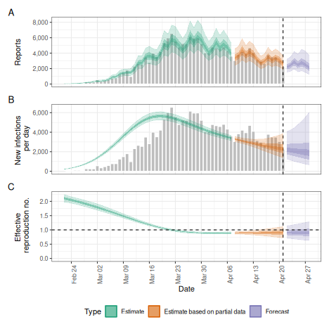
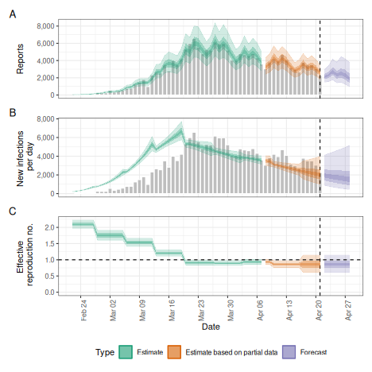
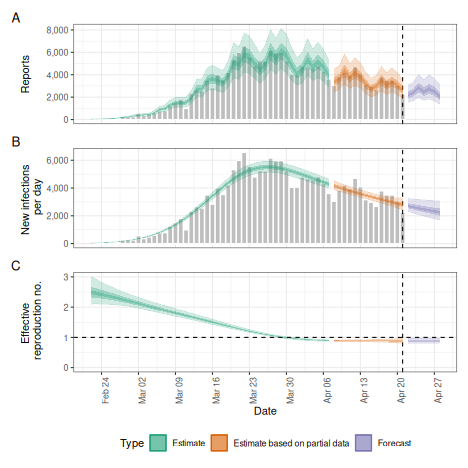

The `estimate_infections()` function encodes a range of different model options.
In this vignette we apply some of these to the example data provided with the _EpiNow2_ package, highlighting differences in inference results and run times. 
It is not meant as a comprehensive exploration of all the functionality in the package, but intended to give users a flavour of the kind of model options that exist for reproduction number estimation and forecasting within the package, and the differences in computational speed between them.
For mathematical detail on the model please consult the [model definition](estimate_infections.html) vignette, and for a more general description of the use of the function, the [estimate_infections workflow](estimate_infections_workflow.html) vignette.

# Set up

We first load the _EpiNow2_ package and also the _rstan_ package that we will use later to show the differences in run times between different model options.


``` r
library("EpiNow2")
#> 
#> Attaching package: 'EpiNow2'
#> The following object is masked from 'package:stats':
#> 
#>     Gamma
library("rstan")
#> Loading required package: StanHeaders
#> 
#> rstan version 2.32.6 (Stan version 2.32.2)
#> For execution on a local, multicore CPU with excess RAM we recommend calling
#> options(mc.cores = parallel::detectCores()).
#> To avoid recompilation of unchanged Stan programs, we recommend calling
#> rstan_options(auto_write = TRUE)
#> For within-chain threading using `reduce_sum()` or `map_rect()` Stan functions,
#> change `threads_per_chain` option:
#> rstan_options(threads_per_chain = 1)
```

In this examples we set the number of cores to use to 4 but the optimal value here will depend on the computing resources available.


``` r
options(mc.cores = 4)
```

# Data

We will use an example data set that is included in the package, representing an outbreak of COVID-19 with an initial rapid increase followed by decreasing incidence.


``` r
library("ggplot2")
reported_cases <- example_confirmed[1:60]
ggplot(reported_cases, aes(x =  date, y = confirm)) +
  geom_col() +
  theme_minimal() +
  xlab("Date") +
  ylab("Cases")
```


# Parameters

Before running the model we need to decide on some parameter values, in particular any delays, the generation time, and a prior on the initial reproduction number.

## Delays: incubation period and reporting delay

Delays reflect the time that passes between infection and reporting, if these exist. In this example, we assume two delays, an _incubation period_ (i.e. delay from infection to symptom onset) and a _reporting delay_ (i.e. the delay from symptom onset to being recorded as a symptomatic case). These delays are usually not the same for everyone and are instead characterised by a distribution. For the incubation period we use an example from the literature that is included in the package.


``` r
example_incubation_period
#> - lognormal distribution (max: 14):
#>   meanlog:
#>     - normal distribution:
#>       mean:
#>         1.6
#>       sd:
#>         0.064
#>   sdlog:
#>     - normal distribution:
#>       mean:
#>         0.42
#>       sd:
#>         0.069
```

For the reporting delay, we use a lognormal distribution with mean of 2 days and standard deviation of 1 day.
Note that the mean and standard deviation must be converted to the log scale, which can be done using the `convert_log_logmean()` function.


``` r
reporting_delay <- LogNormal(mean = 2, sd = 1, max = 10)
reporting_delay
#> - lognormal distribution (max: 10):
#>   meanlog:
#>     0.58
#>   sdlog:
#>     0.47
```

_EpiNow2_ provides a feature that allows us to combine these delays into one by summing them up


``` r
delay <- example_incubation_period + reporting_delay
delay
#> Composite distribution:
#> - lognormal distribution (max: 14):
#>   meanlog:
#>     - normal distribution:
#>       mean:
#>         1.6
#>       sd:
#>         0.064
#>   sdlog:
#>     - normal distribution:
#>       mean:
#>         0.42
#>       sd:
#>         0.069
#> - lognormal distribution (max: 10):
#>   meanlog:
#>     0.58
#>   sdlog:
#>     0.47
```

## Generation time

If we want to estimate the reproduction number we need to provide a distribution of generation times. Here again we use an example from the literature that is included with the package.


``` r
example_generation_time
#> - gamma distribution (max: 14):
#>   shape:
#>     - normal distribution:
#>       mean:
#>         1.4
#>       sd:
#>         0.48
#>   rate:
#>     - normal distribution:
#>       mean:
#>         0.38
#>       sd:
#>         0.25
```

## Initial reproduction number

Lastly we need to choose a prior for the initial value of the reproduction number. This is assumed by the model to be normally distributed and we can set the mean and the standard deviation. We decide to set the mean to 2 and the standard deviation to 1.


``` r
rt_prior <- LogNormal(mean = 2, sd = 0.1)
```

# Running the model

We are now ready to run the model and will in the following show a number of possible options for doing so.

## Default options

By default the model uses a renewal equation for infections and a Gaussian Process prior for the reproduction number. 
Putting all the data and parameters together and tweaking the Gaussian Process to have a shorter length scale prior than the default we run.


``` r
def <- estimate_infections(reported_cases,
  generation_time = gt_opts(example_generation_time),
  delays = delay_opts(delay),
  rt = rt_opts(prior = rt_prior)
)
# summarise results
summary(def)
#>                         measure                 estimate
#>                          <char>                   <char>
#> 1:       New infections per day      2275 (1353 -- 3811)
#> 2:   Expected change in reports        Likely decreasing
#> 3:   Effective reproduction no.        0.9 (0.72 -- 1.1)
#> 4:               Rate of growth -0.029 (-0.095 -- 0.042)
#> 5: Doubling/halving time (days)         -24 (16 -- -7.3)
# elapsed time (in seconds)
get_elapsed_time(def$fit)
#>         warmup sample
#> chain:1 26.914 26.786
#> chain:2 33.233 18.865
#> chain:3 32.647 24.370
#> chain:4 33.549 28.933
# summary plot
plot(def)
```


## Reducing the accuracy of the approximate Gaussian Process

To speed up the calculation of the Gaussian Process we could decrease its accuracy, e.g. decrease the proportion of time points to use as basis functions from the default of 0.2 to 0.1.


``` r
agp <- estimate_infections(reported_cases,
  generation_time = gt_opts(example_generation_time),
  delays = delay_opts(delay),
  rt = rt_opts(prior = rt_prior),
  gp = gp_opts(basis_prop = 0.1)
)
#> Warning in .local(object, ...): some chains had errors; consider specifying
#> chains = 1 to debug
#> here are whatever error messages were returned
# summarise results
summary(agp)
#> roduction no.       0.91 (0.73 -- 1.1)
#> 4:               Rate of growth -0.026 (-0.094 -- 0.036)
#> 5: Doubling/halving time (days)         -26 (19 -- -7.4)
# elapsed time (in seconds)
get_elapsed_time(agp$fit)
#>         warmup sample
#> chain:1 17.698 29.315
#> chain:2 19.648 28.124
#> chain:4 20.225 17.756
# summary plot
plot(agp)
```


## Adjusting for future susceptible depletion

We might want to adjust for future susceptible depletion.
Here, we do so by setting the population to 1000000 and projecting the reproduction number from the latest estimate (rather than the default, which fixes the reproduction number to an earlier time point based on the given reporting delays).
Note that this only affects the forecasts and is done using a crude adjustment (see the [model definition](estimate_infections.html)).


``` r
dep <- estimate_infections(reported_cases,
  generation_time = gt_opts(example_generation_time),
  delays = delay_opts(delay),
  rt = rt_opts(
    prior = rt_prior,
    pop = 1000000, future = "latest"
  )
)
# summarise results
summary(dep)
#>                         measure                 estimate
#>                          <char>                   <char>
#> 1:       New infections per day      2243 (1358 -- 3690)
#> 2:   Expected change in reports        Likely decreasing
#> 3:   Effective reproduction no.        0.9 (0.72 -- 1.1)
#> 4:               Rate of growth -0.028 (-0.096 -- 0.041)
#> 5: Doubling/halving time (days)         -25 (17 -- -7.2)
# elapsed time (in seconds)
get_elapsed_time(dep$fit)
#>         warmup sample
#> chain:1 31.388 27.391
#> chain:2 27.256 20.505
#> chain:3 30.587 30.167
#> chain:4 24.255 33.093
# summary plot
plot(dep)
```


## Adjusting for truncation of the most recent data

We might further want to adjust for right-truncation of recent data estimated using the [estimate_truncation](estimate_truncation.html) model.
Here, instead of doing so we assume that we know about truncation with mean of 1/2 day, sd 1/2 day, following a lognormal distribution and with a maximum of three days.


``` r
trunc_dist <- LogNormal(
  mean = 0.5,
  sd = 0.5,
  max = 3
)
trunc_dist
#> - lognormal distribution (max: 3):
#>   meanlog:
#>     -1
#>   sdlog:
#>     0.83
```

We can then use this in the `esimtate_infections()` function using the `truncation` option.


``` r
trunc <- estimate_infections(reported_cases,
  generation_time = gt_opts(example_generation_time),
  delays = delay_opts(delay),
  truncation = trunc_opts(trunc_dist),
  rt = rt_opts(prior = rt_prior)
)
# summarise results
summary(trunc)
#>                         measure               estimate
#>                          <char>                 <char>
#> 1:       New infections per day    4605 (2739 -- 8031)
#> 2:   Expected change in reports      Likely increasing
#> 3:   Effective reproduction no.      1.1 (0.91 -- 1.4)
#> 4:               Rate of growth 0.044 (-0.029 -- 0.13)
#> 5: Doubling/halving time (days)        16 (5.4 -- -24)
# elapsed time (in seconds)
get_elapsed_time(trunc$fit)
#>         warmup sample
#> chain:1 30.163 21.457
#> chain:2 30.149 25.120
#> chain:3 29.374 21.399
#> chain:4 32.058 24.001
# summary plot
plot(trunc)
```


## Projecting the reproduction number with the Gaussian Process

Instead of keeping the reproduction number fixed from a certain time point we might want to extrapolate the Gaussian Process into the future. 
This will lead to wider uncertainty, and the researcher should check whether this or fixing the reproduction number from an earlier is desirable.


``` r
project_rt <- estimate_infections(reported_cases,
  generation_time = gt_opts(example_generation_time),
  delays = delay_opts(delay),
  rt = rt_opts(
    prior = rt_prior, future = "project"
  )
)
#> Warning: There were 1 divergent transitions after warmup. See
#> https://mc-stan.org/misc/warnings.html#divergent-transitions-after-warmup
#> to find out why this is a problem and how to eliminate them.
#> Warning: Examine the pairs() plot to diagnose sampling problems
# summarise results
summary(project_rt)
#>                         measure               estimate
#>                          <char>                 <char>
#> 1:       New infections per day    2290 (1342 -- 3845)
#> 2:   Expected change in reports      Likely decreasing
#> 3:   Effective reproduction no.     0.91 (0.71 -- 1.1)
#> 4:               Rate of growth -0.027 (-0.1 -- 0.047)
#> 5: Doubling/halving time (days)       -26 (15 -- -6.7)
# elapsed time (in seconds)
get_elapsed_time(project_rt$fit)
#>         warmup sample
#> chain:1 36.265 34.348
#> chain:2 36.758 32.916
#> chain:3 32.600 31.500
#> chain:4 38.363 31.597
# summary plot
plot(project_rt)
```



## Fixed reproduction number

We might want to estimate a fixed reproduction number, i.e. assume that it does not change.


``` r
fixed <- estimate_infections(reported_cases,
  generation_time = gt_opts(example_generation_time),
  delays = delay_opts(delay),
  gp = NULL
)
# summarise results
summary(fixed)
#>                         measure               estimate
#>                          <char>                 <char>
#> 1:       New infections per day 18976 (10957 -- 34164)
#> 2:   Expected change in reports             Increasing
#> 3:   Effective reproduction no.       1.2 (1.2 -- 1.3)
#> 4:               Rate of growth 0.054 (0.039 -- 0.069)
#> 5: Doubling/halving time (days)          13 (10 -- 18)
# elapsed time (in seconds)
get_elapsed_time(fixed$fit)
#>         warmup sample
#> chain:1  1.522  1.003
#> chain:2  1.848  0.963
#> chain:3  1.746  0.974
#> chain:4  1.539  1.007
# summary plot
plot(fixed)
```


## Breakpoints

Instead of assuming the reproduction number varies freely or is fixed, we can assume that it is fixed but with breakpoints.
This can be done by adding a `breakpoint` column to the reported case data set.
e.g. if we think that the reproduction number was constant but would like to allow it to change on the 16th of March 2020 we would define a new case data set using


``` r
bp_cases <- data.table::copy(reported_cases)
bp_cases <- bp_cases[,
 breakpoint := ifelse(date == as.Date("2020-03-16"), 1, 0)
]
```

We then use this instead of `reported_cases` in the `estimate_infections()` function:


``` r
bkp <- estimate_infections(bp_cases,
  generation_time = gt_opts(example_generation_time),
  delays = delay_opts(delay),
  rt = rt_opts(prior = rt_prior),
  gp = NULL
)
# summarise results
summary(bkp)
#>                         measure                  estimate
#>                          <char>                    <char>
#> 1:       New infections per day       2306 (1936 -- 2750)
#> 2:   Expected change in reports                Decreasing
#> 3:   Effective reproduction no.       0.89 (0.86 -- 0.91)
#> 4:               Rate of growth -0.028 (-0.034 -- -0.022)
#> 5: Doubling/halving time (days)          -25 (-32 -- -20)
# elapsed time (in seconds)
get_elapsed_time(bkp$fit)
#>         warmup sample
#> chain:1  2.677  4.080
#> chain:2  3.388  3.815
#> chain:3  2.764  3.706
#> chain:4  2.954  4.115
# summary plot
plot(bkp)
```


## Weekly random walk

Instead of a smooth Gaussian Process we might want the reproduction number to change step-wise, e.g. every week.
This can be achieved using the `rw` option which defines the length of the time step in a random walk that the reproduction number is assumed to follow.


``` r
rw <- estimate_infections(reported_cases,
  generation_time = gt_opts(example_generation_time),
  delays = delay_opts(delay),
  rt = rt_opts(prior = rt_prior, rw = 7),
  gp = NULL
)
# summarise results
summary(rw)
#>                         measure                estimate
#>                          <char>                  <char>
#> 1:       New infections per day     1991 (1048 -- 3838)
#> 2:   Expected change in reports       Likely decreasing
#> 3:   Effective reproduction no.      0.85 (0.62 -- 1.1)
#> 4:               Rate of growth -0.043 (-0.11 -- 0.036)
#> 5: Doubling/halving time (days)        -16 (19 -- -6.1)
# elapsed time (in seconds)
get_elapsed_time(rw$fit)
#>         warmup sample
#> chain:1  7.201 15.471
#> chain:2  9.174 15.434
#> chain:3  7.198 15.883
#> chain:4  8.115 14.902
# summary plot
plot(rw)
```



## No delays

Whilst _EpiNow2_ allows the user to specify delays, it can also run directly on the data as does e.g. the [EpiEstim](https://CRAN.R-project.org/package=EpiEstim) package.


``` r
no_delay <- estimate_infections(
  reported_cases,
  generation_time = gt_opts(example_generation_time)
)
# summarise results
summary(no_delay)
#>                         measure                   estimate
#>                          <char>                     <char>
#> 1:       New infections per day        2794 (2397 -- 3260)
#> 2:   Expected change in reports                 Decreasing
#> 3:   Effective reproduction no.         0.89 (0.8 -- 0.98)
#> 4:               Rate of growth -0.031 (-0.063 -- 0.00098)
#> 5: Doubling/halving time (days)           -22 (710 -- -11)
# elapsed time (in seconds)
get_elapsed_time(no_delay$fit)
#>         warmup sample
#> chain:1 32.160 30.646
#> chain:2 39.035 32.260
#> chain:3 31.499 36.752
#> chain:4 33.613 31.815
# summary plot
plot(no_delay)
```



## Non-parametric infection model

The package also includes a non-parametric infection model.
This runs much faster but does not use the renewal equation to generate infections.
Because of this none of the options defining the behaviour of the reproduction number are available in this case, limiting user choice and model generality.
It also means that the model is questionable for forecasting, which is why were here set the predictive horizon to 0.


``` r
non_parametric <- estimate_infections(reported_cases,
  generation_time = gt_opts(example_generation_time),
  delays = delay_opts(delay),
  rt = NULL,
  backcalc = backcalc_opts(),
  forecast = forecast_opts(horizon = 0)
)
# summarise results
summary(non_parametric)
#>                         measure                  estimate
#>                          <char>                    <char>
#> 1:       New infections per day       2544 (2503 -- 2585)
#> 2:   Expected change in reports                Decreasing
#> 3:   Effective reproduction no.       0.92 (0.83 -- 0.96)
#> 4:               Rate of growth -0.024 (-0.025 -- -0.022)
#> 5: Doubling/halving time (days)          -29 (-31 -- -28)
# elapsed time (in seconds)
get_elapsed_time(non_parametric$fit)
#>         warmup sample
#> chain:1  3.667  0.603
#> chain:2  3.767  0.531
#> chain:3  3.813  0.589
#> chain:4  3.459  0.630
# summary plot
plot(non_parametric)
```


