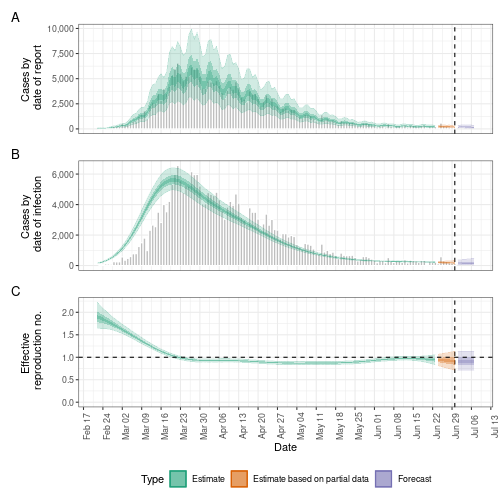

This vignette describes the typical workflow for estimating reproduction numbers and performing short-term forecasts for a disease spreading in a given setting using _EpiNow2_.
The vignette uses the default non-stationary Gaussian process model included in the package.
See other vignettes for a more thorough exploration of [alternative model variants](estimate_infections_options.html) and [theoretical background](estimate_infections.html).

# Data

Obtaining a good and full understanding of the data being used is an important first step in any inference procedure such as the one applied here. 
_EpiNow2_ expects data in the format of a data frame with two columns, `date` and `confirm`, where `confirm` stands for the number of confirmed counts - although in reality this can be applied to any data including suspected cases and lab-confirmed outcomes.
The user might already have the data as such a time series provided, for example, on public dashboards or directly from public health authorities.
Alternatively, they can be constructed from individual-level data, for example using the [incidence2](https://cran.r-project.org/web/packages/incidence2/index.html) R package.
An example data set called `example_confirm`  is included in the package:


```r
head(example_confirmed)
#>          date confirm
#> 1: 2020-02-22      14
#> 2: 2020-02-23      62
#> 3: 2020-02-24      53
#> 4: 2020-02-25      97
#> 5: 2020-02-26      93
#> 6: 2020-02-27      78
```

Any estimation procedure is only as good as the data that feeds into it.
A thorough understanding of the data that is used for _EpiNow2_ and its limitations is a prerequisite for its use.
This includes but is not limited to biases in the population groups that are represented (_EpiNow2_ assumes a closed population with all infections being caused by other infections in the same population), reporting artefacts and delays, and completeness of reporting.
Some of these can be mitigated using the routines available in _EpiNow2_ as described below, but others will cause biases in the results and need to be carefully considered when interpreting the results.

# Set up

We first load the _EpiNow2_ package.


```r
library("EpiNow2")
```

We then set the number of cores to use. We will want to run 4 MCMC chains in parallel so we set this to 4. 


```r
options(mc.cores = 4)
```

If we had fewer than 4 available or wanted to run fewer than 4 chains (at the expense of some robustness), or had fewer than 4 computing cores available we could set it to that. To find out the number of cores available one can use the [detectCores](https://rdrr.io/r/parallel/detectCores.html) function from the `parallel` package.

# Parameters

Once a data set has been identified, a number of relevant parameters need to be considered before using _EpiNow2_.
As these will affect any results, it is worth spending some time investigating what their values should be.

## Delay distributions

_EpiNow2_ works with different delays that apply to different parts of the infection and observation process.
They are defined using a common interface with the `dist_spec()` function.
For help with this function, see its manual page


```r
?EpiNow2::dist_spec
```

In all cases, the distributions given can be *fixed* (i.e. have no uncertainty) or *variable* (i.e. have associated uncertainty).
For example, to define a fixed gamma distribution with mean 3, standard deviation (sd) 1 and maximum value 10, you would write


```r
dist_spec(mean = 3, sd = 1, distribution = "gamma", max = 10)
#> 
#>   Fixed distribution with PMF [0.0038 0.15 0.39 0.3 0.12 0.03 0.006 0.00096 0.00013 1.6e-05 1.8e-06]
```

If distributions are variable, the values with uncertainty are treated as [prior probability densities](https://en.wikipedia.org/wiki/Prior_probability) in the Bayesian inference framework used by _EpiNow2_, i.e. they are estimated as part of the inference.
For example, to define a variable gamma distribution where uncertainty in the mean is given by a normal distribution with mean 3 and sd 2, and uncertainty in the standard deviation is given by a normal distribution with mean 1 and sd 0.1, with a maximum value 10, you would write


```r
dist_spec(
  mean = 3, mean_sd = 2, sd = 1, sd_sd = 0.1, distribution = "gamma", max = 10
)
#> 
#>   Uncertain gamma distribution with (untruncated) mean 3 (SD 2) and SD 1 (SD 0.1)
```

There are various ways the specific delay distributions mentioned below might be obtained.
Often, they will come directly from the existing literature reviewed by the user and studies conducted elsewhere.
Sometimes it might be possible to obtain them from existing databases, e.g. using the [epiparameter](https://github.com/epiverse-trace/epiparameter) R package.
Alternatively they might be obtainable from raw data, e.g. linelists.
The _EpiNow2_ package contains functionality for estimating delay distributions from observed delays in the `estimate_delays()` function.
For a more comprehensive treatment of delays and their estimation avoiding common biases one can consider, for example, the [dynamicaltruncation](https://github.com/parksw3/epidist-paper) R package and associated paper.

### Generation intervals

The generation interval is a delay distribution that describes the amount of time that passes between an individual becoming infected and infecting someone else.
In _EpiNow2_, the generation time distribution is defined by a call to `generation_time_opts()`, a function that takes a single argument defined as a `dist_spec` object (returned by `dist_spec()`).
For example, to define the generation time as gamma distributed with uncertain mean centered on 3 (sd: 2) and sd centered on 1 (sd: 0.1), a maximum value of 10 and weighted by the number of case data points we would use


```r
generation_time <- dist_spec(
  mean = 3, mean_sd = 2, sd = 1, sd_sd = 0.1, distribution = "gamma", max = 10
)
generation_time_opts(generation_time)
```

### Reporting delays

_EpiNow2_ calculates reproduction numbers based on the trajectory of infection incidence.
Usually this is not observed directly.
Instead, we calculate case counts based on, for example, onset of symptoms, lab confirmations, hospitalisations, etc.
In order to estimate the trajectory of infection incidence from this we need to either know or estimate the distribution of delays from infection to count.
Often, such counts are composed of multiple delays for which we only have separate information, for example the incubation period (time from infection to symptom onset) and reporting delay (time from symptom onset to being a case in the data, e.g. via lab confirmation, if counts are not by the date of symptom onset).
In this case, we can combine multiple delays defined using `dist_spec()` with the plus (`+`) operator, e.g.


```r
incubation_period <- dist_spec(
  mean = 1.6, mean_sd = 0.05, sd = 0.5, sd_sd = 0.05,
  distribution = "lognormal", max = 14
)
reporting_delay <- dist_spec(
  mean = 0.5, sd = 0.5, distribution = "lognormal", max = 10
)
incubation_period + reporting_delay
#> 
#> Combination of delay distributions:
#>   Uncertain lognormal distribution with (untruncated) logmean 1.6 (SD 0.05) and logSD 0.5 (SD 0.05)
#>   Fixed distribution with PMF [0.16 0.49 0.23 0.077 0.025 0.0084 0.003 0.0011 0.00045 0.00019 8.2e-05]
```

In _EpiNow2_, the reporting delay distribution is defined by a call to `delay_opts()`, a function that takes a single argument defined as a `dist_spec` object (returned by `dist_spec()`).
For example, if our observations were by symptom onset we would use


```r
delay_opts(incubation_period)
```

If they were by date of lab confirmation that happens with a delay given by `reporting_delay`, we would use


```r
delay <- incubation_period + reporting_delay
delay_opts(delay)
```

### Truncation

Besides the delay from infection to the event that is recorded in the data, there can also be a delay from that event to being recorded in the data.
For example, data reported by symptom onset may only become part of the dataset once lab confirmation has occurred, or even a day or two after that confirmation.
Statistically, this means our data is right-truncated.
In practice, it means that recent data will be unlikely to be complete.

The amount of such truncation that exists in the data can be estimated from multiple snapshots of the data, i.e. what the data looked like at multiple past dates.
One can then use methods that use the amount of backfilling that occurred 1, 2, ... days after data for a date are first reported.
In _EpiNow2_, this can be done using the `estimate_truncation()` method which returns, amongst others, posterior estimates of the truncation distribution.
For more details on the model used for this, see the [estimate_truncation](estimate_truncation.html) vignette.


```r
?estimate_truncation
```

In the `estimate_infections()` function, the truncation distribution is defined by a call to `trunc_opts()`, a function that takes a single argument defined as a `dist_spec` (either defined by the user or obtained from a call to `estimate_truncation()` or any other method for estimating right truncation).
This will then be used to correct for right truncation in the data.

The separation of estimation of right truncation on the one hand and estimation of the reproduction number on the other may be attractive for practical purposes but is questionable statistically as it separates two processes that are not strictly separable, potentially introducing a bias.
An alternative approach where these are estimated jointly is being implemented in the [epinowcast](https://package.epinowcast.org/) package, which is being developed by the _EpiNow2_ developers with collaborators.

## Completeness of reporting

Another issue affecting the progression from infections to reported outcomes is underreporting, i.e. the fact that not all infections are reported as cases.
This varies both by pathogen and population (and e.g. the proportion of infections that are asymptomatic) as well as the specific outcome used as data and where it is located on the severity pyramid (e.g. hospitalisations vs. community cases).
In _EpiNow2_ we can specify the proportion of infections that we expect to be observed (with uncertainty assumed represented by a truncated normal distribution with bounds at 0 and 1) using the `scale` argument to the `obs_opts()` function.
For example, if we think that 40% (with standard deviation 1%) of infections end up in the data as observations we could specify.


```r
obs_scale <- list(mean = 0.4, sd = 0.01)
obs_opts(scale = obs_scale)
```

## Initial reproduction number

The default model that `estimate_infections()` uses to estimate reproduction numbers requires specification of a prior probability distribution for the initial reproduction number.
This represents the user's initial belief of the value of the reproduction number, where there is no data yet to inform its value.
By default this is assumed to be represented by a lognormal distribution with mean and standard deviation of 1.
It can be changed using the `rt_opts()` function.
For example, if the user believes that at the very start of the data the reproduction number was 2, with uncertainty in this belief represented by a standard deviation of 1, they would use


```r
rt_prior <- list(mean =  2, sd = 1)
rt_opts(prior = rt_prior)
```

## Weighing delay priors

When providing uncertain delay distributions one can end up in a situation where the estimated means are shifted a long way from the given distribution means, and possibly further than is deemed realistic by the user.
In that case, one could specify narrower prior distributions (e.g., smaller `mean_sd`) in order to keep the estimated means closer to the given mean, but this can be difficult to do in a principled manner in practice.
As a more straightforward alternative, one can choose to weigh the generation time priors by the number of data points in the case data set by setting `weigh_delay_priors = TRUE` (the default). 

# Estimation and forecasting

All the options are combined in a call to the `estimate_infections()` function.
For example, using some of the options described above one could call


```r
def <- estimate_infections(
  example_confirmed, 
  generation_time = generation_time_opts(generation_time),
  delays = delay_opts(delay),
  rt = rt_opts(prior = rt_prior)
)
#> Warning: There were 15 divergent transitions after warmup. See
#> https://mc-stan.org/misc/warnings.html#divergent-transitions-after-warmup
#> to find out why this is a problem and how to eliminate them.
#> Warning: Examine the pairs() plot to diagnose sampling problems
```

Alternatively, for production environments, we recommend using the `epinow()` function. It uses `estimate_infections()` internally and provides functionality for logging and saving results and plots in dedicated directories in the user's file system.

## Forecasting secondary outcomes

The `estimate_infections()` function works with a single time series of outcomes such as cases by symptom onset or hospitalisations.
Sometimes one wants to further create forecasts of other secondary outcomes such as deaths.
The package contains functionality to estimate the delay and scaling between multiple time series with the `estimate_secondary()` function, as well as for using this to make forecasts with the `forecast_secondary()` function.

# Interpretation

To visualise the results one can use the `plot()` function that comes with the package


```r
plot(def)
```



The results returned by the `estimate_infections` model depend on the values assigned to all to parameters discussed in this vignette, i.e. delays, scaling, and reproduction numbers, as well as the model variant used and its parameters.
Any interpretation of the results will therefore need to bear these in mind, as well as any properties of the data and/or the subpopulations that it represents.
See the [Model options](estimate_infections_options.html) vignette for an illustration of the impact of model choice.
