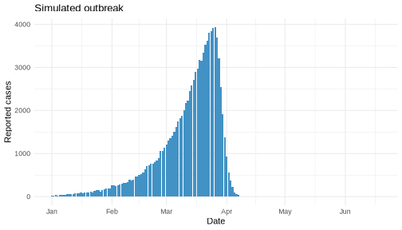
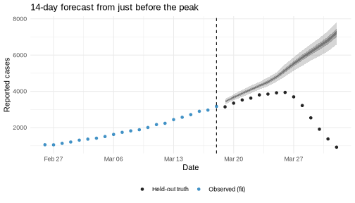
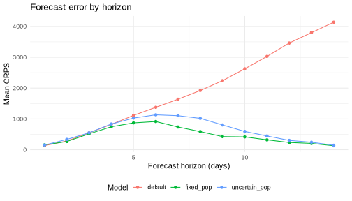

# Introduction

Forecasting means projecting reported cases beyond the last observed
data point.
`estimate_infections()` does this by extending the reproduction number
into the future and running the renewal equation forward.

Backtesting evaluates those forecasts.
We refit the model to data truncated at a set of past dates, generate a
forecast from each truncation point, and compare the forecast against the
values that were later observed.
Scoring the forecasts with a proper score such as the continuous ranked
probability score (CRPS) tells us which model would have forecast best.
We use [scoringutils](https://epiforecasts.io/scoringutils/) [@scoringutils]
for scoring.

This vignette works through a single forecast, then compares three models
across several forecast dates.
For the model itself see `vignette("estimate_infections")`, and for the
options used to configure it see `vignette("estimate_infections_options")`.

# Setup

We load _EpiNow2_ alongside `data.table` and `ggplot2` for data manipulation
and plotting, and `scoringutils` for scoring.
We set the number of cores and a seed for reproducibility.


``` r
library(EpiNow2) # nolint: unused_import_linter.
library(data.table)
library(ggplot2)
library(scoringutils)
options(mc.cores = 2)
set.seed(20240607)
```

# Simulating an outbreak

We simulate a single outbreak to forecast.
Using `simulate_infections()` with a constant reproduction number and a
fixed population size gives an epidemic that grows, peaks, and then declines
as susceptibles are depleted.
Setting `pop_period = "all"` applies the depletion across the whole
simulated period rather than only in a forecast horizon, so the turnover is
built into the data-generating process.
The generation time and delays are the example distributions supplied with
the package, fixed to point values with `fix_parameters()` because
simulation requires known parameters.


``` r
gen_time <- fix_parameters(example_generation_time)
delays <- fix_parameters(
  example_incubation_period + example_reporting_delay
)

pop_size <- 100000
dates <- seq.Date(as.Date("2023-01-01"), by = "day", length.out = 170)
R <- data.frame(date = dates, R = 1.25)

sim <- simulate_infections(
  R = R,
  initial_infections = 20,
  generation_time = gt_opts(gen_time),
  delays = delay_opts(delays),
  obs = obs_opts(family = "poisson"),
  pop = Fixed(pop_size),
  pop_period = "all"
)

reported <- sim[variable == "reported_cases", list(date, confirm = value)]
```

The simulated series of reported cases rises to a peak in late March before
declining.


``` r
ggplot(reported, aes(x = date, y = confirm)) +
  geom_col(fill = "#4292C6") +
  labs(x = "Date", y = "Reported cases", title = "Simulated outbreak") +
  theme_minimal()
```



# A single forecast

To forecast we truncate the series at a forecast date and fit only to the
data available up to that point.
We choose a date shortly before the peak, where the epidemic is still
growing and the turnover has not yet been observed.


``` r
forecast_date <- as.Date("2023-03-18")
train <- reported[date <= forecast_date]
```

For the fit we use a weekly random walk for the reproduction number
(`rt_opts(rw = 7)`) and disable the Gaussian process (`gp = NULL`).
This is a lighter model than the default and keeps the fitting quick, which
matters once we refit many times for backtesting.
We ask for a 14-day forecast horizon.
The generation time and delays are passed with their full uncertainty (we no
longer fix them, since fitting estimates over them).


``` r
gt <- gt_opts(example_generation_time)
del <- delay_opts(example_incubation_period + example_reporting_delay)
```

For this single forecast we use full MCMC sampling, which gives honest
posterior uncertainty.


``` r
fit <- estimate_infections(
  train,
  generation_time = gt,
  delays = del,
  rt = rt_opts(rw = 7),
  gp = NULL,
  forecast = forecast_opts(horizon = 14),
  stan = stan_opts(samples = 1000, chains = 2, backend = "cmdstanr")
)
#> Running MCMC with 2 parallel chains...
#> Chain 1 finished in 45.4 seconds.
#> Chain 2 finished in 48.4 seconds.
#> 
#> Both chains finished successfully.
#> Mean chain execution time: 46.9 seconds.
#> Total execution time: 48.6 seconds.
```

We plot the forecast against the data that were later observed.
The shaded ribbons are the 20%, 50%, and 90% credible intervals; the points
are the observations, split into the data used for fitting and the held-out
truth.


``` r
pred <- summary(fit, type = "parameters")[
  variable == "reported_cases" & type == "forecast"
]

ggplot(pred, aes(x = date)) +
  geom_ribbon(aes(ymin = lower_90, ymax = upper_90), alpha = 0.2) +
  geom_ribbon(aes(ymin = lower_50, ymax = upper_50), alpha = 0.3) +
  geom_ribbon(aes(ymin = lower_20, ymax = upper_20), alpha = 0.4) +
  geom_point(
    data = reported[date > forecast_date & date <= forecast_date + 14],
    aes(y = confirm, colour = "Held-out truth")
  ) +
  geom_point(
    data = train[date > forecast_date - 21],
    aes(y = confirm, colour = "Observed (fit)")
  ) +
  geom_vline(xintercept = forecast_date, linetype = "dashed") +
  scale_colour_manual(
    values = c("Held-out truth" = "#252525", "Observed (fit)" = "#4292C6")
  ) +
  labs(
    x = "Date", y = "Reported cases", colour = NULL,
    title = "14-day forecast from just before the peak"
  ) +
  theme_minimal() +
  theme(legend.position = "bottom")
```



The forecast keeps growing while the observations turn over.
By default the model has no way to know that susceptibles are running out,
so it projects the recent growth forward and over-shoots the peak.

## Scoring the forecast

To score the forecast we convert the fit to a `forecast_sample` object with
`as_forecast_sample()`, supplying the full observed series.
Setting `horizon = 0` keeps only the forecast period (dates on or after the
forecast date).


``` r
single <- as_forecast_sample(fit, observations = reported, horizon = 0)
single_scores <- score(single)
summarise_scores(single_scores, by = "forecast_date")[
  , .(forecast_date, crps = round(crps, 1))
]
#>    forecast_date   crps
#>           <Date>  <num>
#> 1:    2023-03-18 1833.3
```

The CRPS summarises the whole predictive distribution against the
observation, with lower values better.
On its own this number is hard to interpret; it is useful when comparing
models, which is what we do next.

# Three models

Susceptible depletion is what bends the epidemic over at the peak.
We compare three ways of handling it in the reproduction number model.

- **Default**: no depletion adjustment.
  The reproduction number follows the random walk and is projected forward
  unchanged.
- **Fixed population**: depletion with a known population size, set with
  `pop = Fixed(pop_size)`.
  `future = "latest"` projects the reproduction number from its most recent
  estimate.
- **Uncertain population**: depletion with an estimated population size,
  given a wide prior `Normal(mean = pop_size, sd = pop_size / 2)`.

The depletion adjustment is crude and only affects the forecast (see the
[model definition](estimate_infections.html)).
The population at risk is weakly identified from a single epidemic curve, so
the uncertain-population model has to learn it from data that barely
constrain it.


``` r
models <- list(
  default = rt_opts(rw = 7),
  fixed_pop = rt_opts(
    rw = 7, pop = Fixed(pop_size), future = "latest"
  ),
  uncertain_pop = rt_opts(
    rw = 7, pop = Normal(mean = pop_size, sd = pop_size / 2),
    future = "latest"
  )
)
```

# Backtesting across forecast dates

We backtest each model from three forecast dates: one while the epidemic is
still growing, one just before the peak, and one at the peak.


``` r
forecast_dates <- as.Date(c("2023-03-04", "2023-03-18", "2023-03-25"))
```

Refitting three models at three dates is nine fits.
For a backtest we want many quick fits rather than one exact one, so here we
use the pathfinder algorithm (`stan_opts(method = "pathfinder")`).
Pathfinder gives an approximate posterior in a fraction of the time of full
MCMC, which is the pragmatic trade-off when scoring many models and dates.
We saw above that exact MCMC and pathfinder gave a similar forecast for the
default model.


``` r
fit_model <- function(rt, data) {
  estimate_infections(
    data,
    generation_time = gt,
    delays = del,
    rt = rt,
    gp = NULL,
    forecast = forecast_opts(horizon = 14),
    stan = stan_opts(method = "pathfinder", backend = "cmdstanr")
  )
}
```

We loop over the models and dates, collecting the sample-level predictions
from each fit with `get_predictions()`.
Tagging each set of predictions with its model lets us score them together.


``` r
forecasts <- rbindlist(lapply(names(models), function(model) {
  rbindlist(lapply(forecast_dates, function(fdate) {
    fit_d <- fit_model(models[[model]], reported[date <= fdate])
    preds <- get_predictions(fit_d, format = "sample")
    preds[, model := model]
    preds
  }))
}))
```

# Scoring

We merge the forecasts with the observed values and build a single
`forecast_sample` object.
Adding `model` to the forecast unit keeps the three models separate when
scoring.


``` r
obs <- reported[, list(date, observed = confirm)]
forecasts <- merge(forecasts, obs, by = "date")
forecasts <- forecasts[horizon > 0]

fc <- as_forecast_sample(
  forecasts,
  forecast_unit = c("model", "forecast_date", "date", "horizon"),
  observed = "observed",
  predicted = "predicted",
  sample_id = "sample"
)
scores <- score(fc)
```

Averaging the CRPS by model gives the headline comparison.


``` r
summarise_scores(scores, by = "model")[
  order(crps), .(model, crps = round(crps, 1))
]
#>            model   crps
#>           <char>  <num>
#> 1:     fixed_pop  466.8
#> 2: uncertain_pop  621.1
#> 3:       default 1938.4
```

The fixed-population model forecasts best by a wide margin.
Knowing the population at risk lets it anticipate the turnover.
The uncertain-population model improves on the default but falls well short
of the fixed one: with the population estimated rather than known, the model
cannot pin down when depletion will bite.

Breaking the scores down by forecast horizon shows where the difference
comes from.


``` r
by_horizon <- summarise_scores(scores, by = c("model", "horizon"))

ggplot(by_horizon, aes(x = horizon, y = crps, colour = model)) +
  geom_line() +
  geom_point() +
  labs(
    x = "Forecast horizon (days)", y = "Mean CRPS", colour = "Model",
    title = "Forecast error by horizon"
  ) +
  theme_minimal() +
  theme(legend.position = "bottom")
```



At short horizons the models are close, because depletion has little effect
over a few days.
The gap opens at longer horizons, spanning the peak, where the default model
keeps projecting growth while the fixed-population model bends the forecast
over in line with the observations.

# Conclusion

Forecasting projects the reproduction number forward; backtesting refits at
past dates and scores the forecasts against what actually happened.
Here the model that knew the population at risk forecast the turnover best,
while estimating the population from a single curve gave much smaller gains.
Susceptible depletion is only useful forecast information when you have
external knowledge of the population at risk.

Two caveats.
We used pathfinder for the backtest, which trades some accuracy for speed;
for a real evaluation compare it against full MCMC, as we did for the single
forecast, and use more posterior samples.
The depletion adjustment is also crude and applies only to the forecast; see
the [model definition](estimate_infections.html) for details.
