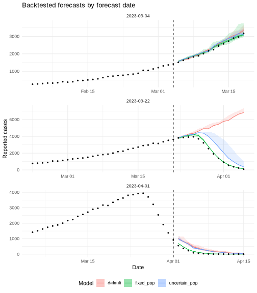

# Introduction

Forecasting means projecting reported cases beyond the last observed
data point.
`estimate_infections()` does this by extending the reproduction number
into the future and running the renewal equation forward.

Backtesting evaluates those forecasts.
We refit the model to data truncated at a set of past dates, generate a
forecast from each truncation point, and compare the forecast against the
values that were later observed.
Scoring the forecasts with a proper score such as the continuous ranked
probability score (CRPS) tells us which model would have forecast best.
We use [scoringutils](https://epiforecasts.io/scoringutils/) [@scoringutils]
for scoring.

This vignette works through a single forecast, then compares three models
across several forecast dates.
For the model itself see `vignette("estimate_infections")`, and for the
options used to configure it see `vignette("estimate_infections_options")`.

# Setup

We load _EpiNow2_ alongside `data.table` and `ggplot2` for data manipulation
and plotting, and `scoringutils` for scoring.
We set the number of cores and a seed for reproducibility.


``` r
library(EpiNow2) # nolint: unused_import_linter.
library(data.table)
library(ggplot2)
library(scoringutils)
options(mc.cores = 2)
set.seed(20240607)
```

# Simulating an outbreak

We simulate a single outbreak to forecast.
Using `simulate_infections()` with a constant reproduction number and a
fixed population size gives an epidemic that grows, peaks, and then declines
as susceptibles are depleted.
Setting `pop_period = "all"` applies the depletion across the whole
simulated period rather than only in a forecast horizon, so the turnover is
built into the data-generating process.
The generation time and delays are the example distributions supplied with
the package, fixed to point values with `fix_parameters()` because
simulation requires known parameters.


``` r
gen_time <- fix_parameters(example_generation_time)
delays <- fix_parameters(
  example_incubation_period + example_reporting_delay
)

pop_size <- 100000
dates <- seq.Date(as.Date("2023-01-01"), by = "day", length.out = 170)
R <- data.frame(date = dates, R = 1.25)

sim <- simulate_infections(
  R = R,
  initial_infections = 20,
  generation_time = gt_opts(gen_time),
  delays = delay_opts(delays),
  obs = obs_opts(family = "poisson"),
  pop = Fixed(pop_size),
  pop_period = "all"
)

reported <- sim[variable == "reported_cases", list(date, confirm = value)]
```

The simulated series of reported cases rises to a peak in late March before
declining.


``` r
ggplot(reported, aes(x = date, y = confirm)) +
  geom_col(fill = "#4292C6") +
  labs(x = "Date", y = "Reported cases", title = "Simulated outbreak") +
  theme_minimal()
```


# A single forecast

To forecast we truncate the series at a forecast date and fit only to the
data available up to that point.
We choose a date shortly before the peak, where the epidemic is still
growing and the turnover has not yet been observed.


``` r
forecast_date <- as.Date("2023-03-18")
train <- reported[date <= forecast_date]
```

For the fit we use a weekly random walk for the reproduction number
(`rt_opts(rw = 7)`) and disable the Gaussian process (`gp = NULL`).
This is a lighter model than the default and keeps the fitting quick, which
matters once we refit many times for backtesting.
We ask for a 14-day forecast horizon.
The generation time and delays are passed with their full uncertainty (we no
longer fix them, since fitting estimates over them).


``` r
gt <- gt_opts(example_generation_time)
del <- delay_opts(example_incubation_period + example_reporting_delay)
```

For this single forecast we use full MCMC sampling, which gives honest
posterior uncertainty.


``` r
fit <- estimate_infections(
  train,
  generation_time = gt,
  delays = del,
  rt = rt_opts(rw = 7),
  gp = NULL,
  forecast = forecast_opts(horizon = 14),
  stan = stan_opts(samples = 1000, chains = 2, backend = "cmdstanr")
)
#> Running MCMC with 2 parallel chains...
#> Chain 1 finished in 45.5 seconds.
#> Chain 2 finished in 48.4 seconds.
#> 
#> Both chains finished successfully.
#> Mean chain execution time: 46.9 seconds.
#> Total execution time: 48.5 seconds.
```

We plot the forecast against the data that were later observed.
The shaded ribbons are the 20%, 50%, and 90% credible intervals; the points
are the observations, split into the data used for fitting and the held-out
truth.


``` r
pred <- summary(fit, type = "parameters")[
  variable == "reported_cases" & type == "forecast"
]

ggplot(pred, aes(x = date)) +
  geom_ribbon(aes(ymin = lower_90, ymax = upper_90), alpha = 0.2) +
  geom_ribbon(aes(ymin = lower_50, ymax = upper_50), alpha = 0.3) +
  geom_ribbon(aes(ymin = lower_20, ymax = upper_20), alpha = 0.4) +
  geom_point(
    data = reported[date > forecast_date & date <= forecast_date + 14],
    aes(y = confirm, colour = "Held-out truth")
  ) +
  geom_point(
    data = train[date > forecast_date - 21],
    aes(y = confirm, colour = "Observed (fit)")
  ) +
  geom_vline(xintercept = forecast_date, linetype = "dashed") +
  scale_colour_manual(
    values = c("Held-out truth" = "#252525", "Observed (fit)" = "#4292C6")
  ) +
  labs(
    x = "Date", y = "Reported cases", colour = NULL,
    title = "14-day forecast from just before the peak"
  ) +
  theme_minimal() +
  theme(legend.position = "bottom")
```


The forecast keeps growing while the observations turn over.
By default the model has no way to know that susceptibles are running out,
so it projects the recent growth forward and over-shoots the peak.

## Scoring the forecast

To score the forecast we convert the fit to a `forecast_sample` object with
`as_forecast_sample()`, supplying the full observed series.
We set `horizon = 1` so only genuinely out-of-sample predictions (one day
ahead or more) are scored; the cutoff day itself (horizon 0) was used for
fitting and would not be a fair test.


``` r
single <- as_forecast_sample(fit, observations = reported, horizon = 1)
single_scores <- score(single)
summarise_scores(single_scores, by = "forecast_date")[
  , .(forecast_date, crps = round(crps, 1), bias = round(bias, 2))
]
#>    forecast_date   crps  bias
#>           <Date>  <num> <num>
#> 1:    2023-03-18 1962.9     1
```

`score()` returns several metrics; here we show the CRPS, which summarises the
whole predictive distribution against the observation (lower is better), and
the bias, which is positive when the forecast sits above the observations.
A single number is hard to interpret on its own; scores are most useful when
comparing models, which is what we do next.

# Three models

Susceptible depletion is what bends the epidemic over at the peak.
We compare three ways of handling it in the reproduction number model.

- **Default**: no depletion adjustment.
  The reproduction number follows the random walk and is projected forward
  unchanged.
- **Fixed population**: depletion with a known population size, set with
  `pop = Fixed(pop_size)`.
  `future = "latest"` projects the reproduction number from its most recent
  estimate.
- **Uncertain population**: depletion with an estimated population size,
  given a wide prior `Normal(mean = pop_size, sd = pop_size / 2)`.

The depletion adjustment is crude and only affects the forecast (see the
[model definition](estimate_infections.html)).
The population at risk is weakly identified from a single epidemic curve, so
the uncertain-population model has to learn it from data that barely
constrain it.


``` r
models <- list(
  default = rt_opts(rw = 7),
  fixed_pop = rt_opts(
    rw = 7, pop = Fixed(pop_size), future = "latest"
  ),
  uncertain_pop = rt_opts(
    rw = 7, pop = Normal(mean = pop_size, sd = pop_size / 2),
    future = "latest"
  )
)
```

# Backtesting across forecast dates

We backtest each model from three forecast dates chosen to span the phases of
the epidemic: one while it is still growing, one around the peak, and one
during the decline.
Contrasting phases matters because susceptible depletion only shapes the
forecast near and after the peak; early in the growth phase it is almost
irrelevant.


``` r
forecast_dates <- as.Date(c("2023-03-04", "2023-03-22", "2023-04-01"))
```

Refitting three models at three dates is nine fits.
For a backtest we want many quick fits rather than one exact one, so here we
use the pathfinder algorithm (`stan_opts(method = "pathfinder")`).
Pathfinder gives an approximate posterior in a fraction of the time of full
MCMC, which is the pragmatic trade-off when scoring many models and dates.
We saw above that exact MCMC and pathfinder gave a similar forecast for the
default model.


``` r
fit_model <- function(rt, data) {
  estimate_infections(
    data,
    generation_time = gt,
    delays = del,
    rt = rt,
    gp = NULL,
    forecast = forecast_opts(horizon = 14),
    stan = stan_opts(method = "pathfinder", backend = "cmdstanr")
  )
}
```

We loop over the models and dates, fitting each combination once.
From each fit we keep the sample-level predictions (with `get_predictions()`,
for scoring) and a summary of the forecast trajectory (with `summary()`, for
plotting).
Tagging each set with its model and forecast date lets us combine them.


``` r
backtests <- unlist(
  lapply(names(models), function(model) {
    lapply(forecast_dates, function(fdate) {
      fit_d <- fit_model(models[[model]], reported[date <= fdate])
      list(model = model, forecast_date = fdate, fit = fit_d)
    })
  }),
  recursive = FALSE
)

forecasts <- rbindlist(lapply(backtests, function(b) {
  preds <- get_predictions(b$fit, format = "sample")
  preds[, model := b$model]
  preds
}))

trajectories <- rbindlist(lapply(backtests, function(b) {
  traj <- summary(b$fit, type = "parameters")[
    variable == "reported_cases" & type == "forecast"
  ]
  traj[, `:=`(model = b$model, forecast_date = b$forecast_date)]
  traj
}))
```

## Visualising the backtested forecasts

Before scoring, we plot the forecast trajectories themselves.
Each panel is a forecast date; the ribbons are the 50% and 90% credible
intervals, the lines are the posterior medians, and the points are the
observed data before and after the forecast date (dashed line).


``` r
obs_windows <- rbindlist(lapply(forecast_dates, function(fd) {
  reported[date >= fd - 28 & date <= fd + 14][, forecast_date := fd]
}))

ggplot(trajectories, aes(x = date)) +
  geom_ribbon(
    aes(ymin = lower_90, ymax = upper_90, fill = model), alpha = 0.15
  ) +
  geom_ribbon(
    aes(ymin = lower_50, ymax = upper_50, fill = model), alpha = 0.3
  ) +
  geom_line(aes(y = median, colour = model)) +
  geom_point(data = obs_windows, aes(y = confirm), size = 0.8) +
  geom_vline(
    data = data.frame(forecast_date = forecast_dates),
    aes(xintercept = forecast_date), linetype = "dashed"
  ) +
  facet_wrap(~forecast_date, scales = "free", ncol = 1) +
  labs(
    x = "Date", y = "Reported cases", colour = "Model", fill = "Model",
    title = "Backtested forecasts by forecast date"
  ) +
  theme_minimal() +
  theme(legend.position = "bottom")
```



During growth the three models agree and all track the data.
Around the peak the default model keeps climbing while the fixed-population
model bends over with the observations; the uncertain-population model sits
between the two.
In the decline the recent downturn is already visible in the data, so all
three project a fall and the gap between them narrows again.

# Scoring

We merge the forecasts with the observed values and build a single
`forecast_sample` object, keeping only out-of-sample horizons (`horizon > 0`)
as we did for the single forecast.
Adding `model` to the forecast unit keeps the three models separate when
scoring.


``` r
obs <- reported[, list(date, observed = confirm)]
forecasts <- merge(forecasts, obs, by = "date")
forecasts <- forecasts[horizon > 0]

fc <- as_forecast_sample(
  forecasts,
  forecast_unit = c("model", "forecast_date", "date", "horizon"),
  observed = "observed",
  predicted = "predicted",
  sample_id = "sample"
)
```

Reported cases span several orders of magnitude over an epidemic, so a score
on the natural scale is dominated by the largest counts near the peak.
Scoring on the log scale instead rewards getting the relative size right, and
matters more when small counts (for example early growth or the tail of the
decline) are important.
We use `transform_forecasts()` with `log_shift` to add log-transformed
forecasts alongside the originals, which `score()` then scores together,
labelling each with a `scale` column.


``` r
fc <- transform_forecasts(fc, fun = log_shift, offset = 1)
scores <- score(fc)
```

`summarise_scores()` returns the full default metric set.
Rather than reduce everything to the CRPS we keep the metrics and show them
per model and scale.


``` r
overall <- as.data.table(
  summarise_scores(scores, by = c("model", "scale"))
)
num_cols <- names(overall)[vapply(overall, is.numeric, logical(1))]
overall[, (num_cols) := lapply(.SD, signif, 3), .SDcols = num_cols]
overall[order(scale, crps)]
#>            model   scale  bias    dss     crps overprediction underprediction
#>           <char>  <char> <num>  <num>    <num>          <num>           <num>
#> 1:     fixed_pop     log 0.655   11.3    0.240          0.205        0.001330
#> 2: uncertain_pop     log 0.875  196.0    0.989          0.974        0.000461
#> 3:       default     log 0.925 2340.0    1.290          1.270        0.000156
#> 4:     fixed_pop natural 0.655   17.8   62.700         48.900        1.000000
#> 5: uncertain_pop natural 0.875   52.8  336.000        326.000        1.200000
#> 6:       default natural 0.925  318.0 1120.000       1100.000        0.269000
#>    dispersion log_score     mad ae_median  se_mean
#>         <num>     <num>   <num>     <num>    <num>
#> 1:     0.0338       Inf  0.0878     0.271 2.40e-01
#> 2:     0.0139       Inf  0.0393     1.010 2.62e+00
#> 3:     0.0248       NaN  0.0858     1.310 4.02e+00
#> 4:    12.8000       Inf 48.0000    79.500 1.49e+04
#> 5:     9.5100       Inf  8.6500   347.000 3.56e+05
#> 6:    10.5000       NaN 18.7000  1120.000 5.19e+06
```

On both scales the fixed-population model scores best overall, and its bias is
closest to zero.
The default model has a large positive bias: it over-predicts, because it
projects growth through the peak.
The uncertain-population model improves on the default but falls short of the
fixed one, with `overprediction` and `dispersion` components in between:
with the population estimated rather than known, it cannot pin down when
depletion will bite.
The `log_score` column is density-based and unstable for sample forecasts (it
can be infinite), so we rely on the sample-friendly CRPS here.

Breaking the natural-scale CRPS down by forecast date shows how the ranking
shifts across the epidemic's phases.


``` r
by_date <- summarise_scores(
  scores, by = c("model", "forecast_date", "scale")
)
by_date[scale == "natural"][
  order(forecast_date, crps),
  .(forecast_date, model, crps = round(crps, 1))
]
#>    forecast_date         model   crps
#>           <Date>        <char>  <num>
#> 1:    2023-03-04     fixed_pop   45.4
#> 2:    2023-03-04 uncertain_pop   73.3
#> 3:    2023-03-04       default   85.5
#> 4:    2023-03-22     fixed_pop  105.5
#> 5:    2023-03-22 uncertain_pop  737.6
#> 6:    2023-03-22       default 3047.6
#> 7:    2023-04-01     fixed_pop   37.1
#> 8:    2023-04-01 uncertain_pop  198.2
#> 9:    2023-04-01       default  212.9
```

During growth (early March) the three models are close.
Around the peak (late March) the fixed-population model pulls well ahead as
the default over-projects the turnover.
In the decline (early April) the models converge again, because the downturn
is already in the data by the time the forecast is made.
Depletion is only decisive when the turning point lies ahead of the data.

Breaking the scores down by horizon and scale shows the same story over the
forecast window.


``` r
by_horizon <- summarise_scores(
  scores, by = c("model", "horizon", "scale")
)

ggplot(by_horizon, aes(x = horizon, y = crps, colour = model)) +
  geom_line() +
  geom_point(size = 1) +
  facet_wrap(~scale, scales = "free_y") +
  labs(
    x = "Forecast horizon (days)", y = "Mean CRPS", colour = "Model",
    title = "Forecast error by horizon and scale"
  ) +
  theme_minimal() +
  theme(legend.position = "bottom")
```


On the natural scale the gap between models opens at longer horizons, where
the forecasts run into the peak.
On the log scale the differences are smaller and steadier, because log
scoring down-weights the large counts that dominate the natural scale.

# Conclusion

Forecasting projects the reproduction number forward; backtesting refits at
past dates and scores the forecasts against what actually happened.
Contrasting forecast dates across the epidemic showed that the model which
knew the population at risk forecast the turnover best around the peak, while
during early growth and the later decline the three models were close.
Susceptible depletion is only useful forecast information when the turning
point still lies ahead and you have external knowledge of the population at
risk.

Scoring on both the natural and log scales gave a fuller picture: the natural
scale is dominated by the large counts near the peak, while the log scale
weighs relative errors across the whole curve.

Two caveats.
We used pathfinder for the backtest, which trades some accuracy for speed;
for a real evaluation compare it against full MCMC, as we did for the single
forecast, and use more posterior samples.
The depletion adjustment is also crude and applies only to the forecast; see
the [model definition](estimate_infections.html) for details.
