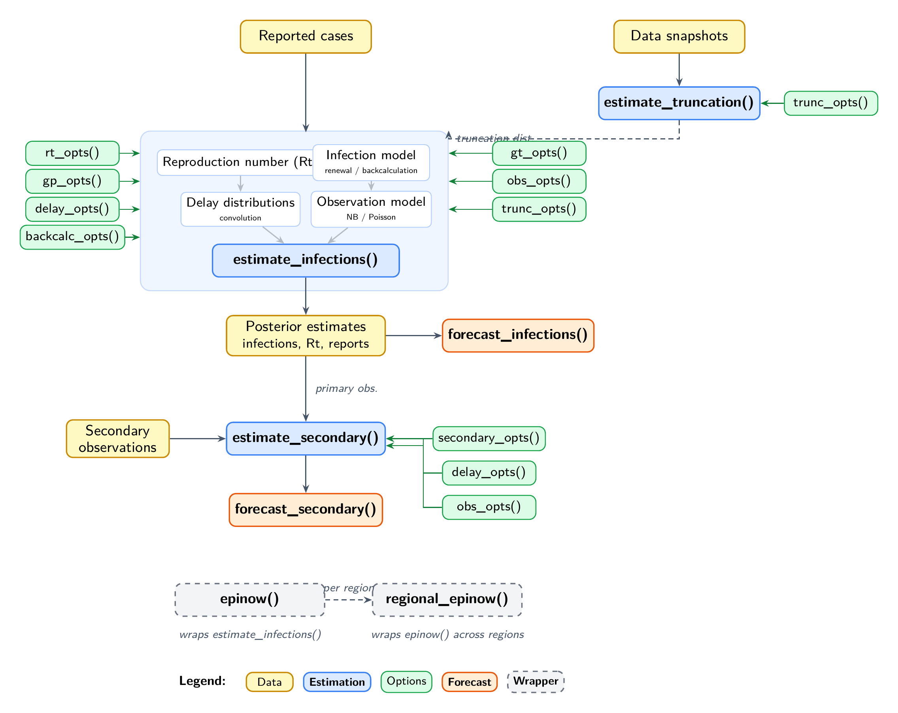

```{r, include = FALSE}
knitr::opts_chunk$set(
  collapse = TRUE,
  comment = "#>"
)
```

# Introduction

EpiNow2 provides several estimation models that can be combined for end-to-end epidemiological inference and forecasting.
This vignette gives an overview of how these models connect.
For a reference of what each model can do see the [model features](model_features.html) vignette.

# Architecture

The diagram below shows the main functions and how they relate to one another.

```{r architecture, echo = FALSE, out.width = "100%", fig.align = "center", fig.alt = "Diagram showing how the main EpiNow2 models connect."}

```

Data flows from top to bottom.
Solid arrows show direct dependencies; dashed arrows show optional connections.
Green boxes are options functions that configure the estimation models.
See the [model features](model_features.html) vignette for what each function and option does.

# Relationship between models

`estimate_dist()` fits delay distributions from linelist data, accounting for double interval censoring and right truncation.
Its output can define priors for the other models via `delay_opts()`, `gt_opts()`, or `trunc_opts()`.

`estimate_truncation()` produces both a nowcast and a truncation distribution from multiple snapshots of the same data.
The distribution is typically passed to `estimate_infections()` via `trunc_opts()` for truncation-adjusted inference, but can also be used via `delay_opts()` or `gt_opts()` where appropriate.

`estimate_infections()` is the core model, estimating latent infections and the time-varying reproduction number from a count time series.
Its posterior feeds into `forecast_infections()` for projections and can inform `simulate_infections()` for scenario analysis.

Estimated primary observations from `estimate_infections()` are used as input to `estimate_secondary()`, which estimates secondary outcomes (e.g. deaths, hospitalisations).
`forecast_secondary()` extends a fitted secondary model with new primary data; `simulate_secondary()` generates synthetic secondary observations.

`epinow()` wraps `estimate_infections()` with logging and formatted output.
`regional_epinow()` runs `epinow()` across regions in parallel.

# Where to look next

**Start here**

- [Getting started](EpiNow2.html) — quick introduction and basic usage
- [Model features](model_features.html) — feature reference for arguments and options

**Model definitions** (mathematical detail)

- [Infection model](estimate_infections.html) — `estimate_infections()`
    - [Gaussian process implementation](gaussian_process_implementation_details.html) — shared component used inside the renewal and back-calculation models
- [Secondary model](estimate_secondary.html) — `estimate_secondary()`
- [Truncation model](estimate_truncation.html) — `estimate_truncation()`
- [Delay distribution fitting](estimate-dist.html) — `estimate_dist()`

**Applied use**

- [Workflow](estimate_infections_workflow.html) — end-to-end estimation and forecasting
- [Configuration examples](estimate_infections_options.html) — different model configurations with results
- [Prior choice guide](prior_choice_guide.html) — default priors and how to modify them
- [Production use](epinow.html) — `epinow()` and `regional_epinow()`
- [Case studies](case-studies.html) — external applications in the literature
