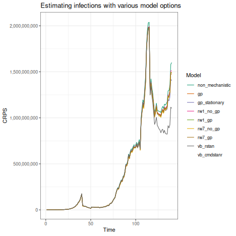

``` r
library(EpiNow2)
library(scoringutils)
library(data.table)
library(rstan)
library(cmdstanr)
library(ggplot2)
library(lubridate)
library(scales)
library(posterior)
```

This vignette explores available model options in `{EpiNow2}` and how they vary by speed and accuracy of estimates. We will compare the models by run time and accuracy of estimates (quantitatively and qualitatively) against the "true" trajectory of the data.

## The benchmarking data

To compare the model options, we will need a dataset for which we know the "true" values and trajectories. So, we will start by generating the "true" infections and $R_t$ data using `{EpiNow2}`'s `forecast_infections()` function. 

`forecast_infections()` requires a fitted estimates object from `epinow()` with `output` set to "fit", the trajectory of the reproduction number, `R`, and the number of samples to simulate. So, we will set these up first.

To obtain the `estimates` object, we will run the `epinow()` function using real-world observed data and delay distributions to recover realistic parameter values. We will use the first $100$ observations of the `example_confirmed` data set, the `example_generation_time`, `example_incubation_period`, and `example_reporting_delay` values that come with `{EpiNow2}`.

Several of the argument values we will use here will be kept the same for all the model runs, so we will set them up here. These include the generation time, incubation period, reporting delay, observation model options, and the forecast horizon.

``` r
# Set the number of cores to use
options(mc.cores = 4)

# Generation time
generation_time <- Gamma(
  shape = Normal(1.3, 0.3),
  rate = Normal(0.37, 0.09),
  max = 14
)

# Incubation period
incubation_period <- LogNormal(
  meanlog = Normal(1.6, 0.05),
  sdlog = Normal(0.5, 0.05),
  max = 14
)

# Reporting delay
reporting_delay <- LogNormal(
  meanlog = 0.5,
  sdlog = 0.5,
  max = 10
)

# Combine the incubation period and reporting delay into one delay
delay <- incubation_period + reporting_delay

# Observation model options
obs <- obs_opts(
  scale = list(mean = 0.1, sd = 0.025),
  return_likelihood = TRUE
)

# No forecasting; just estimation
horizon <- 0
```

Now, let's generate the `estimates` object from `epinow()`.

``` r
estimates <- epinow(
  data = example_confirmed[1:100],
  generation_time = generation_time_opts(example_generation_time),
  delays = delay_opts(example_incubation_period + example_reporting_delay),
  rt = rt_opts(prior = list(mean = 2, sd = 0.1), rw = 14),
  gp = NULL,
  obs = obs,
  horizon = horizon,
  output = "fit"
)
#> DEBUG [2024-08-01 17:44:06] epinow: Running in exact mode for 2000 samples (across 4 chains each with a warm up of 250 iterations each) and 114 time steps of which 0 are a forecast
```

For the `R` data, we will set up an arbitrary trajectory and add some Gaussian noise.

``` r
# Arbitrary reproduction number trajectory
R <- c(
  rep(2, 40), rep(0.5, 10), rep(1, 10), 1 + 0.04 * 1:20, rep(1.4, 5),
  1.4 - 0.02 * 1:20, rep(1.4, 10), rep(0.8, 5), 0.8 + 0.02 * 1:20
)
# Add Gaussian noise
R_noisy <- R * rnorm(length(R), 1, 0.05)
```

Now, we are ready to simulate the true infections and $R_t$ data by sampling from $10$ posterior samples.

``` r
# Forecast infections and the trajectory of Rt
forecast <- forecast_infections(
  estimates$estimates,
  R = R_noisy,
  samples = 10
)
#> DEBUG [2024-08-01 17:44:48] simulate_infections: Running in exact mode for 1 samples (across 1 chains each with a warm up of 1 iterations each) and 154 time steps of which 40 are a forecast
```

We will now extract the required data:
- `R_true`: the median of the simulated $R_t$ values,
- `infections_true`: the infections by date of infection, and
- `reported_cases_true`: the reported cases by date of report.

``` r
R_true <- forecast$summarised[variable == "R"]$median

# Get the posterior samples from which to extract the simulated infections and reported cases
posterior_sample <- forecast$samples[sample == 1]

# Extract the simulated infections
infections_true <- posterior_sample[variable == "infections"]$value

# Extract the simulated reported cases and rename the "value" column to "confirm" (to match EpiNow2 requirements)
reported_cases_true <- posterior_sample[
  variable == "reported_cases", .(date, confirm = value)
]
```

Now, to the main part of this vignette: we will define and run the different model options and evaluate their runtimes and estimation performance.

## Model options


Table: Model options

|model           |description                                                                                   |
|:---------------|:---------------------------------------------------------------------------------------------|
|non_mechanistic |The model with no priors on Rt                                                                |
|gp              |Gaussian process turned on and with a non-stationary prior on $R_t$ (default)                 |
|gp_stationary   |Gaussian process turned on and with a stationary Gaussian process prior on $R_t$              |
|rw1_no_gp       |1-day random walk, Gaussian process turned off, and a non-stationary prior on $R_t$ (default) |
|rw1_gp          |1-day random walk, Gaussian process turned on, and a non-stationary prior on $R_t$ (default)  |
|rw7_no_gp       |7-day random walk, Gaussian process turned off, and a non-stationary prior on $R_t$ (default) |
|rw7_gp          |7-day random walk, Gaussian process turned on, and a non-stationary prior on $R_t$ (default)  |
|vb_rstan        |Variational inference method instead of MCMC for sampling using [`{rstan}`]                   |
|vb_cmdstanr     |Variational inference method instead of MCMC for sampling using [`{cmdstanr}`]                |


``` r
model_configs <- list(
  # The non-mechanistic model
  non_mechanistic = list(rt = NULL),
  # The model with the Gaussian process turned on and a non-stationary prior on R_t (default)
  gp = list(
    rt = rt_opts(
      prior = list(mean = 2, sd = 0.1)
    )
  ),
  # # The model with the Gaussian process turned on and the stationary Gaussian process prior on R_t
  gp_stationary = list(
    rt = rt_opts(
      prior = list(mean = 2, sd = 0.1),
      gp_on = "R0"
    )
  ),
  # # The model with a 1-day random walk, the Gaussian process turned off and a non-stationary prior on R_t (default)
  rw1_no_gp = list(
    rt = rt_opts(
      prior = list(mean = 2, sd = 0.1),
        rw = 1
      ),
    gp = NULL
  ),
  #  # The model with a 1-day random walk, the Gaussian process turned on, and a non-stationary prior on R_t (default)
  rw1_gp = list(
    rt = rt_opts(
      prior = list(mean = 2, sd = 0.1),
        rw = 1
      )
  ),
  # # The model with a 7-day random walk, the Gaussian process turned off, and a non-stationary prior on R_t (default)
  rw7_no_gp = list(
    rt = rt_opts(
      prior = list(mean = 2, sd = 0.1),
        rw = 7
      ),
    gp = NULL
  ),
  # # The model with a 7-day random walk, the Gaussian process turned on, and a non-stationary prior on R_t (default)
  rw7_gp = list(
    rt = rt_opts(
      prior = list(mean = 2, sd = 0.1),
      rw = 7
    )
  ),
  # Model that uses the variational inference method instead of MCMC (from rstan) 
  vb_rstan = list(
    stan = stan_opts(
      method = "vb"
    )
  ),
  # Model that uses the variational inference method instead of MCMC (from cmdstanr) 
  vb_cmdstanr = list(
    stan = stan_opts(
      method = "vb",
      backend = "cmdstanr"
    )
  )
)
```

## Running the models

Let's run the models and gather the results.

Let's combine the shared model inputs into a list for use across all the models.

``` r
model_inputs <- list(
  data = reported_cases_true,
  generation_time = generation_time_opts(generation_time),
  delays = delay_opts(delay),
  obs = obs,
  horizon = horizon,
  verbose = FALSE
)
```

To run the models, we will sweep across the list of models `models` and shared model inputs `model_inputs`. We will use the `epinow()` function and return useful outputs like the timing of model runs.

``` r
# Create a version of epinow() that works like base::try() and works even if some models fail.
safe_epinow <- purrr::safely(epinow)
# Run the models
results <- lapply(
  model_configs,
  function(model) {
    do.call(
      safe_epinow,
      c(
        model_inputs,
        model
      )
    )
  }
)
```

## Evaluating performance

### Run times

Let's see how long each model took to run. Note that the run time measured here uses a crude method that compares the start and end times of each simulation. It only measures the time taken for one model run and may not be accurate. For more accurate run time measurements, we recommend using a more sophisticated approach like those provided by packages like [`{bench}`](https://cran.r-project.org/web/packages/bench/index.html) and [`{microbenchmark}`](https://cran.r-project.org/web/packages/microbenchmark/index.html).

Another thing to note is that here, we used 4 cores and so using more or fewer cores might change the runtime results but we expect the relative rankings to be the same or similar. To speed up the model runs, we recommend checking the number of cores available on your machine using `parallel::detectCores()` and setting a high enough number of cores in `options()`. See the \ref{shared_inputs} chunk above for an example.


``` r
# Extract the run times
runtimes <- lapply(
  results,
  function(x) {
    if (is.null(x$error)) {
      return(round(as.duration(x$result$timing), 1))
    } else {
      return(as.duration("NA"))
    }
  }
)

# Convert to a table format

runtimes_dt <- melt(
  as.data.table(runtimes),
  measure.vars = names(model_configs),
  variable.name = "model",
  value.name = "runtime"
)

# Add model descriptions

runtimes_dt <- merge(
  runtimes_dt,
  model_descriptions,
  by = "model"
)

setcolorder(runtimes_dt, c("model", "description", "runtime"))

# Order by run time

runtimes_dt <- runtimes_dt[order(runtime), ]
 
# Print table
knitr::kable(runtimes_dt, caption = "Run times for various _EpiNow2_ models")
```


Table: Run times for various _EpiNow2_ models

|model           |description                                                                                   |                  runtime|
|:---------------|:---------------------------------------------------------------------------------------------|------------------------:|
|vb_rstan        |Variational inference method instead of MCMC for sampling using [`{rstan}`]                   |                     8.2s|
|non_mechanistic |The model with no priors on Rt                                                                |                    18.4s|
|vb_cmdstanr     |Variational inference method instead of MCMC for sampling using [`{cmdstanr}`]                |                    32.2s|
|gp_stationary   |Gaussian process turned on and with a stationary Gaussian process prior on $R_t$              |   135.6s (~2.26 minutes)|
|gp              |Gaussian process turned on and with a non-stationary prior on $R_t$ (default)                 |  634.9s (~10.58 minutes)|
|rw7_gp          |7-day random walk, Gaussian process turned on, and a non-stationary prior on $R_t$ (default)  |  740.1s (~12.34 minutes)|
|rw7_no_gp       |7-day random walk, Gaussian process turned off, and a non-stationary prior on $R_t$ (default) |  933.9s (~15.56 minutes)|
|rw1_gp          |1-day random walk, Gaussian process turned on, and a non-stationary prior on $R_t$ (default)  |   1060s (~17.67 minutes)|
|rw1_no_gp       |1-day random walk, Gaussian process turned off, and a non-stationary prior on $R_t$ (default) | 1141.9s (~19.03 minutes)|


### Estimation performance

Now, we will compare the estimated and true values using the continuous ranked probability score (CRPS). The CRPS is a proper scoring rule that measures the accuracy of probabilistic forecasts. The smaller the CRPS, the better. We will use the `crps()` function from the `{scoringutils}` package.

To calculate the CRPS for the estimated $R_t$ and infections, we will first set up a function that makes sure the true data and estimates are of the same length and calls the `crps_sample()` function from the `{scoringutils}` package.

``` r
# A function to calculate the CRPS
calc_crps <- function(x, truth) {
  shortest_obs_length <- min(ncol(x), length(truth))
  reduced_truth <- tail(truth, shortest_obs_length)
  reduced_x <- tail(t(x), shortest_obs_length)
  return(crps_sample(reduced_truth, reduced_x))
}
```

Now, we will extract the $R_t$ and infection estimates and calculate the CRPS using the `calc_crps()` function above.


``` r
# Function to extract Rt estimates
Rt_estimated <- lapply(results, function(x) {
  if (is.null(x$error)) {
    obj <- x$result$estimates$fit
    if (inherits(obj, "stanfit")) {
      if ("R[1]" %in% names(obj)) {
        extract(obj, "R")$R
      } else {
        extract(obj, "gen_R")$gen_R
      }
    } else {
      obj |>
        as_draws_matrix() |> 
        subset_draws(variable = "R")
    }
  } else {
    NA
  }
})
# Apply function above to calculate CRPS for the Rt estimates
rt_crps <- lapply(
  Rt_estimated,
  function (x) {
  if (all(!is.na(x))) {
    calc_crps(x = x, truth = R)
  } else {
      NA
  }
    }
)

# Function to extract infection estimates
infections_estimated <- lapply(results, function(x) {
  if (is.null(x$error)) {
  obj <- x$result$estimates$fit
  if (inherits(obj, "stanfit")) {
  extract(obj, "infections")$infections
  } else {
    obj |>
      as_draws_matrix() |> 
      subset_draws(variable = "infections")
    }
  } else {
    NA
  }
})

# Apply function above to calculate CRPS for the infections estimates
infections_crps <- lapply(
  infections_estimated,
  function(x) {
    if (all(!is.na(x))) {
      calc_crps(x = x, truth = infections_true)
    } else {
      NA
    }
  }
)
```

We will now post-process the CRPS results to make them easier to visualise by adding a "time" column and reshaping the data to long format.


``` r
# Post-processing the CRPS results of the Rt estimates
rt_df <- as.data.table(rt_crps)
rt_df[, time := 1:.N]
rt_df <- melt(
  rt_df,
  id.vars = c("time"),
  variable.name = "model"
)

# Post-processing the CRPS results of the infection estimates
infections_df <- as.data.table(infections_crps)
infections_df[, time := 1:.N]
infections_df <- melt(
  infections_df,
  id.vars = c("time"),
  variable.name = "model"
)
```

Let's first look at the total CRPS for each model and the real-time CRPS (CRPS at the last time point) alongside the run times.


``` r
# Get total CRPS for Rt estimates
rt_crps_total <- rt_df[, sum(value), by = .(model)] |> setnames("V1", "rt_crps_total")
# Get CRPS at the final time point for Rt estimates
rt_crps_real_time <- rt_df[, .SD[.N], by = "model"][, time := NULL] |> setnames("value", "rt_crps_real_time")
# Combine the total and real-time CRPS for the Rt estimates
rt_crps_summaries <- merge.data.frame(rt_crps_total, rt_crps_real_time)


# Get total CRPS for infection estimates
infections_crps_total <- infections_df[, sum(value), by = .(model)] |> setnames("V1", "infections_crps_total")
# Get CRPS at the final time point for infection estimates
infections_crps_real_time <- infections_df[, .SD[.N], by = "model"][, time := NULL] |> setnames("value", "infections_crps_real_time")
# Combine the total and real-time CRPS for the infection estimates
infections_crps_summaries <- merge.data.frame(infections_crps_total, infections_crps_real_time)

# Combine the CRPS summaries for Rt and infection estimates
all_crps_summaries <- merge.data.table(rt_crps_summaries, infections_crps_summaries)

# Combine CRPS summaries with the run times
model_summaries <- merge.data.table(runtimes_dt, all_crps_summaries)

# Order by run time
model_summaries <- model_summaries[order(runtime), ]

# Print table
knitr::kable(
  model_summaries,
  caption = "Run times, total CRPS, and real-time CRPS (CRPS at the last time point) for various _EpiNow2_ models (ordered by run times)",
  format.args = list(
    big.mark = ",",
    scientific = FALSE,
    digits = 2
  ),
  col.names = c("Model", "Description", "Run time (s)", "Total CRPS (Rt)", "Real-time CRPS (Rt)", "Total CRPS (Infections)", "Real-time CRPS (Infections)")
)
```


Table: Run times, total CRPS, and real-time CRPS (CRPS at the last time point) for various _EpiNow2_ models (ordered by run times)

|Model           |Description                                                                                   |             Run time (s)| Total CRPS (Rt)| Real-time CRPS (Rt)| Total CRPS (Infections)| Real-time CRPS (Infections)|
|:---------------|:---------------------------------------------------------------------------------------------|------------------------:|---------------:|-------------------:|-----------------------:|---------------------------:|
|vb_rstan        |Variational inference method instead of MCMC for sampling using [`{rstan}`]                   |                     8.2s|              30|               0.204|          97,315,471,315|               2,498,490,676|
|non_mechanistic |The model with no priors on Rt                                                                |                    18.4s|              15|               0.220|          97,252,551,348|               2,517,519,191|
|vb_cmdstanr     |Variational inference method instead of MCMC for sampling using [`{cmdstanr}`]                |                    32.2s|              55|               0.038|          90,855,605,909|               1,993,489,397|
|gp_stationary   |Gaussian process turned on and with a stationary Gaussian process prior on $R_t$              |   135.6s (~2.26 minutes)|              14|               0.110|          92,847,573,287|               2,286,922,320|
|gp              |Gaussian process turned on and with a non-stationary prior on $R_t$ (default)                 |  634.9s (~10.58 minutes)|              13|               0.147|          92,277,971,624|               2,370,692,441|
|rw7_gp          |7-day random walk, Gaussian process turned on, and a non-stationary prior on $R_t$ (default)  |  740.1s (~12.34 minutes)|              13|               0.140|          90,732,139,177|               2,358,206,814|
|rw7_no_gp       |7-day random walk, Gaussian process turned off, and a non-stationary prior on $R_t$ (default) |  933.9s (~15.56 minutes)|              15|               0.131|          92,008,520,165|               2,377,736,632|
|rw1_gp          |1-day random walk, Gaussian process turned on, and a non-stationary prior on $R_t$ (default)  |   1060s (~17.67 minutes)|              13|               0.142|          91,897,730,153|               2,382,439,587|
|rw1_no_gp       |1-day random walk, Gaussian process turned off, and a non-stationary prior on $R_t$ (default) | 1141.9s (~19.03 minutes)|              13|               0.157|          93,236,931,966|               2,409,844,598|


Let's visualise the CRPS results for the $R_t$ and infection estimates over time. This will help us see how the models performed over time.


``` r
rt_plot <- ggplot(rt_df, aes(x = time, y = value, colour = model)) +
  geom_line() +
  scale_colour_brewer("Model", palette = "Dark2") +
    scale_y_continuous(labels = label_number_auto()) +
  labs(x = "Time", y = "CRPS", title = "Estimating Rt with various model options") +
  ggplot2::theme_bw()
plot(rt_plot)
#> Warning in RColorBrewer::brewer.pal(n, pal): n too large, allowed maximum for palette Dark2 is 8
#> Returning the palette you asked for with that many colors
#> Warning: Removed 140 rows containing missing values or values outside the scale range (`geom_line()`).
```


``` r
infections_plot <- ggplot(infections_df, aes(x = time, y = value, colour = model)) +
  geom_line() +
  scale_colour_brewer("Model", palette = "Dark2") +
  scale_y_continuous(labels = label_comma()) +
  labs(x = "Time", y = "CRPS", title = "Estimating infections with various model options") +
  ggplot2::theme_bw()
plot(infections_plot)
#> Warning in RColorBrewer::brewer.pal(n, pal): n too large, allowed maximum for palette Dark2 is 8
#> Returning the palette you asked for with that many colors
#> Warning: Removed 140 rows containing missing values or values outside the scale range (`geom_line()`).
```



From the table of run times and CRPS measures, we can see that the various models have a trade-off between speed and accuracy. For example, the `vb_stan` model was the fastest but had the second worst total CRPS score after `vb_cmdstanr` when predicting $R_t$. This same model has the worst score for predicting $R_t$ and infections in real-time and overall. The non-mechanistic model was the second fastest but had a good total CRPS score for predicting $R_t$. It however had one of the worst aggregate scores for predicting the infection trajectory.

The daily random walk model with no Gaussian process (`rw1_no_gp`) on the other hand is the slowest but has one of the best total CRPS for predicting $R_t$ but does not do very well in the other measures. The 7-day random walk with a Gaussian process(`rw7_gp`), though slow, produced the most desirable aggregate scores for predicting both the $R_t$ and infections.

These results show that choosing an appropriate model requires a careful consideration of one's use case and appropriate trade-off. Below are a few considerations.

## Some considerations when using the model options

### Mechanistic vs non-mechanistic models

- Estimation in `{EpiNow2}` using the mechanistic approaches (prior on $R_t$) is often much slower than the non-mechanistic approach. The mechanistic model is slower because it models aspects of the processes and mechanisms that drive $R_t$ estimates using the renewal equation. The non-mechanistic model, on the other hand, runs much faster but does not use the renewal equation to generate infections. Because of this none of the options defining the behaviour of the reproduction number are available in this case, limiting flexibility. It also means that the model is questionable for forecasting. The non-mechanistic model in `{EpiNow2}` is equivalent to that used in the [`{EpiEstim}`](https://mrc-ide.github.io/EpiEstim/index.html) R package as they both use a Renewal equation to estimate $R_t$ from case time series and the generation interval distribution.

### Exact vs approximate sampling methods

- The default sampling method, set through `stan_opts()`, performs [MCMC sampling](https://en.wikipedia.org/wiki/Markov_chain_Monte_Carlo) using [`{rstan}`](https://cran.r-project.org/web/packages/rstan/vignettes/rstan.html). The MCMC sampling method is accurate but is often slow. The variational inference method is faster because it is an [approximate method](https://arxiv.org/abs/1506.03431). In `{EpiNow2}`, you can use this method with an `{rstan}` or [`{cmdstanr}`](https://mc-stan.org/cmdstanr/) backend but you will have to install the latter to access its functionalities. Additionally, `{EpiNow2}` supports using the [Laplace](https://mc-stan.org/docs/cmdstan-guide/laplace_sample_config.html) and [Pathfinder](https://mc-stan.org/docs/cmdstan-guide/pathfinder_config.html) approximate samplers through `{cmdstanr}` but these two methods are currently experimental in `{cmdstanr}` and have not been well tested here. Future enhancements to this vignette will include their benchmarks as well but initial tests show they are extremely fast but with varied estimation performance depending on the data. Moreover, they may not be as reliable as the default MCMC sampling method and we do not recommend using them in real-world inference.

### Granularity of estimates

- The random walk method reduces granularity in estimates, compared to the other methods.
